# Cortex-R Agent Architecture Report

## Executive Summary

**Cortex-R** is a sophisticated reasoning-driven AI agent system built on Python that leverages the Model Context Protocol (MCP) to orchestrate multiple specialized tool servers. The system implements a perception-decision-action loop with configurable planning strategies, persistent memory management, and multi-modal document processing capabilities.

**Core Capabilities:**
- Multi-strategy planning (conservative vs exploratory modes)
- Dynamic tool selection via perception engine
- Sandboxed Python execution for complex reasoning
- Multi-modal RAG (Retrieval-Augmented Generation) with FAISS indexing
- Session-based memory management with semantic search
- Support for multiple LLM backends (Gemini, Ollama models)

---

## System Architecture Overview

### High-Level Architecture

```
┌─────────────────────────────────────────────────────────────┐
│                        User Interface                        │
│                      (agent.py - CLI)                        │
└──────────────────────────┬──────────────────────────────────┘
                           │
                           ▼
┌─────────────────────────────────────────────────────────────┐
│                      AgentLoop (core/loop.py)                │
│  ┌──────────────┐  ┌──────────────┐  ┌──────────────┐      │
│  │  Perception  │→ │   Decision   │→ │    Action    │      │
│  │   Module     │  │   Module     │  │   Module     │      │
│  └──────────────┘  └──────────────┘  └──────────────┘      │
└──────────────────────────┬──────────────────────────────────┘
                           │
                           ▼
┌─────────────────────────────────────────────────────────────┐
│              AgentContext (core/context.py)                  │
│  ┌──────────────┐  ┌──────────────┐  ┌──────────────┐      │
│  │   Memory     │  │   Strategy   │  │   Profile    │      │
│  │   Manager    │  │   Config     │  │   Config     │      │
│  └──────────────┘  └──────────────┘  └──────────────┘      │
└──────────────────────────┬──────────────────────────────────┘
                           │
                           ▼
┌─────────────────────────────────────────────────────────────┐
│           MultiMCP Dispatcher (core/session.py)              │
└──────────────┬──────────────┬──────────────┬────────────────┘
               │              │              │
               ▼              ▼              ▼
    ┌──────────────┐ ┌──────────────┐ ┌──────────────┐
    │ MCP Server 1 │ │ MCP Server 2 │ │ MCP Server 3 │
    │    (Math)    │ │ (Documents)  │ │ (WebSearch)  │
    └──────────────┘ └──────────────┘ └──────────────┘
```


---

## Core Components

### 1. Entry Point: agent.py

**Purpose:** Main application entry point providing CLI interface for user interaction.

**Key Responsibilities:**
- Initialize MCP server connections via MultiMCP
- Manage conversation sessions (new/continue)
- Parse user input and route to AgentLoop
- Handle FINAL_ANSWER and FURTHER_PROCESSING_REQUIRED responses
- Implement session continuity across multiple queries

**Flow:**
1. Load configuration from `config/profiles.yaml`
2. Initialize MultiMCP with server configurations
3. Enter main loop accepting user queries
4. Create AgentContext for each query
5. Execute AgentLoop and process results
6. Handle multi-step processing via FURTHER_PROCESSING_REQUIRED

**Session Management:**
- Sessions persist across queries until user types 'new'
- Session IDs follow format: `YYYY/MM/DD/session-{timestamp}-{uid}`
- Memory is automatically saved per session

---

### 2. Core Loop: core/loop.py (AgentLoop)

**Purpose:** Orchestrates the perception-decision-action cycle with retry logic.

**Architecture Pattern:** Iterative refinement with lifeline-based retry mechanism

**Key Components:**

#### Step Execution Loop
```python
for step in range(max_steps):  # Default: 3 steps
    while lifelines_left >= 0:  # Default: 3 lifelines per step
        1. Perception → Select relevant MCP servers
        2. Decision → Generate solve() function plan
        3. Action → Execute plan in sandbox
        4. Evaluate result → FINAL_ANSWER or retry
```

**Execution Modes:**
- **Sandbox Execution:** Detects `async def solve()` pattern and runs in isolated environment
- **Direct Tool Call:** Falls back if plan doesn't match expected format
- **Retry Logic:** Uses lifelines for failed executions

**Result Handling:**
- `FINAL_ANSWER:` → Task complete, return to user
- `FURTHER_PROCESSING_REQUIRED:` → Pass result to next step for interpretation
- `[sandbox error:]` → Retry with remaining lifelines

**Memory Integration:**
- Logs all tool executions with success/failure status
- Tracks subtask progress for debugging
- Stores final answers in session memory


---

### 3. Perception Module: modules/perception.py

**Purpose:** Analyzes user queries to determine intent, extract entities, and select relevant MCP servers.

#### Function: `extract_perception(user_input: str, mcp_server_descriptions: dict) -> PerceptionResult`

**Detailed Flow:**
1. **Input Processing:**
   - Receives raw user query string
   - Receives MCP server catalog with descriptions

2. **Prompt Construction:**
   - Loads template from `prompts/perception_prompt.txt`
   - Formats server catalog into readable list
   - Injects user query into prompt

3. **LLM Invocation:**
   - Calls ModelManager.generate_text() with formatted prompt
   - Expects JSON response with structure:
     ```json
     {
       "intent": "string describing user's goal",
       "entities": ["extracted", "key", "terms"],
       "tool_hint": "optional specific tool suggestion",
       "selected_servers": ["server_id1", "server_id2"]
     }
     ```

4. **Response Parsing:**
   - Extracts JSON block using `extract_json_block()` helper
   - Validates and creates PerceptionResult object
   - Fallback: If parsing fails, selects ALL servers

5. **Error Handling:**
   - Catches JSON parsing errors
   - Returns safe default (all servers selected)
   - Logs warnings for debugging

**Output:** PerceptionResult containing:
- `intent`: Classified user intention
- `entities`: Key terms/concepts extracted
- `tool_hint`: Suggested tool name (optional)
- `tags`: Categorization tags
- `selected_servers`: List of relevant MCP server IDs

#### Function: `run_perception(context: AgentContext, user_input: Optional[str]) -> PerceptionResult`

**Purpose:** Wrapper function that extracts perception from context.

**Implementation:**
```python
async def run_perception(context: AgentContext, user_input: Optional[str] = None):
    return await extract_perception(
        user_input = user_input or context.user_input,
        mcp_server_descriptions=context.mcp_server_descriptions
    )
```

**Design Pattern:** Facade pattern - simplifies perception invocation from AgentLoop.


---

### 4. Decision Module: modules/decision.py

**Purpose:** Generates executable Python code (solve() function) based on available tools and user query.

#### Function: `generate_plan(user_input, perception, memory_items, tool_descriptions, prompt_path, step_num, max_steps) -> str`

**Detailed Implementation:**

1. **Context Preparation:**
   ```python
   memory_texts = "\n".join(f"- {m.text}" for m in memory_items) or "None"
   ```
   - Aggregates session memory into readable format
   - Provides historical context to LLM

2. **Prompt Loading:**
   ```python
   prompt_template = load_prompt(prompt_path)
   prompt = prompt_template.format(
       tool_descriptions=tool_descriptions,
       user_input=user_input
   )
   ```
   - Loads strategy-specific prompt template
   - Injects tool catalog and user query

3. **LLM Code Generation:**
   ```python
   raw = (await model.generate_text(prompt)).strip()
   ```
   - Requests LLM to generate `async def solve():` function
   - Expected output: Complete Python function with tool calls

4. **Code Extraction:**
   ```python
   if raw.startswith("```"):
       raw = raw.strip("`").strip()
       if raw.lower().startswith("python"):
           raw = raw[len("python"):].strip()
   ```
   - Strips markdown code fences if present
   - Removes language identifier

5. **Validation:**
   ```python
   if re.search(r"^\s*(async\s+)?def\s+solve\s*\(", raw, re.MULTILINE):
       return raw  # Valid function
   else:
       return "FINAL_ANSWER: [Could not generate valid solve()]"
   ```
   - Validates presence of solve() function definition
   - Returns error message if invalid

**Error Handling:**
- Catches all exceptions during generation
- Returns fallback FINAL_ANSWER with error message
- Logs detailed error information

**Output:** String containing either:
- Valid Python code with `async def solve()` function
- Error message starting with "FINAL_ANSWER:"


---

### 5. Strategy Module: core/strategy.py

**Purpose:** Implements different planning strategies and manages tool selection logic.

#### Function: `select_decision_prompt_path(planning_mode: str, exploration_mode: Optional[str]) -> str`

**Logic Tree:**
```
if planning_mode == "conservative":
    return "prompts/decision_prompt_conservative.txt"
elif planning_mode == "exploratory":
    if exploration_mode == "parallel":
        return "prompts/decision_prompt_exploratory_parallel.txt"
    elif exploration_mode == "sequential":
        return "prompts/decision_prompt_exploratory_sequential.txt"
return "prompts/decision_prompt_conservative.txt"  # fallback
```

**Strategy Descriptions:**
- **Conservative:** Plans exactly ONE tool call per step
- **Exploratory Parallel:** Plans 2-4 independent tool calls executed together
- **Exploratory Sequential:** Plans fallback chain with try/except blocks

#### Function: `conservative_plan(...) -> str`

**Purpose:** Generate single-tool execution plan.

**Implementation Details:**
1. **Tool Selection:**
   ```python
   if force_replan or not filtered_summary.strip():
       tool_context = summarize_tools(all_tools)  # Use all tools
   else:
       tool_context = filtered_summary  # Use perception-filtered tools
   ```

2. **Plan Generation:**
   - Calls `generate_plan()` with conservative prompt
   - Expects single tool call in solve() function
   - No fallback logic in generated code

**Use Case:** Simple, deterministic tasks requiring one tool.

#### Function: `exploratory_plan(...) -> str`

**Purpose:** Generate multi-tool or fallback execution plan.

**Implementation Details:**

1. **Force Replan Logic:**
   ```python
   if force_replan:
       if memory_fallback_enabled:
           fallback_tools = find_recent_successful_tools(memory_items)
           if fallback_tools:
               # Use recently successful tools
   ```
   - Triggered when previous attempts failed
   - Leverages memory to find working tools
   - Falls back to all tools if no memory available

2. **Tool Context Selection:**
   ```python
   if not filtered_summary.strip():
       tool_context = summarize_tools(all_tools)
   else:
       tool_context = filtered_summary
   ```

3. **Plan Generation:**
   - Uses exploratory prompt (parallel or sequential)
   - Generates multi-tool execution code
   - Includes error handling if sequential mode

**Use Case:** Complex tasks requiring multiple tools or uncertain tool selection.

#### Function: `find_recent_successful_tools(memory_items: List[MemoryItem], limit: int = 5) -> List[str]`

**Purpose:** Extract recently successful tool names from memory for fallback.

**Algorithm:**
```python
successful_tools = []
for item in reversed(memory_items):  # Newest first
    if item.type == "tool_output" and item.success and item.tool_name:
        if item.tool_name not in successful_tools:
            successful_tools.append(item.tool_name)
    if len(successful_tools) >= limit:
        break
return successful_tools
```

**Design Pattern:** Memory-based adaptive strategy selection.


---

### 6. Action Module: modules/action.py

**Purpose:** Executes LLM-generated Python code in a sandboxed environment with MCP tool access.

#### Function: `run_python_sandbox(code: str, dispatcher: Any) -> str`

**Detailed Execution Flow:**

1. **Sandbox Creation:**
   ```python
   sandbox = types.ModuleType("sandbox")
   ```
   - Creates isolated module namespace
   - Prevents access to global scope
   - Fresh environment per execution

2. **MCP Client Injection:**
   ```python
   class SandboxMCP:
       def __init__(self, dispatcher):
           self.dispatcher = dispatcher
           self.call_count = 0
       
       async def call_tool(self, tool_name: str, input_dict: dict):
           self.call_count += 1
           if self.call_count > MAX_TOOL_CALLS_PER_PLAN:
               raise RuntimeError(f"Exceeded max tool calls ({MAX_TOOL_CALLS_PER_PLAN})")
           result = await self.dispatcher.call_tool(tool_name, input_dict)
           return result
   
   sandbox.mcp = SandboxMCP(dispatcher)
   ```
   - Wraps real MCP dispatcher
   - Enforces MAX_TOOL_CALLS_PER_PLAN limit (default: 5)
   - Tracks call count to prevent infinite loops

3. **Safe Built-ins Injection:**
   ```python
   import json, re
   sandbox.__dict__["json"] = json
   sandbox.__dict__["re"] = re
   ```
   - Provides essential modules
   - Limited to safe operations
   - No file system or network access (except via MCP)

4. **Code Compilation and Execution:**
   ```python
   exec(compile(code, "<solve_plan>", "exec"), sandbox.__dict__)
   solve_fn = sandbox.__dict__.get("solve")
   
   if asyncio.iscoroutinefunction(solve_fn):
       result = await solve_fn()
   else:
       result = solve_fn()
   ```
   - Compiles code with custom filename for debugging
   - Extracts solve() function from sandbox
   - Handles both sync and async functions

5. **Result Formatting:**
   ```python
   if isinstance(result, dict) and "result" in result:
       return f"{result['result']}"
   elif isinstance(result, dict):
       return f"{json.dumps(result)}"
   elif isinstance(result, list):
       return f"{' '.join(str(r) for r in result)}"
   else:
       return f"{result}"
   ```
   - Normalizes different return types
   - Extracts "result" key from dicts
   - Converts lists to space-separated strings
   - Preserves string results as-is

6. **Error Handling:**
   ```python
   except Exception as e:
       log("sandbox", f"⚠️ Execution error: {e}")
       return f"[sandbox error: {str(e)}]"
   ```
   - Catches all execution errors
   - Returns formatted error message
   - Logs for debugging

**Security Features:**
- Isolated module namespace
- No access to file system
- No network access (except via MCP)
- Tool call limit enforcement
- Exception containment

**Design Pattern:** Sandbox pattern with dependency injection.


---

### 7. Context Management: core/context.py

**Purpose:** Manages agent state, configuration, and session context throughout execution.

#### Class: `StrategyProfile(BaseModel)`

**Fields:**
```python
planning_mode: str              # "conservative" or "exploratory"
exploration_mode: Optional[str] # "parallel" or "sequential"
memory_fallback_enabled: bool   # Enable memory-based tool selection
max_steps: int                  # Maximum agent loop iterations
max_lifelines_per_step: int     # Retry attempts per step
```

**Purpose:** Pydantic model for type-safe strategy configuration.

#### Class: `AgentProfile`

**Purpose:** Loads and manages agent configuration from YAML.

**Initialization:**
```python
def __init__(self):
    with open("config/profiles.yaml", "r") as f:
        config = yaml.safe_load(f)
    
    self.name = config["agent"]["name"]
    self.id = config["agent"]["id"]
    self.description = config["agent"]["description"]
    self.strategy = StrategyProfile(**config["strategy"])
    self.memory_config = config["memory"]
    self.llm_config = config["llm"]
    self.persona = config["persona"]
```

**Configuration Sections:**
- **agent:** Name, ID, description
- **strategy:** Planning mode, exploration settings, retry limits
- **memory:** Storage configuration, summarization settings
- **llm:** Model selection (Gemini/Ollama)
- **persona:** Tone, verbosity, behavior tags

#### Class: `AgentContext`

**Purpose:** Central state container for agent execution.

**Initialization Flow:**

1. **Session ID Generation:**
   ```python
   if session_id is None:
       today = datetime.now()
       ts = int(time.time())
       uid = uuid.uuid4().hex[:6]
       session_id = f"{today.year}/{today.month:02}/{today.day:02}/session-{ts}-{uid}"
   ```
   - Creates hierarchical date-based session ID
   - Format: `YYYY/MM/DD/session-{timestamp}-{uid}`
   - Enables organized memory storage

2. **Component Initialization:**
   ```python
   self.user_input = user_input
   self.agent_profile = AgentProfile()
   self.memory = MemoryManager(session_id=session_id)
   self.session_id = self.memory.session_id
   self.dispatcher = dispatcher
   self.mcp_server_descriptions = mcp_server_descriptions
   self.step = 0
   self.task_progress = []
   self.final_answer = None
   ```

3. **Session Start Logging:**
   ```python
   self.add_memory(MemoryItem(
       timestamp=time.time(),
       text=f"Started new session with input: {user_input}...",
       type="run_metadata",
       session_id=self.session_id,
       tags=["run_start"],
       user_query=user_input,
       metadata={"start_time": datetime.now().isoformat(), "step": self.step}
   ))
   ```

**Key Methods:**

#### `add_memory(item: MemoryItem)`
```python
def add_memory(self, item: MemoryItem):
    self.memory.add(item)
```
- Delegates to MemoryManager
- Automatically persists to disk

#### `log_subtask(tool_name: str, status: str = "pending")`
```python
def log_subtask(self, tool_name: str, status: str = "pending"):
    self.task_progress.append({
        "step": self.step,
        "tool": tool_name,
        "status": status,
    })
```
- Tracks tool execution progress
- Used for debugging and monitoring

#### `update_subtask_status(tool_name: str, status: str)`
```python
def update_subtask_status(self, tool_name: str, status: str):
    for item in reversed(self.task_progress):
        if item["tool"] == tool_name and item["step"] == self.step:
            item["status"] = status
            break
```
- Updates most recent matching subtask
- Searches in reverse for efficiency

**Design Pattern:** Context object pattern - encapsulates all execution state.


---

### 8. Memory Management: modules/memory.py

**Purpose:** Persistent session memory with semantic search and success tracking.

#### Class: `MemoryItem(BaseModel)`

**Schema:**
```python
timestamp: float                    # Unix timestamp
type: str                          # "run_metadata", "tool_call", "tool_output", "final_answer"
text: str                          # Human-readable description
tool_name: Optional[str] = None    # Tool identifier
tool_args: Optional[dict] = None   # Tool input parameters
tool_result: Optional[dict] = None # Tool output
final_answer: Optional[str] = None # Final result
tags: Optional[List[str]] = []     # Categorization tags
success: Optional[bool] = None     # Execution success flag
metadata: Optional[dict] = {}      # Additional context
```

**Design:** Flexible schema supporting multiple memory types.

#### Class: `MemoryManager`

**Purpose:** Manages session-based memory persistence and retrieval.

**Initialization:**
```python
def __init__(self, session_id: str, memory_dir: str = "memory"):
    self.session_id = session_id
    self.memory_dir = memory_dir
    
    # Parse session_id: "YYYY/MM/DD/session-{ts}-{uid}"
    parts = session_id.split('-')
    self.memory_path = os.path.join(
        'memory',
        parts[0],  # YYYY/MM/DD
        parts[1],
        parts[2],
        f'session-{session_id}.json'
    )
    
    self.items: List[MemoryItem] = []
    if not os.path.exists(self.memory_dir):
        os.makedirs(self.memory_dir)
    self.load()
```

**File Structure:**
```
memory/
├── 2025/
│   ├── 01/
│   │   ├── 15/
│   │   │   ├── session-2025-01-15-1234567890-abc123.json
│   │   │   └── session-2025-01-15-1234567891-def456.json
```

**Key Methods:**

#### `load()`
```python
def load(self):
    if os.path.exists(self.memory_path):
        with open(self.memory_path, "r", encoding="utf-8") as f:
            raw = json.load(f)
            self.items = [MemoryItem(**item) for item in raw]
    else:
        self.items = []
```
- Loads existing session memory
- Deserializes JSON to MemoryItem objects
- Initializes empty list if no file exists

#### `save()`
```python
def save(self):
    os.makedirs(os.path.dirname(self.memory_path), exist_ok=True)
    with open(self.memory_path, "w", encoding="utf-8") as f:
        raw = [item.dict() for item in self.items]
        json.dump(raw, f, indent=2)
```
- Creates directory structure if needed
- Serializes MemoryItem objects to JSON
- Writes atomically to disk

#### `add(item: MemoryItem)`
```python
def add(self, item: MemoryItem):
    self.items.append(item)
    self.save()
```
- Appends item to memory
- Immediately persists to disk
- Ensures durability

#### `add_tool_call(tool_name, tool_args, tags)`
```python
def add_tool_call(self, tool_name: str, tool_args: dict, tags: Optional[List[str]] = None):
    item = MemoryItem(
        timestamp=time.time(),
        type="tool_call",
        text=f"Called {tool_name} with {tool_args}",
        tool_name=tool_name,
        tool_args=tool_args,
        tags=tags or [],
    )
    self.add(item)
```
- Convenience method for logging tool invocations
- Auto-generates descriptive text

#### `add_tool_output(tool_name, tool_args, tool_result, success, tags)`
```python
def add_tool_output(self, tool_name: str, tool_args: dict, tool_result: dict, 
                    success: bool, tags: Optional[List[str]] = None):
    item = MemoryItem(
        timestamp=time.time(),
        type="tool_output",
        text=f"Output of {tool_name}: {tool_result}",
        tool_name=tool_name,
        tool_args=tool_args,
        tool_result=tool_result,
        success=success,
        tags=tags or [],
    )
    self.add(item)
```
- Logs tool execution results
- Tracks success/failure for adaptive strategies

#### `find_recent_successes(limit: int = 5) -> List[str]`
```python
def find_recent_successes(self, limit: int = 5) -> List[str]:
    tool_successes = []
    for item in reversed(self.items):  # Newest first
        if item.type == "tool_output" and item.success:
            if item.tool_name and item.tool_name not in tool_successes:
                tool_successes.append(item.tool_name)
        if len(tool_successes) >= limit:
            break
    return tool_successes
```
- Extracts recently successful tool names
- Used by exploratory strategy for fallback
- Deduplicates tool names

#### `get_session_items() -> List[MemoryItem]`
```python
def get_session_items(self) -> List[MemoryItem]:
    return self.items
```
- Returns all memory items for current session
- Used by decision module for context

**Design Patterns:**
- Repository pattern for data persistence
- Builder pattern for specialized memory items
- Strategy pattern for memory-based tool selection


---

### 9. Session Management: core/session.py

**Purpose:** Manages MCP (Model Context Protocol) server connections and tool dispatching.

#### Class: `MCP`

**Purpose:** Lightweight wrapper for single MCP server communication.

**Initialization:**
```python
def __init__(self, server_script: str = "mcp_server_2.py",
             working_dir: Optional[str] = None,
             server_command: Optional[str] = None):
    self.server_script = server_script
    self.working_dir = working_dir or os.getcwd()
    self.server_command = server_command or sys.executable
```

**Key Methods:**

#### `list_tools()`
```python
async def list_tools(self):
    server_params = StdioServerParameters(
        command=self.server_command,
        args=[self.server_script],
        cwd=self.working_dir
    )
    async with stdio_client(server_params) as (read, write):
        async with ClientSession(read, write) as session:
            await session.initialize()
            tools_result = await session.list_tools()
            return tools_result.tools
```
- Spawns subprocess for MCP server
- Establishes stdio communication channel
- Retrieves available tools
- Closes connection after retrieval

#### `call_tool(tool_name: str, arguments: dict)`
```python
async def call_tool(self, tool_name: str, arguments: dict) -> Any:
    server_params = StdioServerParameters(
        command=self.server_command,
        args=[self.server_script],
        cwd=self.working_dir
    )
    async with stdio_client(server_params) as (read, write):
        async with ClientSession(read, write) as session:
            await session.initialize()
            return await session.call_tool(tool_name, arguments=arguments)
```
- Spawns fresh subprocess per call
- Stateless design - no persistent connections
- Ensures clean state per invocation

**Design Pattern:** Stateless service wrapper.

#### Class: `MultiMCP`

**Purpose:** Manages multiple MCP servers and routes tool calls to appropriate server.

**Data Structures:**
```python
self.server_configs: List[dict]              # Server configurations
self.tool_map: Dict[str, Dict[str, Any]]     # tool_name → {config, tool}
self.server_tools: Dict[str, List[Any]]      # server_id → [tools]
```

**Initialization:**
```python
def __init__(self, server_configs: List[dict]):
    self.server_configs = server_configs
    self.tool_map: Dict[str, Dict[str, Any]] = {}
    self.server_tools: Dict[str, List[Any]] = {}
```

**Key Methods:**

#### `initialize()`
```python
async def initialize(self):
    print("in MultiMCP initialize")
    for config in self.server_configs:
        try:
            params = StdioServerParameters(
                command=sys.executable,
                args=[config["script"]],
                cwd=config.get("cwd", os.getcwd())
            )
            print(f"→ Scanning tools from: {config['script']} in {params.cwd}")
            
            async with stdio_client(params) as (read, write):
                async with ClientSession(read, write) as session:
                    await session.initialize()
                    tools = await session.list_tools()
                    print(f"→ Tools received: {[tool.name for tool in tools.tools]}")
                    
                    for tool in tools.tools:
                        # Map tool to server config
                        self.tool_map[tool.name] = {
                            "config": config,
                            "tool": tool
                        }
                        
                        # Group tools by server
                        server_key = config["id"]
                        if server_key not in self.server_tools:
                            self.server_tools[server_key] = []
                        self.server_tools[server_key].append(tool)
                        
        except Exception as e:
            print(f"❌ Error initializing MCP server {config['script']}: {e}")
```

**Initialization Flow:**
1. Iterate through all server configurations
2. For each server:
   - Create stdio connection parameters
   - Spawn subprocess and establish session
   - List all available tools
   - Build tool_map: tool_name → server config
   - Build server_tools: server_id → tool list
3. Handle errors gracefully (continue with other servers)

**Tool Discovery Process:**
```
Server Config → Subprocess → stdio_client → ClientSession → list_tools()
                                                              ↓
                                                         Tool Objects
                                                              ↓
                                                    tool_map & server_tools
```

#### `call_tool(tool_name: str, arguments: dict)`
```python
async def call_tool(self, tool_name: str, arguments: dict) -> Any:
    entry = self.tool_map.get(tool_name)
    if not entry:
        raise ValueError(f"Tool '{tool_name}' not found on any server.")
    
    config = entry["config"]
    params = StdioServerParameters(
        command=sys.executable,
        args=[config["script"]],
        cwd=config.get("cwd", os.getcwd())
    )
    
    async with stdio_client(params) as (read, write):
        async with ClientSession(read, write) as session:
            await session.initialize()
            return await session.call_tool(tool_name, arguments)
```

**Call Flow:**
1. Lookup tool in tool_map
2. Retrieve associated server config
3. Spawn fresh subprocess for that server
4. Execute tool call
5. Return result
6. Close connection

**Design Decision:** Stateless per-call connections
- **Pros:** Clean state, no connection management, fault isolation
- **Cons:** Subprocess overhead per call

#### `get_tools_from_servers(selected_servers: List[str]) -> List[Any]`
```python
def get_tools_from_servers(self, selected_servers: List[str]) -> List[Any]:
    tools = []
    for server in selected_servers:
        if server in self.server_tools:
            tools.extend(self.server_tools[server])
    return tools
```
- Filters tools by server IDs
- Used by perception module to narrow tool selection
- Returns aggregated tool list

#### `list_all_tools() -> List[str]`
```python
async def list_all_tools(self) -> List[str]:
    return list(self.tool_map.keys())
```
- Returns all available tool names
- Used for debugging and introspection

#### `get_all_tools() -> List[Any]`
```python
def get_all_tools(self) -> List[Any]:
    return [entry["tool"] for entry in self.tool_map.values()]
```
- Returns all tool objects
- Used when perception selects all servers

**Design Patterns:**
- Service locator pattern (tool_map)
- Facade pattern (simplified multi-server interface)
- Stateless service pattern


---

### 10. Model Management: modules/model_manager.py

**Purpose:** Abstracts LLM interactions supporting multiple backends (Gemini, Ollama).

#### Class: `ModelManager`

**Initialization:**
```python
def __init__(self):
    self.config = json.loads(MODELS_JSON.read_text())
    self.profile = yaml.safe_load(PROFILE_YAML.read_text())
    
    self.text_model_key = self.profile["llm"]["text_generation"]
    self.model_info = self.config["models"][self.text_model_key]
    self.model_type = self.model_info["type"]
    
    if self.model_type == "gemini":
        api_key = os.getenv("GEMINI_API_KEY")
        self.client = genai.Client(api_key=api_key)
```

**Configuration Loading:**
1. Load `config/models.json` (model definitions)
2. Load `config/profiles.yaml` (active model selection)
3. Extract selected model configuration
4. Initialize appropriate client

**Supported Models:**
```json
{
  "gemini": {
    "type": "gemini",
    "model": "gemini-2.0-flash",
    "api_key_env": "GEMINI_API_KEY"
  },
  "phi4": {
    "type": "ollama",
    "model": "phi4",
    "url": {
      "generate": "http://localhost:11434/api/generate",
      "embed": "http://localhost:11434/api/embeddings"
    }
  }
}
```

#### `generate_text(prompt: str) -> str`
```python
async def generate_text(self, prompt: str) -> str:
    if self.model_type == "gemini":
        return self._gemini_generate(prompt)
    elif self.model_type == "ollama":
        return self._ollama_generate(prompt)
    raise NotImplementedError(f"Unsupported model type: {self.model_type}")
```
- Routes to appropriate backend
- Async interface for consistency
- Raises error for unsupported types

#### `_gemini_generate(prompt: str) -> str`
```python
def _gemini_generate(self, prompt: str) -> str:
    response = self.client.models.generate_content(
        model=self.model_info["model"],
        contents=prompt
    )
    
    # Robust response extraction
    try:
        return response.text.strip()
    except AttributeError:
        try:
            return response.candidates[0].content.parts[0].text.strip()
        except Exception:
            return str(response)
```

**Response Extraction Strategy:**
1. Try direct `.text` attribute
2. Fallback to candidates structure
3. Final fallback to string conversion

**Error Handling:** Graceful degradation through fallback chain.

#### `_ollama_generate(prompt: str) -> str`
```python
def _ollama_generate(self, prompt: str) -> str:
    response = requests.post(
        self.model_info["url"]["generate"],
        json={"model": self.model_info["model"], "prompt": prompt, "stream": False}
    )
    response.raise_for_status()
    return response.json()["response"].strip()
```

**Implementation:**
- HTTP POST to local Ollama server
- Non-streaming mode for simplicity
- Raises exception on HTTP errors

**Design Patterns:**
- Strategy pattern (backend selection)
- Factory pattern (client initialization)
- Adapter pattern (unified interface)


---

### 11. Tool Utilities: modules/tools.py

**Purpose:** Helper functions for tool manipulation and prompt loading.

#### Function: `extract_json_block(text: str) -> str`
```python
def extract_json_block(text: str) -> str:
    match = re.search(r"```json\n(.*?)```", text, re.DOTALL)
    if match:
        return match.group(1).strip()
    return text.strip()
```
- Extracts JSON from markdown code fences
- Handles LLM responses with formatting
- Returns original text if no fence found

**Regex Pattern:** `r"```json\n(.*?)```"`
- Matches triple backticks with "json" language identifier
- Captures content between fences
- DOTALL flag for multiline matching

#### Function: `summarize_tools(tools: List[Any]) -> str`
```python
def summarize_tools(tools: List[Any]) -> str:
    return "\n".join(
        f"- {tool.name}: {getattr(tool, 'description', 'No description provided.')}"
        for tool in tools
    )
```
- Generates human-readable tool catalog
- Format: `- tool_name: description`
- Used in decision prompts

**Output Example:**
```
- add: Add two numbers
- subtract: Subtract one number from another
- search_documents: Search stored documents
```

#### Function: `filter_tools_by_hint(tools: List[Any], hint: Optional[str]) -> List[Any]`
```python
def filter_tools_by_hint(tools: List[Any], hint: Optional[str] = None) -> List[Any]:
    if not hint:
        return tools
    
    hint_lower = hint.lower()
    filtered = [tool for tool in tools if hint_lower in tool.name.lower()]
    return filtered if filtered else tools
```

**Filtering Logic:**
1. If no hint provided, return all tools
2. Filter tools where hint appears in tool name (case-insensitive)
3. If no matches, return all tools (fallback)

**Use Case:** Perception module suggests tool hint, this narrows selection.

#### Function: `get_tool_map(tools: List[Any]) -> Dict[str, Any]`
```python
def get_tool_map(tools: List[Any]) -> Dict[str, Any]:
    return {tool.name: tool for tool in tools}
```
- Creates name-to-tool lookup dictionary
- O(1) tool retrieval by name
- Used for fast tool access

#### Function: `load_prompt(path: str) -> str`
```python
def load_prompt(path: str) -> str:
    with open(path, "r", encoding="utf-8") as f:
        return f.read()
```
- Loads prompt template from file
- UTF-8 encoding for special characters
- Simple file I/O wrapper

**Design Pattern:** Utility/Helper module with pure functions.


---

## MCP Server Implementations

### 12. MCP Server 1: Math & String Operations (mcp_server_1.py)

**Purpose:** Provides mathematical operations and string manipulation tools.

**Framework:** FastMCP (MCP server framework)

**Tool Categories:**

#### A. Basic Math Operations

**Implementation Pattern:**
```python
@mcp.tool()
def add(input: AddInput) -> AddOutput:
    """Add two numbers. Usage: input={"input": {"a": 1, "b": 2}}"""
    print("CALLED: add(AddInput) -> AddOutput")
    return AddOutput(result=input.a + input.b)
```

**Available Tools:**
- `add(a, b)` - Addition
- `subtract(a, b)` - Subtraction
- `multiply(a, b)` - Multiplication
- `divide(a, b)` - Division (returns float)
- `power(a, b)` - Exponentiation (a^b)
- `cbrt(a)` - Cube root
- `factorial(a)` - Factorial
- `remainder(a, b)` - Modulo operation

#### B. Trigonometric Functions

```python
@mcp.tool()
def sin(input: SinInput) -> SinOutput:
    """Compute sine of an angle in radians."""
    return SinOutput(result=math.sin(input.a))
```

**Available Tools:**
- `sin(a)` - Sine (radians)
- `cos(a)` - Cosine (radians)
- `tan(a)` - Tangent (radians)

#### C. String & List Operations

**ASCII Conversion:**
```python
@mcp.tool()
def strings_to_chars_to_int(input: StringsToIntsInput) -> StringsToIntsOutput:
    """Convert characters to ASCII values."""
    ascii_values = [ord(char) for char in input.string]
    return StringsToIntsOutput(result=ascii_values)
```

**Exponential Sum:**
```python
@mcp.tool()
def int_list_to_exponential_sum(input: ExpSumInput) -> ExpSumOutput:
    """Sum exponentials of int list."""
    result = sum(math.exp(i) for i in input.numbers)
    return ExpSumOutput(result=result)
```

**Fibonacci Generator:**
```python
@mcp.tool()
def fibonacci_numbers(input: FibonacciInput) -> FibonacciOutput:
    """Generate first n Fibonacci numbers."""
    n = input.n
    if n <= 0:
        return FibonacciOutput(sequence=[])
    fib_sequence = [0, 1]
    for _ in range(2, n):
        fib_sequence.append(fib_sequence[-1] + fib_sequence[-2])
    return FibonacciOutput(result=fib_sequence[:n])
```

#### D. Image Processing

```python
@mcp.tool()
def create_thumbnail(input: CreateThumbnailInput) -> ImageOutput:
    """Create a 100x100 thumbnail from image."""
    img = PILImage.open(input.image_path)
    img.thumbnail((100, 100))
    return ImageOutput(data=img.tobytes(), format="png")
```

**Input/Output Models:**
- All tools use Pydantic models for type safety
- Input wrapped in `{"input": {...}}` structure
- Output contains `result` field

**Server Startup:**
```python
if __name__ == "__main__":
    if len(sys.argv) > 1 and sys.argv[1] == "dev":
        mcp.run()  # Dev mode (no transport)
    else:
        mcp.run(transport="stdio")  # Production (stdio)
```

**Design Patterns:**
- Decorator pattern (@mcp.tool())
- Data Transfer Object pattern (Pydantic models)
- Command pattern (tool invocations)


---

### 13. MCP Server 2: Document Processing & RAG (mcp_server_2.py)

**Purpose:** Multi-modal document processing with semantic search using FAISS vector database.

**Key Technologies:**
- FAISS (Facebook AI Similarity Search)
- Trafilatura (web scraping)
- PyMuPDF4LLM (PDF extraction)
- MarkItDown (universal document converter)
- Ollama (local LLM for semantic chunking)

#### A. Document Search Tool

**Function:** `search_stored_documents(input: SearchDocumentsInput) -> list[str]`

```python
@mcp.tool()
def search_stored_documents(input: SearchDocumentsInput) -> list[str]:
    """Search documents to get relevant extracts."""
    ensure_faiss_ready()
    query = input.query
    
    # Load FAISS index and metadata
    index = faiss.read_index(str(ROOT / "faiss_index" / "index.bin"))
    metadata = json.loads((ROOT / "faiss_index" / "metadata.json").read_text())
    
    # Generate query embedding
    query_vec = get_embedding(query).reshape(1, -1)
    
    # Search top-5 similar chunks
    D, I = index.search(query_vec, k=5)
    
    # Format results
    results = []
    for idx in I[0]:
        data = metadata[idx]
        results.append(f"{data['chunk']}\n[Source: {data['doc']}, ID: {data['chunk_id']}]")
    
    return results
```

**Search Flow:**
1. Ensure FAISS index exists (lazy initialization)
2. Load index and metadata from disk
3. Generate embedding for query using Ollama
4. Perform similarity search (L2 distance)
5. Retrieve top-5 matching chunks
6. Format with source attribution

#### B. Web Content Extraction

**Function:** `convert_webpage_url_into_markdown(input: UrlInput) -> MarkdownOutput`

```python
@mcp.tool()
def convert_webpage_url_into_markdown(input: UrlInput) -> MarkdownOutput:
    """Return clean webpage content without Ads and clutter."""
    downloaded = trafilatura.fetch_url(input.url)
    if not downloaded:
        return MarkdownOutput(markdown="Failed to download the webpage.")
    
    markdown = trafilatura.extract(
        downloaded,
        include_comments=False,
        include_tables=True,
        include_images=True,
        output_format='markdown'
    ) or ""
    
    markdown = replace_images_with_captions(markdown)
    return MarkdownOutput(markdown=markdown)
```

**Extraction Pipeline:**
1. Fetch HTML using Trafilatura
2. Extract main content (removes ads, navigation, etc.)
3. Convert to markdown format
4. Process images → captions using vision model
5. Return clean markdown

#### C. PDF Extraction

**Function:** `extract_pdf(input: FilePathInput) -> MarkdownOutput`

```python
@mcp.tool()
def extract_pdf(input: FilePathInput) -> MarkdownOutput:
    """Convert PDF to markdown."""
    if not os.path.exists(input.file_path):
        return MarkdownOutput(markdown=f"File not found: {input.file_path}")
    
    ROOT = Path(__file__).parent.resolve()
    global_image_dir = ROOT / "documents" / "images"
    global_image_dir.mkdir(parents=True, exist_ok=True)
    
    # Extract with PyMuPDF4LLM
    markdown = pymupdf4llm.to_markdown(
        input.file_path,
        write_images=True,
        image_path=str(global_image_dir)
    )
    
    # Fix image paths
    markdown = re.sub(
        r'!\[\]\((.*?/images/)([^)]+)\)',
        r'',
        markdown.replace("\\", "/")
    )
    
    markdown = replace_images_with_captions(markdown)
    return MarkdownOutput(markdown=markdown)
```

**PDF Processing:**
1. Validate file existence
2. Create image output directory
3. Extract text and images using PyMuPDF4LLM
4. Normalize image paths
5. Caption images using vision model
6. Return markdown with embedded captions

#### D. Image Captioning

**Function:** `caption_image(img_url_or_path: str) -> str`

```python
def caption_image(img_url_or_path: str) -> str:
    full_path = Path(__file__).parent / "documents" / img_url_or_path
    
    if not full_path.exists():
        return f"[Image file not found: {img_url_or_path}]"
    
    # Load and encode image
    with open(full_path, "rb") as img_file:
        encoded_image = base64.b64encode(img_file.read()).decode("utf-8")
    
    # Generate caption using Ollama vision model
    with requests.post(OLLAMA_URL, json={
        "model": GEMMA_MODEL,
        "prompt": "If there is lot of text in the image, then ONLY reply back with exact text...",
        "images": [encoded_image],
        "stream": True
    }, stream=True) as result:
        caption_parts = []
        for line in result.iter_lines():
            if not line:
                continue
            data = json.loads(line)
            caption_parts.append(data.get("result", ""))
            if data.get("done", False):
                break
        
        caption = "".join(caption_parts).strip()
        return caption if caption else "[No caption returned]"
```

**Captioning Process:**
1. Load image from disk
2. Base64 encode for API
3. Send to Ollama vision model (Gemma3:12b)
4. Stream response and accumulate
5. Return caption or fallback message

#### E. Semantic Document Chunking

**Function:** `semantic_merge(text: str) -> list[str]`

```python
def semantic_merge(text: str) -> list[str]:
    """Splits text semantically using LLM."""
    WORD_LIMIT = 512
    words = text.split()
    i = 0
    final_chunks = []
    
    while i < len(words):
        chunk_words = words[i:i + WORD_LIMIT]
        chunk_text = " ".join(chunk_words).strip()
        
        prompt = f"""
        You are a markdown document segmenter.
        
        Here is a portion of a markdown document:
        ---
        {chunk_text}
        ---
        
        If this chunk clearly contains **more than one distinct topic or section**, 
        reply ONLY with the **second part**, starting from the first sentence or 
        heading of the new topic.
        
        If it's only one topic, reply with NOTHING.
        """
        
        result = requests.post(OLLAMA_CHAT_URL, json={
            "model": PHI_MODEL,
            "messages": [{"role": "user", "content": prompt}],
            "stream": False
        })
        reply = result.json().get("message", {}).get("content", "").strip()
        
        if reply:
            # Split detected - separate first and second parts
            split_point = chunk_text.find(reply)
            if split_point != -1:
                first_part = chunk_text[:split_point].strip()
                second_part = reply.strip()
                
                final_chunks.append(first_part)
                
                # Reuse leftover words
                leftover_words = second_part.split()
                words = leftover_words + words[i + WORD_LIMIT:]
                i = 0
                continue
        
        final_chunks.append(chunk_text)
        i += WORD_LIMIT
    
    return final_chunks
```

**Semantic Chunking Algorithm:**
1. Take 512-word window from document
2. Ask LLM: "Does this contain multiple topics?"
3. If yes:
   - LLM returns second topic text
   - Split at that point
   - Append first part to chunks
   - Prepend second part to remaining words
   - Continue from beginning
4. If no:
   - Append entire chunk
   - Move to next window

**Advantages:**
- Topic-aware boundaries
- Preserves semantic coherence
- Better retrieval quality than fixed-size chunks

#### F. Document Processing Pipeline

**Function:** `process_documents()`

```python
def process_documents():
    """Process documents and create FAISS index."""
    ROOT = Path(__file__).parent.resolve()
    DOC_PATH = ROOT / "documents"
    INDEX_CACHE = ROOT / "faiss_index"
    
    # Load cache to skip unchanged files
    CACHE_META = json.loads(CACHE_FILE.read_text()) if CACHE_FILE.exists() else {}
    metadata = json.loads(METADATA_FILE.read_text()) if METADATA_FILE.exists() else []
    index = faiss.read_index(str(INDEX_FILE)) if INDEX_FILE.exists() else None
    
    for file in DOC_PATH.glob("*.*"):
        fhash = file_hash(file)
        
        # Skip if unchanged
        if file.name in CACHE_META and CACHE_META[file.name] == fhash:
            continue
        
        # Extract content based on file type
        ext = file.suffix.lower()
        if ext == ".pdf":
            markdown = extract_pdf(FilePathInput(file_path=str(file))).markdown
        elif ext in [".html", ".htm", ".url"]:
            markdown = extract_webpage(UrlInput(url=file.read_text().strip())).markdown
        else:
            converter = MarkItDown()
            markdown = converter.convert(str(file)).text_content
        
        # Semantic chunking
        if len(markdown.split()) < 10:
            chunks = [markdown.strip()]
        else:
            chunks = semantic_merge(markdown)
        
        # Generate embeddings
        embeddings_for_file = []
        new_metadata = []
        for i, chunk in enumerate(tqdm(chunks, desc=f"Embedding {file.name}")):
            embedding = get_embedding(chunk)
            embeddings_for_file.append(embedding)
            new_metadata.append({
                "doc": file.name,
                "chunk": chunk,
                "chunk_id": f"{file.stem}_{i}"
            })
        
        # Update FAISS index
        if embeddings_for_file:
            if index is None:
                dim = len(embeddings_for_file[0])
                index = faiss.IndexFlatL2(dim)
            index.add(np.stack(embeddings_for_file))
            metadata.extend(new_metadata)
            CACHE_META[file.name] = fhash
            
            # Save immediately
            CACHE_FILE.write_text(json.dumps(CACHE_META, indent=2))
            METADATA_FILE.write_text(json.dumps(metadata, indent=2))
            faiss.write_index(index, str(INDEX_FILE))
```

**Processing Pipeline:**
1. **File Discovery:** Scan documents/ directory
2. **Change Detection:** Hash-based caching (skip unchanged files)
3. **Content Extraction:**
   - PDF → PyMuPDF4LLM
   - HTML/URL → Trafilatura
   - Other → MarkItDown
4. **Semantic Chunking:** LLM-based topic segmentation
5. **Embedding Generation:** Ollama nomic-embed-text
6. **Index Update:** Add to FAISS L2 index
7. **Persistence:** Save index, metadata, and cache

**Optimization Features:**
- Incremental indexing (only process changed files)
- Hash-based change detection (MD5)
- Immediate persistence after each file
- Progress bars for user feedback

**Server Initialization:**
```python
if __name__ == "__main__":
    if len(sys.argv) > 1 and sys.argv[1] == "dev":
        mcp.run()
    else:
        # Start server in background thread
        server_thread = threading.Thread(target=lambda: mcp.run(transport="stdio"))
        server_thread.daemon = True
        server_thread.start()
        
        # Process documents on startup
        time.sleep(2)
        process_documents()
        
        # Keep alive
        while True:
            time.sleep(1)
```

**Design Patterns:**
- Pipeline pattern (document processing)
- Cache-aside pattern (hash-based caching)
- Repository pattern (FAISS index management)
- Strategy pattern (multi-format extraction)


---

### 14. MCP Server 3: Web Search (mcp_server_3.py)

**Purpose:** Provides web search and content fetching capabilities via DuckDuckGo.

#### A. DuckDuckGo Search

**Class:** `DuckDuckGoSearcher`

**Initialization:**
```python
def __init__(self):
    self.rate_limiter = RateLimiter()
```

**Rate Limiting:**
```python
class RateLimiter:
    def __init__(self, requests_per_minute: int = 30):
        self.requests_per_minute = requests_per_minute
        self.requests = []
    
    async def acquire(self):
        now = datetime.now()
        # Remove requests older than 1 minute
        self.requests = [
            req for req in self.requests if now - req < timedelta(minutes=1)
        ]
        
        if len(self.requests) >= self.requests_per_minute:
            # Wait until we can make another request
            wait_time = 60 - (now - self.requests[0]).total_seconds()
            if wait_time > 0:
                await asyncio.sleep(wait_time)
        
        self.requests.append(now)
```

**Rate Limiting Algorithm:**
- Sliding window: Track timestamps of last N requests
- Remove requests older than 1 minute
- If at limit, calculate wait time
- Sleep until next request allowed
- Add current request timestamp

**Search Method:**
```python
async def search(self, query: str, ctx: Context, max_results: int = 10) -> List[SearchResult]:
    # Apply rate limiting
    await self.rate_limiter.acquire()
    
    # Create form data for POST request
    data = {"q": query, "b": "", "kl": ""}
    
    await ctx.info(f"Searching DuckDuckGo for: {query}")
    
    # Make HTTP request
    async with httpx.AsyncClient() as client:
        result = await client.post(
            self.BASE_URL, 
            data=data, 
            headers=self.HEADERS, 
            timeout=30.0
        )
        result.raise_for_status()
    
    # Parse HTML result
    soup = BeautifulSoup(result.text, "html.parser")
    
    results = []
    for result in soup.select(".result"):
        title_elem = result.select_one(".result__title")
        if not title_elem:
            continue
        
        link_elem = title_elem.find("a")
        if not link_elem:
            continue
        
        title = link_elem.get_text(strip=True)
        link = link_elem.get("href", "")
        
        # Skip ad results
        if "y.js" in link:
            continue
        
        # Clean up DuckDuckGo redirect URLs
        if link.startswith("//duckduckgo.com/l/?uddg="):
            link = urllib.parse.unquote(link.split("uddg=")[1].split("&")[0])
        
        snippet_elem = result.select_one(".result__snippet")
        snippet = snippet_elem.get_text(strip=True) if snippet_elem else ""
        
        results.append(SearchResult(
            title=title,
            link=link,
            snippet=snippet,
            position=len(results) + 1,
        ))
        
        if len(results) >= max_results:
            break
    
    await ctx.info(f"Successfully found {len(results)} results")
    return results
```

**Search Flow:**
1. **Rate Limiting:** Wait if necessary
2. **Request Construction:** POST form data to DuckDuckGo HTML endpoint
3. **HTTP Request:** Async HTTP with 30s timeout
4. **HTML Parsing:** BeautifulSoup CSS selectors
5. **Result Extraction:**
   - Title from `.result__title a`
   - Link from `href` attribute
   - Snippet from `.result__snippet`
6. **URL Cleaning:** Decode DuckDuckGo redirect URLs
7. **Ad Filtering:** Skip results with "y.js" in URL
8. **Result Limiting:** Stop at max_results

**Result Formatting:**
```python
def format_results_for_llm(self, results: List[SearchResult]) -> str:
    if not results:
        return "No results were found for your search query..."
    
    output = []
    output.append(f"Found {len(results)} search results:\n")
    
    for result in results:
        output.append(f"{result.position}. {result.title}")
        output.append(f"   URL: {result.link}")
        output.append(f"   Summary: {result.snippet}")
        output.append("")  # Empty line
    
    return "\n".join(output)
```

**Format Example:**
```
Found 3 search results:

1. Python Programming Language
   URL: https://www.python.org
   Summary: Official Python website with documentation...

2. Python Tutorial
   URL: https://docs.python.org/tutorial
   Summary: Learn Python programming step by step...
```

#### B. Web Content Fetcher

**Class:** `WebContentFetcher`

**Initialization:**
```python
def __init__(self):
    self.rate_limiter = RateLimiter(requests_per_minute=20)
```

**Fetch and Parse Method:**
```python
async def fetch_and_parse(self, url: str, ctx: Context) -> str:
    await self.rate_limiter.acquire()
    
    await ctx.info(f"Fetching content from: {url}")
    
    # Fetch HTML
    async with httpx.AsyncClient() as client:
        result = await client.get(
            url,
            headers={"User-Agent": "Mozilla/5.0..."},
            follow_redirects=True,
            timeout=30.0,
        )
        result.raise_for_status()
    
    # Parse HTML
    soup = BeautifulSoup(result.text, "html.parser")
    
    # Remove unwanted elements
    for element in soup(["script", "style", "nav", "header", "footer"]):
        element.decompose()
    
    # Extract text
    text = soup.get_text()
    
    # Clean up whitespace
    lines = (line.strip() for line in text.splitlines())
    chunks = (phrase.strip() for line in lines for phrase in line.split("  "))
    text = " ".join(chunk for chunk in chunks if chunk)
    text = re.sub(r"\s+", " ", text).strip()
    
    # Truncate if too long
    if len(text) > 8000:
        text = text[:8000] + "... [content truncated]"
    
    await ctx.info(f"Successfully fetched ({len(text)} characters)")
    return text
```

**Content Extraction Pipeline:**
1. **Rate Limiting:** Enforce 20 requests/minute
2. **HTTP Fetch:** GET with redirects, 30s timeout
3. **HTML Parsing:** BeautifulSoup
4. **Element Removal:** Strip scripts, styles, navigation
5. **Text Extraction:** Get all text content
6. **Whitespace Cleanup:**
   - Split into lines
   - Split lines into phrases
   - Join with single spaces
   - Remove extra whitespace
7. **Truncation:** Limit to 8000 characters
8. **Return:** Clean text content

#### C. MCP Tool Endpoints

**Search Tool:**
```python
@mcp.tool()
async def duckduckgo_search_results(input: SearchInput, ctx: Context) -> str:
    """Search DuckDuckGo."""
    try:
        results = await searcher.search(input.query, ctx, input.max_results)
        return PythonCodeOutput(result=searcher.format_results_for_llm(results))
    except Exception as e:
        traceback.print_exc(file=sys.stderr)
        return f"An error occurred while searching: {str(e)}"
```

**Fetch Tool:**
```python
@mcp.tool()
async def download_raw_html_from_url(input: UrlInput, ctx: Context) -> str:
    """Fetch webpage content."""
    return PythonCodeOutput(result=await fetcher.fetch_and_parse(input.url, ctx))
```

**Error Handling:**
- Timeout exceptions → User-friendly message
- HTTP errors → Include status code
- Generic exceptions → Full traceback to stderr

**Design Patterns:**
- Rate limiter pattern (sliding window)
- Adapter pattern (DuckDuckGo HTML interface)
- Template method pattern (fetch-parse-clean pipeline)
- Facade pattern (simplified search interface)


---

## Data Models and Configuration

### 15. Pydantic Models (models.py)

**Purpose:** Type-safe data transfer objects for all tool inputs/outputs.

**Design Pattern:** Data Transfer Object (DTO) pattern with Pydantic validation.

#### Math Tool Models

```python
class AddInput(BaseModel):
    a: int
    b: int

class AddOutput(BaseModel):
    result: int
```

**Pattern:** Separate Input/Output models for each operation.

**Benefits:**
- Type validation at runtime
- Auto-generated JSON schemas
- IDE autocomplete support
- Clear API contracts

#### String Processing Models

```python
class StringsToIntsInput(BaseModel):
    string: str

class StringsToIntsOutput(BaseModel):
    result: List[int]

class ExpSumInput(BaseModel):
    numbers: List[int]

class ExpSumOutput(BaseModel):
    result: float
```

**Chaining Pattern:** Output of one tool becomes input to another.

#### Document Processing Models

```python
class UrlInput(BaseModel):
    url: str

class FilePathInput(BaseModel):
    file_path: str

class MarkdownOutput(BaseModel):
    markdown: str

class SearchDocumentsInput(BaseModel):
    query: str
```

**Flexibility:** Multiple input types for different content sources.

#### Search Models

```python
class SearchInput(BaseModel):
    query: str
    max_results: int = Field(default=10, description="Maximum number of results")
```

**Features:**
- Default values
- Field descriptions
- Validation rules

**Total Models:** 30+ input/output pairs covering all tool operations.

---

### 16. Configuration Files

#### A. config/models.json

**Purpose:** LLM backend configuration and model definitions.

**Structure:**
```json
{
  "defaults": {
    "text_generation": "gemini",
    "embedding": "nomic"
  },
  "models": {
    "gemini": {
      "type": "gemini",
      "model": "gemini-2.0-flash",
      "embedding_model": "models/embedding-001",
      "api_key_env": "GEMINI_API_KEY"
    },
    "phi4": {
      "type": "ollama",
      "model": "phi4",
      "embedding_model": "phi4",
      "url": {
        "generate": "http://localhost:11434/api/generate",
        "embed": "http://localhost:11434/api/embeddings"
      }
    }
  }
}
```

**Supported Backends:**
- **Gemini:** Google's cloud API (requires API key)
- **Ollama:** Local models (phi4, gemma3:12b, qwen2.5:32b)
- **HuggingFace:** Embedding models (nomic-embed-text)

**Configuration Pattern:** Strategy pattern for model selection.

#### B. config/profiles.yaml

**Purpose:** Agent behavior and strategy configuration.

**Full Structure:**
```yaml
agent:
  name: Cortex-R
  id: cortex_r_002
  description: >
    A reasoning-driven AI agent capable of using external tools
    and memory to solve complex tasks step-by-step.

strategy:
  planning_mode: conservative   # [conservative, exploratory]
  exploration_mode: parallel    # [parallel, sequential]
  memory_fallback_enabled: true
  max_steps: 3
  max_lifelines_per_step: 3

memory:
  memory_service: true
  summarize_tool_results: true
  tag_interactions: true
  storage:
    base_dir: "memory"
    structure: "date"

llm:
  text_generation: gemini
  embedding: nomic

persona:
  tone: concise
  verbosity: low
  behavior_tags: [rational, focused, tool-using]

mcp_servers:
  - id: math
    script: mcp_server_1.py
    cwd: I:/TSAI/2025/EAG/Session 9/S9
    description: "Most used Math tools..."
    capabilities: ["add", "subtract", ...]
    basic_tools: [run_python_sandbox]
  
  - id: documents
    script: mcp_server_2.py
    cwd: I:/TSAI/2025/EAG/Session 9/S9
    description: "Load, search and extract..."
    capabilities: ["search_stored_documents", ...]
    basic_tools: [convert_webpage_url_into_markdown]
  
  - id: websearch
    script: mcp_server_3.py
    cwd: I:/TSAI/2025/EAG/Session 9/S9
    description: "Webtools to search internet..."
    capabilities: ["duckduckgo_search_results", ...]
    basic_tools: [duckduckgo_search_results]
```

**Configuration Sections:**

1. **agent:** Identity and description
2. **strategy:** Planning behavior and retry logic
3. **memory:** Persistence settings
4. **llm:** Model selection
5. **persona:** Response style
6. **mcp_servers:** Tool server definitions

**MCP Server Configuration:**
- `id`: Unique identifier for perception
- `script`: Python file to execute
- `cwd`: Working directory
- `description`: Natural language description for LLM
- `capabilities`: List of tool names
- `basic_tools`: Frequently used tools

**Design Pattern:** Configuration as code with YAML for readability.


---

## Prompt Engineering

### 17. Prompt Templates

**Purpose:** Guide LLM behavior for perception, decision-making, and code generation.

#### A. Perception Prompt (prompts/perception_prompt.txt)

**Structure:**
```
You are a perception engine helping an AI agent to decide which MCP server(s) 
are most relevant to a user's query.

🔧 MCP Server Catalog:
{servers_text}

🧠 User Query:
"{user_input}"

🎯 Your Tasks:
- Identify the INTENT of the user's query
- Extract important ENTITIES (e.g., company names, numbers, concepts)
- Suggest a TOOL_HINT if you can guess a useful tool (optional)
- Pick the most relevant MCP server IDs from the catalog above

📋 Your Output Format (in JSON):
{
  "intent": "...",
  "entities": [...],
  "tool_hint": "...",
  "selected_servers": ["server1", "server2"]
}
```

**Key Features:**
- Clear role definition
- Structured input (catalog + query)
- Explicit output format (JSON)
- Fallback instruction (select all if uncertain)

**Design Pattern:** Few-shot prompting with structured output.

#### B. Conservative Decision Prompt

**Purpose:** Generate single-tool execution plans.

**Key Sections:**

1. **Role Definition:**
```
You are a reasoning-driven AI agent responsible for generating a simple, 
structured execution plan using ONLY the tools currently available to you.
```

2. **Tool Catalog Injection:**
```
🔧 Tool Catalog:
{tool_descriptions}
```

3. **Goal Statement:**
```
Write a valid async Python function named `solve()` that solves the user 
query using exactly ONE FUNCTION_CALL.
```

4. **Strict Rules:**
```
- Plan exactly ONE FUNCTION_CALL only
- You must always define a function `async def solve():`
- Call a tool using its tool name string, not function variable
- Parse results using json.loads(result.content[0].text)["result"]
- End with 'FINAL_ANSWER:' or 'FURTHER_PROCESSING_REQUIRED:'
```

5. **Examples (5 different patterns):**
   - Chained tool calls with parsing
   - Independent sequential calls
   - Fallback logic with try/except
   - Document fetching (FURTHER_PROCESSING_REQUIRED)
   - Search and summarization

**Example Template:**
```python
import json
async def solve():
    # FUNCTION_CALL: 1
    """Tool docstring copied here"""
    input = {"input": {"param": "value"}}
    result = await mcp.call_tool('tool_name', input)
    parsed = json.loads(result.content[0].text)["result"]
    
    return f"FINAL_ANSWER: {parsed}"
```

**Design Principles:**
- Explicit function signature
- Docstring before each call
- Proper result parsing
- Clear return format

#### C. Exploratory Prompts

**Parallel Mode:**
- Plans 2-4 independent tool calls
- No fallback logic
- Collect and merge results

**Sequential Mode:**
- Plans fallback chain
- Uses try/except blocks
- Attempts tools in order until success

**Differences from Conservative:**
```
Conservative: 1 tool call, no fallback
Parallel:     2-4 tools, independent execution
Sequential:   2-4 tools, fallback chain
```

**Prompt Engineering Techniques:**
1. **Role prompting:** Define agent identity
2. **Few-shot learning:** 5 examples per prompt
3. **Structured output:** JSON for perception, Python for decision
4. **Constraint specification:** Explicit rules and limitations
5. **Format enforcement:** Code fences, function signatures
6. **Error prevention:** Anti-patterns and common mistakes


---

## Execution Flow Analysis

### 18. Complete Request Flow

**Scenario:** User asks "Find the ASCII values of characters in INDIA and sum their exponentials"

#### Step-by-Step Execution:

**1. User Input (agent.py)**
```python
user_input = "Find the ASCII values of characters in INDIA and sum their exponentials"
```

**2. Context Creation**
```python
context = AgentContext(
    user_input=user_input,
    session_id=current_session,  # or None for new session
    dispatcher=multi_mcp,
    mcp_server_descriptions=mcp_servers,
)
# Session ID generated: "2025/01/15/session-1736950000-abc123"
```

**3. AgentLoop Initialization**
```python
agent = AgentLoop(context)
result = await agent.run()
```

**4. Perception Phase (Step 1, Lifeline 1)**
```python
perception = await run_perception(context=context, user_input=user_input)
# LLM analyzes query and returns:
PerceptionResult(
    intent="convert_string_to_ascii_and_calculate",
    entities=["INDIA", "ASCII", "exponentials"],
    tool_hint="strings_to_chars_to_int",
    selected_servers=["math"]
)
```

**5. Tool Selection**
```python
selected_tools = mcp.get_tools_from_servers(["math"])
# Returns: [add, subtract, multiply, ..., strings_to_chars_to_int, 
#           int_list_to_exponential_sum, ...]
```

**6. Decision Phase**
```python
tool_descriptions = summarize_tools(selected_tools)
# "- add: Add two numbers\n- strings_to_chars_to_int: Convert characters to ASCII..."

prompt_path = "prompts/decision_prompt_conservative.txt"
plan = await generate_plan(
    user_input=user_input,
    perception=perception,
    memory_items=context.memory.get_session_items(),
    tool_descriptions=tool_descriptions,
    prompt_path=prompt_path,
    step_num=1,
    max_steps=3
)
```

**7. Generated Plan**
```python
# LLM generates:
"""
import json
async def solve():
    # FUNCTION_CALL: 1
    input = {"input": {"string": "INDIA"}}
    result = await mcp.call_tool('strings_to_chars_to_int', input)
    numbers = json.loads(result.content[0].text)["result"]
    
    # FUNCTION_CALL: 2
    input = {"input": {"numbers": numbers}}
    result = await mcp.call_tool('int_list_to_exponential_sum', input)
    final_result = json.loads(result.content[0].text)["result"]
    
    return f"FINAL_ANSWER: {final_result}"
"""
```

**8. Action Phase - Sandbox Execution**
```python
result = await run_python_sandbox(plan, dispatcher=multi_mcp)

# Inside sandbox:
# 1. Create isolated module
# 2. Inject SandboxMCP wrapper
# 3. Execute plan code
# 4. solve() function runs:
#    a. Call strings_to_chars_to_int("INDIA")
#       → MultiMCP.call_tool() spawns mcp_server_1.py subprocess
#       → Returns: {"result": [73, 78, 68, 73, 65]}
#    b. Parse result: numbers = [73, 78, 68, 73, 65]
#    c. Call int_list_to_exponential_sum([73, 78, 68, 73, 65])
#       → MultiMCP.call_tool() spawns mcp_server_1.py subprocess
#       → Returns: {"result": 1.0978e+33}
#    d. Parse result: final_result = 1.0978e+33
#    e. Return "FINAL_ANSWER: 1.0978e+33"
```

**9. Result Processing**
```python
# In AgentLoop:
if result.startswith("FINAL_ANSWER:"):
    context.final_answer = result
    context.update_subtask_status("solve_sandbox", "success")
    context.memory.add_tool_output(
        tool_name="solve_sandbox",
        tool_args={"plan": plan},
        tool_result={"result": result},
        success=True,
        tags=["sandbox"]
    )
    return {"status": "done", "result": result}
```

**10. Memory Persistence**
```python
# MemoryManager saves to:
# memory/2025/01/15/session-2025-01-15-1736950000-abc123.json
[
  {
    "timestamp": 1736950000.0,
    "type": "run_metadata",
    "text": "Started new session with input: Find the ASCII...",
    "session_id": "2025/01/15/session-1736950000-abc123",
    "tags": ["run_start"]
  },
  {
    "timestamp": 1736950005.0,
    "type": "tool_output",
    "text": "Output of solve_sandbox: {...}",
    "tool_name": "solve_sandbox",
    "tool_result": {"result": "FINAL_ANSWER: 1.0978e+33"},
    "success": true,
    "tags": ["sandbox"]
  }
]
```

**11. User Output**
```python
# In agent.py:
answer = result["result"]
if "FINAL_ANSWER:" in answer:
    print(f"\n💡 Final Answer: {answer.split('FINAL_ANSWER:')[1].strip()}")
    # Output: "💡 Final Answer: 1.0978e+33"
```

---

### 19. Multi-Step Processing Flow

**Scenario:** User asks "Summarize this webpage: https://example.com"

**Step 1: Fetch Content**

1. Perception selects "documents" server
2. Decision generates:
```python
async def solve():
    input = {"input": {"url": "https://example.com"}}
    result = await mcp.call_tool('convert_webpage_url_into_markdown', input)
    return f"FURTHER_PROCESSING_REQUIRED: {result}"
```
3. Sandbox executes, returns webpage content
4. AgentLoop detects FURTHER_PROCESSING_REQUIRED

**Step 2: Summarization**

1. AgentLoop updates user_input_override:
```python
context.user_input_override = f"""
Original user task: Summarize this webpage: https://example.com

Your last tool produced this result:

[Full webpage markdown content here...]

If this fully answers the task, return:
FINAL_ANSWER: your answer

Otherwise, return the next FUNCTION_CALL.
"""
```

2. Perception re-analyzes (now sees content, not URL)
3. Decision generates summarization plan:
```python
async def solve():
    # Content already available in prompt
    summary = "This webpage discusses..."
    return f"FINAL_ANSWER: {summary}"
```

4. Returns final answer to user

**Key Mechanism:** FURTHER_PROCESSING_REQUIRED enables multi-step reasoning.


---

## Design Patterns and Principles

### 20. Architectural Patterns

#### A. Perception-Decision-Action Loop
**Pattern:** Sense-Think-Act cognitive architecture
- **Perception:** Analyze input, select relevant tools
- **Decision:** Generate execution plan
- **Action:** Execute plan in sandbox

**Benefits:**
- Clear separation of concerns
- Testable components
- Extensible architecture

#### B. Strategy Pattern
**Implementation:** Multiple planning strategies
- Conservative (single tool)
- Exploratory Parallel (multiple independent tools)
- Exploratory Sequential (fallback chain)

**Selection:** Runtime configuration via profiles.yaml

#### C. Sandbox Pattern
**Implementation:** Isolated code execution
- Fresh module namespace per execution
- Limited built-ins (json, re)
- MCP access via injected wrapper
- Tool call limits

**Security:** Prevents file system access, network access (except MCP)

#### D. Repository Pattern
**Implementation:** MemoryManager
- Abstracts persistence layer
- Date-based hierarchical storage
- JSON serialization
- CRUD operations

#### E. Facade Pattern
**Implementation:** MultiMCP
- Simplifies multi-server interaction
- Hides subprocess management
- Unified tool calling interface

#### F. Adapter Pattern
**Implementation:** ModelManager
- Adapts different LLM APIs (Gemini, Ollama)
- Unified generate_text() interface
- Backend-specific implementations

#### G. Pipeline Pattern
**Implementation:** Document processing
- Extract → Chunk → Embed → Index
- Each stage transforms data
- Composable processing steps

#### H. Observer Pattern (Implicit)
**Implementation:** Memory logging
- Context logs all operations
- MemoryManager persists events
- Enables debugging and replay

---

### 21. SOLID Principles

#### Single Responsibility Principle
- **Perception:** Only analyzes queries
- **Decision:** Only generates plans
- **Action:** Only executes code
- **Memory:** Only manages persistence

#### Open/Closed Principle
- **Extensible:** Add new MCP servers without modifying core
- **Configurable:** Change strategies via configuration
- **Pluggable:** Swap LLM backends

#### Liskov Substitution Principle
- **ModelManager:** Gemini and Ollama implementations interchangeable
- **MCP Servers:** All follow same protocol

#### Interface Segregation Principle
- **Pydantic Models:** Specific input/output for each tool
- **No fat interfaces:** Tools only expose needed parameters

#### Dependency Inversion Principle
- **AgentLoop depends on abstractions:** MultiMCP interface, not concrete servers
- **ModelManager depends on configuration:** Not hardcoded backends

---

### 22. Error Handling Strategy

#### Layered Error Handling

**Level 1: Tool Execution**
```python
try:
    result = await mcp.call_tool(tool_name, arguments)
except Exception as e:
    return f"[tool error: {str(e)}]"
```

**Level 2: Sandbox Execution**
```python
try:
    result = await solve_fn()
except Exception as e:
    return f"[sandbox error: {str(e)}]"
```

**Level 3: AgentLoop Retry**
```python
if result.startswith("[sandbox error:"):
    lifelines_left -= 1
    if lifelines_left >= 0:
        continue  # Retry
    else:
        return "FINAL_ANSWER: [Execution failed]"
```

**Level 4: Graceful Degradation**
```python
# Perception fallback: Select all servers
# Decision fallback: Return error message
# Memory fallback: Use recent successful tools
```

#### Error Recovery Mechanisms

1. **Lifelines:** 3 retries per step
2. **Memory Fallback:** Use previously successful tools
3. **Perception Fallback:** Select all servers if uncertain
4. **Validation:** Check solve() function presence before execution

---

### 23. Performance Optimizations

#### A. Caching Strategies

**Document Processing:**
- Hash-based change detection
- Skip unchanged files
- Incremental indexing

**FAISS Index:**
- Persistent on-disk storage
- Lazy loading (only when needed)
- Immediate saves after updates

#### B. Stateless Design

**MCP Connections:**
- Fresh subprocess per call
- No connection pooling
- Clean state per invocation

**Trade-off:**
- **Pro:** Fault isolation, no state management
- **Con:** Subprocess overhead (~100ms per call)

#### C. Async/Await

**Async Operations:**
- HTTP requests (httpx)
- LLM calls
- Tool invocations
- File I/O (where possible)

**Benefits:**
- Non-blocking I/O
- Concurrent operations
- Better resource utilization

#### D. Rate Limiting

**Implementation:**
- Sliding window algorithm
- Per-service limits (30/min search, 20/min fetch)
- Automatic backoff

**Purpose:**
- Prevent API bans
- Respect service limits
- Smooth traffic distribution

---

### 24. Security Considerations

#### Sandbox Security

**Restrictions:**
- No file system access (except via MCP)
- No network access (except via MCP)
- Limited built-ins (json, re only)
- Tool call limits (max 5 per plan)

**Risks Mitigated:**
- Arbitrary code execution
- Data exfiltration
- Resource exhaustion
- Infinite loops

#### Input Validation

**Pydantic Models:**
- Type checking
- Field validation
- Required field enforcement

**LLM Output Validation:**
- Regex check for solve() function
- JSON parsing with error handling
- Result format verification

#### API Key Management

**Environment Variables:**
- GEMINI_API_KEY from .env
- Not hardcoded in source
- Not committed to git

#### MCP Server Isolation

**Process Isolation:**
- Each server runs in separate subprocess
- Crashes don't affect main agent
- Clean shutdown on errors


---

## Testing and Debugging

### 25. Testing Infrastructure

#### A. MCP Server Testing (mcp_server_check.py)

**Purpose:** Validate MCP server functionality and tool chaining.

**Test Flow:**
```python
async def main():
    # 1. Connect to server
    server_params = StdioServerParameters(
        command="python",
        args=["mcp_server_1.py"]
    )
    
    async with stdio_client(server_params) as (read, write):
        async with ClientSession(read, write) as session:
            await session.initialize()
            
            # 2. Test Tool 1: strings_to_chars_to_int
            input1 = {"input": {"string": "INDIA"}}
            result1 = await session.call_tool("strings_to_chars_to_int", input1)
            ascii_values = json.loads(result1.content[0].text)["result"]
            # Expected: [73, 78, 68, 73, 65]
            
            # 3. Test Tool 2: int_list_to_exponential_sum
            input2 = {"input": {"numbers": ascii_values}}
            result2 = await session.call_tool("int_list_to_exponential_sum", input2)
            exp_sum = json.loads(result2.content[0].text)["result"]
            # Expected: ~1.0978e+33
            
            # 4. Verify result
            print("🎯 FINAL_ANSWER:", exp_sum)
```

**Test Coverage:**
- Server initialization
- Tool discovery
- Tool invocation
- Result parsing
- Tool chaining

#### B. Logging and Debugging

**Console Logging:**
```python
def log(stage: str, msg: str):
    now = datetime.datetime.now().strftime("%H:%M:%S")
    print(f"[{now}] [{stage}] {msg}")
```

**Log Stages:**
- `[perception]` - Query analysis
- `[plan]` - Generated code
- `[loop]` - Execution flow
- `[sandbox]` - Code execution
- `[memory]` - Persistence operations
- `[strategy]` - Planning decisions

**Example Output:**
```
[14:23:45] [perception] Raw output: {"intent": "calculate", ...}
[14:23:46] [plan] Generated solve():
async def solve():
    ...
[14:23:47] [sandbox] 🔍 Entered run_python_sandbox()
[14:23:48] [loop] ✅ FINAL_ANSWER detected
```

#### C. Memory Inspection

**Session Files:**
```
memory/2025/01/15/session-2025-01-15-1736950000-abc123.json
```

**Content:**
```json
[
  {
    "timestamp": 1736950000.0,
    "type": "run_metadata",
    "text": "Started new session...",
    "tags": ["run_start"]
  },
  {
    "timestamp": 1736950005.0,
    "type": "tool_output",
    "tool_name": "solve_sandbox",
    "tool_result": {"result": "FINAL_ANSWER: ..."},
    "success": true
  }
]
```

**Debugging Uses:**
- Replay sessions
- Analyze failures
- Track tool usage
- Measure performance

#### D. Error Tracing

**Traceback Preservation:**
```python
except Exception as e:
    traceback.print_exc(file=sys.stderr)
    return f"An error occurred: {str(e)}"
```

**Error Context:**
- Full stack trace to stderr
- User-friendly message to stdout
- Error type and message preserved

---

### 26. Monitoring and Observability

#### A. Task Progress Tracking

**Implementation:**
```python
context.log_subtask(tool_name="solve_sandbox", status="pending")
# ... execution ...
context.update_subtask_status("solve_sandbox", "success")
```

**Progress States:**
- `pending` - Task started
- `success` - Completed successfully
- `failure` - Execution failed

**Use Cases:**
- Real-time monitoring
- Progress bars
- Failure analysis

#### B. Memory Analytics

**Success Rate Tracking:**
```python
def find_recent_successes(self, limit: int = 5) -> List[str]:
    tool_successes = []
    for item in reversed(self.items):
        if item.type == "tool_output" and item.success:
            if item.tool_name not in tool_successes:
                tool_successes.append(item.tool_name)
    return tool_successes
```

**Metrics Available:**
- Tool success rates
- Execution times (via timestamps)
- Retry counts
- Session duration

#### C. Performance Metrics

**Measurable:**
- Time per step
- Tool call latency
- LLM response time
- Document processing time

**Implementation:**
```python
start_time = time.time()
result = await operation()
duration = time.time() - start_time
log("perf", f"Operation took {duration:.2f}s")
```

---

## Deployment and Operations

### 27. Environment Setup

#### A. Dependencies (pyproject.toml)

**Core Dependencies:**
```toml
[project]
requires-python = ">=3.11"
dependencies = [
    "asyncio>=3.4.3",
    "pydantic>=2.11.3",
    "mcp[cli]>=1.6.0",
    "requests>=2.32.3",
    "httpx>=0.28.1",
    "pyyaml>=6.0",
]
```

**Document Processing:**
```toml
"faiss-cpu>=1.10.0",
"trafilatura[all]>=2.0.0",
"pymupdf4llm>=0.0.21",
"markitdown[all]>=0.1.1",
"bs4>=0.0.2",
```

**LLM Integration:**
```toml
"llama-index>=0.12.31",
"llama-index-embeddings-google-genai>=0.1.0",
"google-generativeai>=0.3.0",
```

**Utilities:**
```toml
"pillow>=11.2.1",
"rich>=14.0.0",
"tqdm>=4.67.1",
```

#### B. Environment Variables

**Required:**
```bash
GEMINI_API_KEY=your_api_key_here
```

**Optional:**
```bash
OLLAMA_HOST=http://localhost:11434
```

#### C. Directory Structure

```
cortex-r/
├── agent.py                 # Main entry point
├── models.py                # Pydantic models
├── pyproject.toml           # Dependencies
├── .env                     # API keys (gitignored)
├── .gitignore
│
├── config/
│   ├── models.json          # LLM configurations
│   └── profiles.yaml        # Agent configuration
│
├── core/
│   ├── context.py           # State management
│   ├── loop.py              # Main execution loop
│   ├── session.py           # MCP management
│   └── strategy.py          # Planning strategies
│
├── modules/
│   ├── action.py            # Sandbox execution
│   ├── decision.py          # Plan generation
│   ├── perception.py        # Query analysis
│   ├── memory.py            # Persistence
│   ├── model_manager.py     # LLM abstraction
│   └── tools.py             # Utilities
│
├── prompts/
│   ├── perception_prompt.txt
│   ├── decision_prompt_conservative.txt
│   ├── decision_prompt_exploratory_parallel.txt
│   └── decision_prompt_exploratory_sequential.txt
│
├── mcp_server_1.py          # Math tools
├── mcp_server_2.py          # Document processing
├── mcp_server_3.py          # Web search
├── mcp_server_check.py      # Testing utility
│
├── documents/               # Input documents (gitignored)
│   └── images/              # Extracted images
│
├── faiss_index/             # Vector database (gitignored)
│   ├── index.bin
│   ├── metadata.json
│   └── doc_index_cache.json
│
└── memory/                  # Session memory (gitignored)
    └── YYYY/MM/DD/
        └── session-*.json
```

#### D. Startup Sequence

1. **Load Configuration:**
   - Read profiles.yaml
   - Read models.json
   - Load environment variables

2. **Initialize MCP Servers:**
   - Spawn each server subprocess
   - Discover available tools
   - Build tool maps

3. **Initialize Components:**
   - Create ModelManager
   - Setup logging
   - Prepare memory directory

4. **Enter Main Loop:**
   - Accept user input
   - Create AgentContext
   - Execute AgentLoop
   - Display results


---

## Extension Points and Future Enhancements

### 28. Extensibility

#### A. Adding New MCP Servers

**Steps:**
1. Create new server file (e.g., `mcp_server_4.py`)
2. Implement tools using FastMCP decorators
3. Add configuration to `profiles.yaml`:
```yaml
- id: database
  script: mcp_server_4.py
  cwd: /path/to/project
  description: "Database query and management tools"
  capabilities: ["query_sql", "insert_data", "update_records"]
  basic_tools: [query_sql]
```
4. Restart agent - tools automatically discovered

**No Core Changes Required:** Fully pluggable architecture.

#### B. Adding New LLM Backends

**Steps:**
1. Add model configuration to `models.json`:
```json
"claude": {
  "type": "anthropic",
  "model": "claude-3-opus",
  "api_key_env": "ANTHROPIC_API_KEY"
}
```

2. Implement backend in `ModelManager`:
```python
def _anthropic_generate(self, prompt: str) -> str:
    # Implementation here
    pass
```

3. Update `generate_text()` routing:
```python
elif self.model_type == "anthropic":
    return self._anthropic_generate(prompt)
```

#### C. Custom Planning Strategies

**Steps:**
1. Create new prompt template in `prompts/`
2. Add strategy to `select_decision_prompt_path()`:
```python
elif planning_mode == "hybrid":
    return "prompts/decision_prompt_hybrid.txt"
```

3. Update `profiles.yaml`:
```yaml
strategy:
  planning_mode: hybrid
```

#### D. Memory Backends

**Current:** JSON files with date-based hierarchy

**Extensible to:**
- SQLite database
- PostgreSQL
- Redis cache
- Cloud storage (S3, GCS)

**Interface:** MemoryManager class provides abstraction layer.

---

### 29. Known Limitations

#### A. Subprocess Overhead

**Issue:** Fresh subprocess per MCP tool call (~100ms overhead)

**Impact:** Slower than persistent connections

**Mitigation:** Acceptable for reasoning tasks, problematic for high-frequency calls

**Future:** Connection pooling or persistent sessions

#### B. Context Window Limits

**Issue:** Large documents may exceed LLM context limits

**Current Handling:**
- Truncate to 8000 characters (web content)
- Semantic chunking (documents)
- FAISS retrieval (top-5 chunks)

**Future:** Hierarchical summarization, map-reduce patterns

#### C. Error Recovery

**Issue:** Limited retry strategies

**Current:** 3 lifelines per step, memory fallback

**Future:**
- Adaptive retry delays
- Tool-specific error handlers
- Automatic prompt refinement

#### D. Concurrency

**Issue:** Single-threaded execution per session

**Current:** One query at a time

**Future:**
- Parallel session handling
- Async tool execution
- Batch processing

---

### 30. Best Practices

#### A. Configuration Management

**Do:**
- Use environment variables for secrets
- Version control configuration files
- Document configuration options
- Provide sensible defaults

**Don't:**
- Hardcode API keys
- Commit .env files
- Use production keys in development

#### B. Memory Management

**Do:**
- Clean old sessions periodically
- Monitor disk usage
- Implement retention policies
- Compress archived sessions

**Don't:**
- Store sensitive data in memory
- Keep unlimited history
- Ignore failed writes

#### C. Tool Development

**Do:**
- Use Pydantic models for validation
- Include usage examples in docstrings
- Handle errors gracefully
- Log tool invocations

**Don't:**
- Expose dangerous operations
- Skip input validation
- Ignore timeouts
- Return raw exceptions to users

#### D. Prompt Engineering

**Do:**
- Provide clear examples
- Specify output format
- Include error cases
- Test with edge cases

**Don't:**
- Assume LLM knowledge
- Use ambiguous instructions
- Skip validation
- Ignore failure modes

---

## Conclusion

### 31. Architecture Summary

**Cortex-R** implements a sophisticated multi-agent reasoning system with:

**Core Strengths:**
1. **Modular Design:** Clear separation of perception, decision, and action
2. **Extensibility:** Plugin architecture for tools and models
3. **Safety:** Sandboxed execution with security controls
4. **Persistence:** Session-based memory with semantic search
5. **Flexibility:** Multiple planning strategies and LLM backends
6. **Observability:** Comprehensive logging and debugging

**Key Innovations:**
1. **Semantic Document Chunking:** LLM-based topic segmentation
2. **Multi-Modal RAG:** Unified pipeline for PDFs, web, and documents
3. **Adaptive Strategy:** Memory-based tool selection
4. **Sandbox Pattern:** Safe code execution with MCP access
5. **FURTHER_PROCESSING_REQUIRED:** Multi-step reasoning mechanism

**Technology Stack:**
- **Language:** Python 3.11+
- **LLMs:** Gemini, Ollama (Phi4, Gemma3, Qwen2.5)
- **Vector DB:** FAISS
- **Protocol:** MCP (Model Context Protocol)
- **Validation:** Pydantic
- **Async:** asyncio, httpx

**Use Cases:**
- Complex multi-step reasoning tasks
- Document analysis and summarization
- Mathematical computations
- Web research and synthesis
- Multi-modal information retrieval

**Production Readiness:**
- ✅ Error handling and recovery
- ✅ Logging and debugging
- ✅ Configuration management
- ✅ Security controls
- ⚠️ Performance optimization needed
- ⚠️ Scalability considerations
- ⚠️ Monitoring and alerting

This architecture provides a solid foundation for building advanced AI agents with tool use, memory, and reasoning capabilities.

---

**Document Version:** 1.0  
**Last Updated:** January 2025  
**Total Functions Documented:** 50+  
**Total Classes Documented:** 15+  
**Lines of Analysis:** 2000+


---

## Function-Level Flow Diagrams

### 32. Complete End-to-End Flow Diagram

```mermaid
graph TD
    Start([User Input]) --> A1[agent.py::main]
    
    A1 --> A2[Load config/profiles.yaml]
    A2 --> A3[MultiMCP.__init__]
    A3 --> A4[MultiMCP.initialize]
    
    A4 --> A5{For each server config}
    A5 --> A6[StdioServerParameters]
    A6 --> A7[stdio_client]
    A7 --> A8[ClientSession.initialize]
    A8 --> A9[ClientSession.list_tools]
    A9 --> A10[Build tool_map & server_tools]
    A10 --> A5
    
    A5 --> A11[input: User Query]
    
    A11 --> B1[AgentContext.__init__]
    B1 --> B2[Generate session_id]
    B2 --> B3[AgentProfile.__init__]
    B3 --> B4[MemoryManager.__init__]
    B4 --> B5[MemoryManager.load]
    B5 --> B6[MemoryManager.add: run_metadata]
    
    B6 --> C1[AgentLoop.__init__]
    C1 --> C2[AgentLoop.run]
    
    C2 --> C3{Step < max_steps?}
    C3 -->|Yes| C4{lifelines_left >= 0?}
    C3 -->|No| END1[Return: Max steps reached]
    
    C4 -->|Yes| D1[PERCEPTION PHASE]
    C4 -->|No| C3
    
    D1 --> D2[run_perception]
    D2 --> D3[extract_perception]
    D3 --> D4[Load prompts/perception_prompt.txt]
    D4 --> D5[Format: servers_text + user_input]
    D5 --> D6[ModelManager.generate_text]
    
    D6 --> D7{Model Type?}
    D7 -->|gemini| D8[_gemini_generate]
    D7 -->|ollama| D9[_ollama_generate]
    
    D8 --> D10[genai.Client.generate_content]
    D9 --> D11[requests.post to Ollama]
    
    D10 --> D12[Extract response.text]
    D11 --> D12
    
    D12 --> D13[extract_json_block]
    D13 --> D14[json.loads]
    D14 --> D15[PerceptionResult]
    D15 --> D16{Parsing success?}
    D16 -->|No| D17[Fallback: select all servers]
    D16 -->|Yes| D18[Return PerceptionResult]
    D17 --> D18
    
    D18 --> E1[DECISION PHASE]
    
    E1 --> E2[MultiMCP.get_tools_from_servers]
    E2 --> E3{For each selected_server}
    E3 --> E4[Lookup in server_tools dict]
    E4 --> E5[Aggregate tools list]
    E5 --> E3
    E3 --> E6[summarize_tools]
    
    E6 --> E7[select_decision_prompt_path]
    E7 --> E8{planning_mode?}
    E8 -->|conservative| E9[decision_prompt_conservative.txt]
    E8 -->|exploratory+parallel| E10[decision_prompt_exploratory_parallel.txt]
    E8 -->|exploratory+sequential| E11[decision_prompt_exploratory_sequential.txt]
    
    E9 --> E12[generate_plan]
    E10 --> E12
    E11 --> E12
    
    E12 --> E13[Load prompt template]
    E13 --> E14[Format: tool_descriptions + user_input]
    E14 --> E15[ModelManager.generate_text]
    E15 --> E16[Strip markdown fences]
    E16 --> E17{Contains 'async def solve'?}
    E17 -->|No| E18[Return error FINAL_ANSWER]
    E17 -->|Yes| E19[Return solve function code]
    
    E18 --> C4
    E19 --> F1[ACTION PHASE]
    
    F1 --> F2{Plan contains solve?}
    F2 -->|No| F3[Invalid plan - retry]
    F2 -->|Yes| F4[context.log_subtask: solve_sandbox]
    
    F3 --> C4
    
    F4 --> F5[run_python_sandbox]
    F5 --> F6[Create sandbox module]
    F6 --> F7[Create SandboxMCP wrapper]
    F7 --> F8[Inject mcp, json, re into sandbox]
    F8 --> F9[exec: compile code]
    F9 --> F10[Extract solve function]
    F10 --> F11{Is coroutine?}
    F11 -->|Yes| F12[await solve]
    F11 -->|No| F13[solve]
    
    F12 --> F14[SOLVE EXECUTION]
    F13 --> F14
    
    F14 --> F15{Tool call in solve?}
    F15 -->|Yes| F16[SandboxMCP.call_tool]
    F15 -->|No| F17[Return result]
    
    F16 --> F18{call_count > MAX?}
    F18 -->|Yes| F19[Raise RuntimeError]
    F18 -->|No| F20[MultiMCP.call_tool]
    
    F19 --> F21[Catch exception]
    
    F20 --> F22[Lookup tool in tool_map]
    F22 --> F23[Get server config]
    F23 --> F24[StdioServerParameters]
    F24 --> F25[stdio_client: spawn subprocess]
    F25 --> F26[ClientSession.initialize]
    F26 --> F27[ClientSession.call_tool]
    F27 --> F28[Return CallToolResult]
    F28 --> F29[Close subprocess]
    F29 --> F30[Return to solve]
    
    F30 --> F31{More tool calls?}
    F31 -->|Yes| F15
    F31 -->|No| F17
    
    F17 --> F32{Result type?}
    F32 -->|dict with result| F33[Extract result value]
    F32 -->|dict| F34[json.dumps]
    F32 -->|list| F35[Join with spaces]
    F32 -->|string| F36[Return as-is]
    
    F33 --> F37[Format result]
    F34 --> F37
    F35 --> F37
    F36 --> F37
    
    F21 --> F38[Return sandbox error]
    
    F37 --> F39{Result starts with?}
    F38 --> F39
    
    F39 -->|FINAL_ANSWER:| F40[context.update_subtask_status: success]
    F39 -->|FURTHER_PROCESSING_REQUIRED:| F41[Extract content]
    F39 -->|sandbox error:| F42[context.update_subtask_status: failure]
    
    F40 --> F43[MemoryManager.add_tool_output: success=True]
    F41 --> F44[Update context.user_input_override]
    F42 --> F45[MemoryManager.add_tool_output: success=False]
    
    F43 --> F46[context.final_answer = result]
    F44 --> F47[Continue to next step]
    F45 --> F48[lifelines_left -= 1]
    
    F46 --> F49[Return: status=done]
    F47 --> C3
    F48 --> C4
    
    F49 --> G1[MEMORY PERSISTENCE]
    
    G1 --> G2[MemoryManager.save]
    G2 --> G3[os.makedirs: create date hierarchy]
    G3 --> G4[Open session JSON file]
    G4 --> G5[Serialize MemoryItems to dict]
    G5 --> G6[json.dump with indent=2]
    G6 --> G7[Close file]
    
    G7 --> H1[RESULT PROCESSING]
    
    H1 --> H2[agent.py: Parse result]
    H2 --> H3{Contains FINAL_ANSWER:?}
    H3 -->|Yes| H4[Split and extract answer]
    H3 -->|No| H5{Contains FURTHER_PROCESSING_REQUIRED:?}
    
    H4 --> H6[Print to user]
    H5 -->|Yes| H7[Extract content]
    H5 -->|No| H8[Print raw result]
    
    H6 --> H9[Break inner loop]
    H7 --> H10[Set as new user_input]
    H8 --> H9
    
    H10 --> H11[Continue outer loop]
    H9 --> H12{User continues session?}
    
    H11 --> A11
    H12 -->|Yes| A11
    H12 -->|No| END2([Exit])
    
    END1 --> H1
    
    style D1 fill:#e1f5ff
    style E1 fill:#fff4e1
    style F1 fill:#ffe1e1
    style G1 fill:#e1ffe1
    style H1 fill:#f0e1ff
```




---

### 33. Perception Module Detailed Flow

```mermaid
graph TD
    Start([Perception Phase]) --> P1[modules/perception.py::run_perception]
    
    P1 --> P2[Extract user_input from context]
    P2 --> P3[Extract mcp_server_descriptions]
    
    P3 --> P4[extract_perception]
    P4 --> P5{For each server in mcp_server_descriptions}
    
    P5 --> P6[Get server id]
    P6 --> P7[Get server description]
    P7 --> P8[Format: - server_id: description]
    P8 --> P9[Append to servers_text]
    P9 --> P5
    
    P5 --> P10[tools.load_prompt: perception_prompt.txt]
    P10 --> P11[Read file content]
    P11 --> P12[prompt_template.format]
    P12 --> P13[Inject servers_text]
    P13 --> P14[Inject user_input]
    
    P14 --> P15[ModelManager.generate_text]
    P15 --> P16[Load config/models.json]
    P16 --> P17[Load config/profiles.yaml]
    P17 --> P18[Get text_model_key from profile]
    P18 --> P19[Get model_info from config]
    P19 --> P20{model_type?}
    
    P20 -->|gemini| P21[_gemini_generate]
    P20 -->|ollama| P22[_ollama_generate]
    
    P21 --> P23[genai.Client.models.generate_content]
    P23 --> P24[Pass model name]
    P24 --> P25[Pass prompt as contents]
    P25 --> P26[Receive response object]
    P26 --> P27{Try response.text}
    P27 -->|Success| P28[Extract text]
    P27 -->|AttributeError| P29{Try response.candidates}
    P29 -->|Success| P30[Extract from candidates[0].content.parts[0].text]
    P29 -->|Fail| P31[str(response)]
    
    P22 --> P32[requests.post to OLLAMA_URL]
    P32 --> P33[JSON payload: model + prompt]
    P33 --> P34[stream=False]
    P34 --> P35[response.raise_for_status]
    P35 --> P36[response.json]
    P36 --> P37[Extract response field]
    
    P28 --> P38[Strip whitespace]
    P30 --> P38
    P31 --> P38
    P37 --> P38
    
    P38 --> P39[tools.extract_json_block]
    P39 --> P40[Regex search: ```json...```]
    P40 --> P41{Match found?}
    P41 -->|Yes| P42[Extract group(1)]
    P41 -->|No| P43[Return text as-is]
    
    P42 --> P44[Strip whitespace]
    P43 --> P44
    
    P44 --> P45[json.loads]
    P45 --> P46{Parse success?}
    P46 -->|Yes| P47[Create dict from JSON]
    P46 -->|No| P48[Catch JSONDecodeError]
    
    P47 --> P49{selected_servers in dict?}
    P49 -->|No| P50[Add all server IDs]
    P49 -->|Yes| P51[Use provided servers]
    
    P50 --> P52[PerceptionResult(**result)]
    P51 --> P52
    
    P52 --> P53[Validate with Pydantic]
    P53 --> P54{Validation success?}
    P54 -->|Yes| P55[Return PerceptionResult object]
    P54 -->|No| P56[Catch ValidationError]
    
    P48 --> P57[Log error]
    P56 --> P57
    
    P57 --> P58[Create fallback PerceptionResult]
    P58 --> P59[intent = unknown]
    P59 --> P60[entities = empty list]
    P60 --> P61[tool_hint = None]
    P61 --> P62[selected_servers = all servers]
    P62 --> P63[Return fallback result]
    
    P55 --> End([Return to AgentLoop])
    P63 --> End
    
    style P15 fill:#e1f5ff
    style P39 fill:#fff4e1
    style P52 fill:#e1ffe1
```

---

### 34. Decision Module Detailed Flow

```mermaid
graph TD
    Start([Decision Phase]) --> D1[modules/decision.py::generate_plan]
    
    D1 --> D2[Receive user_input]
    D2 --> D3[Receive perception result]
    D3 --> D4[Receive memory_items]
    D4 --> D5[Receive tool_descriptions]
    D5 --> D6[Receive prompt_path]
    D6 --> D7[Receive step_num, max_steps]
    
    D7 --> D8{memory_items empty?}
    D8 -->|Yes| D9[memory_texts = None]
    D8 -->|No| D10[Format memory items]
    
    D10 --> D11{For each item in memory_items}
    D11 --> D12[Extract item.text]
    D12 --> D13[Format: - text]
    D13 --> D14[Append to list]
    D14 --> D11
    D11 --> D15[Join with newlines]
    
    D9 --> D16[tools.load_prompt]
    D15 --> D16
    
    D16 --> D17[Open prompt_path file]
    D17 --> D18[Read entire content]
    D18 --> D19[Return template string]
    
    D19 --> D20[prompt_template.format]
    D20 --> D21[Inject tool_descriptions]
    D21 --> D22[Inject user_input]
    D22 --> D23[Create final prompt]
    
    D23 --> D24[ModelManager.generate_text]
    D24 --> D25{Model backend?}
    D25 -->|gemini| D26[_gemini_generate]
    D25 -->|ollama| D27[_ollama_generate]
    
    D26 --> D28[API call to Gemini]
    D27 --> D29[HTTP POST to Ollama]
    
    D28 --> D30[Receive raw response]
    D29 --> D30
    
    D30 --> D31[Strip whitespace]
    D31 --> D32{Starts with ```?}
    D32 -->|Yes| D33[Strip backticks]
    D32 -->|No| D34[Keep as-is]
    
    D33 --> D35{Starts with python?}
    D35 -->|Yes| D36[Remove python keyword]
    D35 -->|No| D37[Keep stripped]
    
    D34 --> D38[Validate code]
    D36 --> D38
    D37 --> D38
    
    D38 --> D39[re.search for async def solve]
    D39 --> D40{Pattern found?}
    D40 -->|Yes| D41[Valid solve function]
    D40 -->|No| D42[Invalid plan]
    
    D41 --> D43[Return code string]
    D42 --> D44[Return FINAL_ANSWER: error]
    
    D43 --> End1([Return to AgentLoop])
    D44 --> End1
    
    D24 -.->|Exception| D45[Catch Exception]
    D45 --> D46[Log error]
    D46 --> D47[Return FINAL_ANSWER: unknown]
    D47 --> End1
    
    style D24 fill:#e1f5ff
    style D38 fill:#fff4e1
    style D43 fill:#e1ffe1
```



---

### 35. Action Module (Sandbox) Detailed Flow

```mermaid
graph TD
    Start([Action Phase]) --> A1[modules/action.py::run_python_sandbox]
    
    A1 --> A2[Receive code string]
    A2 --> A3[Receive dispatcher: MultiMCP]
    
    A3 --> A4[types.ModuleType: sandbox]
    A4 --> A5[Create fresh module namespace]
    
    A5 --> A6[Define SandboxMCP class]
    A6 --> A7[__init__: store dispatcher]
    A7 --> A8[Initialize call_count = 0]
    
    A8 --> A9[async def call_tool]
    A9 --> A10[Increment call_count]
    A10 --> A11{call_count > MAX_TOOL_CALLS_PER_PLAN?}
    A11 -->|Yes| A12[Raise RuntimeError]
    A11 -->|No| A13[await dispatcher.call_tool]
    
    A13 --> A14[MultiMCP.call_tool]
    A14 --> A15[Lookup tool_name in tool_map]
    A15 --> A16{Tool found?}
    A16 -->|No| A17[Raise ValueError]
    A16 -->|Yes| A18[Get server config]
    
    A18 --> A19[StdioServerParameters]
    A19 --> A20[command = sys.executable]
    A20 --> A21[args = [config[script]]]
    A21 --> A22[cwd = config[cwd]]
    
    A22 --> A23[stdio_client: async context]
    A23 --> A24[Spawn subprocess]
    A24 --> A25[Create read/write streams]
    
    A25 --> A26[ClientSession: async context]
    A26 --> A27[session.initialize]
    A27 --> A28[MCP handshake]
    
    A28 --> A29[session.call_tool]
    A29 --> A30[Send tool_name + arguments]
    A30 --> A31[MCP server processes request]
    A31 --> A32[Receive CallToolResult]
    
    A32 --> A33[Exit ClientSession context]
    A33 --> A34[Close subprocess]
    A34 --> A35[Exit stdio_client context]
    
    A35 --> A36[Return result to sandbox]
    
    A12 --> A37[Propagate to sandbox]
    A17 --> A37
    
    A36 --> A38[Continue solve execution]
    
    A6 --> A39[sandbox.mcp = SandboxMCP(dispatcher)]
    A39 --> A40[import json, re]
    A40 --> A41[sandbox.__dict__[json] = json]
    A41 --> A42[sandbox.__dict__[re] = re]
    
    A42 --> A43[compile(code, <solve_plan>, exec)]
    A43 --> A44[exec(compiled, sandbox.__dict__)]
    A44 --> A45{Compilation success?}
    A45 -->|No| A46[Raise SyntaxError]
    A45 -->|Yes| A47[Code executed in sandbox]
    
    A47 --> A48[sandbox.__dict__.get(solve)]
    A48 --> A49{solve function exists?}
    A49 -->|No| A50[Raise ValueError]
    A49 -->|Yes| A51[Extract solve_fn]
    
    A51 --> A52[asyncio.iscoroutinefunction(solve_fn)]
    A52 --> A53{Is async?}
    A53 -->|Yes| A54[await solve_fn()]
    A53 -->|No| A55[solve_fn()]
    
    A54 --> A56[Execute solve function]
    A55 --> A56
    
    A56 --> A38
    
    A38 --> A57{Tool calls in solve?}
    A57 -->|Yes| A9
    A57 -->|No| A58[Receive return value]
    
    A58 --> A59{Result type?}
    A59 -->|dict with result key| A60[Extract result[result]]
    A59 -->|dict| A61[json.dumps(result)]
    A59 -->|list| A62[Join with spaces]
    A59 -->|other| A63[str(result)]
    
    A60 --> A64[Format as string]
    A61 --> A64
    A62 --> A64
    A63 --> A64
    
    A64 --> A65[Return formatted result]
    
    A46 --> A66[Catch Exception]
    A50 --> A66
    A37 --> A66
    
    A66 --> A67[Log error]
    A67 --> A68[Format: [sandbox error: ...]]
    A68 --> A69[Return error string]
    
    A65 --> End1([Return to AgentLoop])
    A69 --> End1
    
    style A4 fill:#e1f5ff
    style A14 fill:#fff4e1
    style A56 fill:#ffe1e1
    style A64 fill:#e1ffe1
```


---

### 36. Memory Management Detailed Flow

```mermaid
graph TD
    Start([Memory Operation]) --> M1{Operation Type?}
    
    M1 -->|Initialize| M2[MemoryManager.__init__]
    M1 -->|Add Item| M20[MemoryManager.add]
    M1 -->|Load Session| M40[MemoryManager.load]
    M1 -->|Save Session| M60[MemoryManager.save]
    M1 -->|Find Successes| M80[MemoryManager.find_recent_successes]
    
    M2 --> M3[Receive session_id]
    M3 --> M4[Receive memory_dir: default=memory]
    M4 --> M5[Store session_id]
    M5 --> M6[Store memory_dir]
    
    M6 --> M7[Parse session_id]
    M7 --> M8[Split by -]
    M8 --> M9[Extract date parts: YYYY/MM/DD]
    M9 --> M10[Extract timestamp]
    M10 --> M11[Extract uid]
    
    M11 --> M12[os.path.join]
    M12 --> M13[memory_dir/YYYY/MM/DD]
    M13 --> M14[Append session-{session_id}.json]
    M14 --> M15[Store as memory_path]
    
    M15 --> M16[Initialize items = empty list]
    M16 --> M17{memory_dir exists?}
    M17 -->|No| M18[os.makedirs(memory_dir)]
    M17 -->|Yes| M19[Continue]
    M18 --> M19
    
    M19 --> M40
    
    M20 --> M21[Receive MemoryItem]
    M21 --> M22[self.items.append(item)]
    M22 --> M60
    
    M40 --> M41{memory_path exists?}
    M41 -->|No| M42[self.items = empty list]
    M41 -->|Yes| M43[open(memory_path, r)]
    
    M43 --> M44[json.load(f)]
    M44 --> M45[Receive list of dicts]
    M45 --> M46{For each dict in raw}
    M46 --> M47[MemoryItem(**item)]
    M47 --> M48[Pydantic validation]
    M48 --> M49[Create MemoryItem object]
    M49 --> M50[Append to items list]
    M50 --> M46
    
    M46 --> M51[self.items = items list]
    M42 --> M52[Return]
    M51 --> M52
    
    M60 --> M61[os.path.dirname(memory_path)]
    M61 --> M62[os.makedirs(dir, exist_ok=True)]
    M62 --> M63[Create date hierarchy if needed]
    
    M63 --> M64[open(memory_path, w)]
    M64 --> M65{For each item in self.items}
    M65 --> M66[item.dict()]
    M66 --> M67[Convert Pydantic to dict]
    M67 --> M68[Append to raw list]
    M68 --> M65
    
    M65 --> M69[json.dump(raw, f, indent=2)]
    M69 --> M70[Write formatted JSON]
    M70 --> M71[Close file]
    M71 --> M72[Return]
    
    M80 --> M81[Receive limit: default=5]
    M81 --> M82[Initialize tool_successes = empty list]
    M82 --> M83[reversed(self.items)]
    M83 --> M84{For each item (newest first)}
    
    M84 --> M85{item.type == tool_output?}
    M85 -->|No| M84
    M85 -->|Yes| M86{item.success == True?}
    M86 -->|No| M84
    M86 -->|Yes| M87{item.tool_name exists?}
    M87 -->|No| M84
    M87 -->|Yes| M88{tool_name in tool_successes?}
    M88 -->|Yes| M84
    M88 -->|No| M89[Append tool_name]
    
    M89 --> M90{len(tool_successes) >= limit?}
    M90 -->|Yes| M91[Break loop]
    M90 -->|No| M84
    
    M84 --> M92[Return tool_successes list]
    M91 --> M92
    
    M52 --> End([Return])
    M72 --> End
    M92 --> End
    
    style M2 fill:#e1f5ff
    style M40 fill:#fff4e1
    style M60 fill:#ffe1e1
    style M80 fill:#e1ffe1
```

---

### 37. MCP Server Tool Execution Flow

```mermaid
graph TD
    Start([MCP Tool Call]) --> S1[MultiMCP.call_tool]
    
    S1 --> S2[Receive tool_name]
    S2 --> S3[Receive arguments dict]
    
    S3 --> S4[self.tool_map.get(tool_name)]
    S4 --> S5{Tool exists?}
    S5 -->|No| S6[Raise ValueError: Tool not found]
    S5 -->|Yes| S7[entry = tool_map[tool_name]]
    
    S7 --> S8[config = entry[config]]
    S8 --> S9[Extract script path]
    S9 --> S10[Extract working directory]
    
    S10 --> S11[StdioServerParameters]
    S11 --> S12[command = sys.executable]
    S12 --> S13[args = [script]]
    S13 --> S14[cwd = working_dir]
    
    S14 --> S15[stdio_client(params)]
    S15 --> S16[Spawn subprocess]
    S16 --> S17[Create stdin/stdout pipes]
    S17 --> S18[async with (read, write)]
    
    S18 --> S19[ClientSession(read, write)]
    S19 --> S20[async with session]
    
    S20 --> S21[session.initialize()]
    S21 --> S22[Send MCP initialize request]
    S22 --> S23[Receive server capabilities]
    S23 --> S24[Complete handshake]
    
    S24 --> S25[session.call_tool(tool_name, arguments)]
    S25 --> S26[Serialize to JSON-RPC]
    S26 --> S27[Write to subprocess stdin]
    
    S27 --> S28[MCP SERVER PROCESSING]
    
    S28 --> S29{Server Type?}
    S29 -->|mcp_server_1| S30[Math/String Tools]
    S29 -->|mcp_server_2| S31[Document/RAG Tools]
    S29 -->|mcp_server_3| S32[Web Search Tools]
    
    S30 --> S33[FastMCP.tool decorator]
    S31 --> S33
    S32 --> S33
    
    S33 --> S34[Route to tool function]
    S34 --> S35{Tool Name?}
    
    S35 -->|add| S36[add(input: AddInput)]
    S35 -->|search_stored_documents| S37[search_stored_documents(input)]
    S35 -->|duckduckgo_search_results| S38[duckduckgo_search_results(input)]
    
    S36 --> S39[Pydantic validation]
    S37 --> S39
    S38 --> S39
    
    S39 --> S40{Validation success?}
    S40 -->|No| S41[Return validation error]
    S40 -->|Yes| S42[Execute tool logic]
    
    S42 --> S43{Tool Type?}
    
    S43 -->|Math| S44[Perform calculation]
    S43 -->|Document Search| S45[FAISS similarity search]
    S43 -->|Web Search| S46[HTTP request to DuckDuckGo]
    
    S44 --> S47[Create output model]
    S45 --> S48[Query FAISS index]
    S46 --> S49[Parse HTML response]
    
    S48 --> S50[faiss.read_index]
    S50 --> S51[Load metadata.json]
    S51 --> S52[get_embedding(query)]
    S52 --> S53[requests.post to Ollama]
    S53 --> S54[Receive embedding vector]
    S54 --> S55[index.search(query_vec, k=5)]
    S55 --> S56[Get top-5 indices]
    S56 --> S57{For each index}
    S57 --> S58[metadata[idx]]
    S58 --> S59[Extract chunk + source]
    S59 --> S60[Format result string]
    S60 --> S57
    S57 --> S61[Return results list]
    
    S49 --> S62[BeautifulSoup(html)]
    S62 --> S63[soup.select(.result)]
    S63 --> S64{For each result}
    S64 --> S65[Extract title]
    S65 --> S66[Extract link]
    S66 --> S67[Extract snippet]
    S67 --> S68[Create SearchResult]
    S68 --> S64
    S64 --> S69[format_results_for_llm]
    S69 --> S70[Return formatted string]
    
    S47 --> S71[Serialize to dict]
    S61 --> S71
    S70 --> S71
    
    S71 --> S72[Wrap in result field]
    S72 --> S73[Create CallToolResult]
    S73 --> S74[content = [TextContent]]
    S74 --> S75[text = json.dumps(result)]
    
    S41 --> S76[Create error response]
    
    S75 --> S77[Write to subprocess stdout]
    S76 --> S77
    
    S77 --> S78[Read from subprocess stdout]
    S78 --> S79[Deserialize JSON-RPC response]
    S79 --> S80[Extract CallToolResult]
    
    S80 --> S81[Exit session context]
    S81 --> S82[Close subprocess]
    S82 --> S83[Exit stdio_client context]
    
    S83 --> S84[Return CallToolResult]
    
    S6 --> End([Return to Sandbox])
    S84 --> End
    
    style S28 fill:#e1f5ff
    style S45 fill:#fff4e1
    style S46 fill:#ffe1e1
    style S84 fill:#e1ffe1
```

