# Conversation History Visual Diagrams

## Complete System Architecture

## Indexing Process Detail

## Search Process Detail

## Context Injection Flow

```mermaid
sequenceDiagram
    participant User
    participant Agent
    participant Index
    participant Decision
    participant LLM
    
    User->>Agent: "What happened with Gensol?"
    
    Agent->>Index: search("What happened with Gensol?")
    Index->>Index: Generate embedding
    Index->>Index: FAISS search
    Index->>Index: Filter & format
    Index-->>Agent: Past Context:<br/>1. [2025-01-15] Gensol-Go-Auto fraud...
    
    Agent->>Decision: generate_plan(query, past_context)
    Decision->>Decision: Combine contexts
    
    Note over Decision: 📚 Past Conversations:<br/>1. Gensol-Go-Auto fraud...<br/><br/>🎯 Current Query:<br/>What happened with Gensol?
    
    Decision->>LLM: Send combined prompt
    LLM-->>Decision: Informed plan
    Decision-->>Agent: Plan with context
    
    Agent->>Agent: Execute plan
    Agent-->>User: Comprehensive answer
```

## Data Flow Diagram

## Before vs After Comparison

## Performance Metrics

## Success Rate Analysis

## Integration Points

## Summary Statistics

