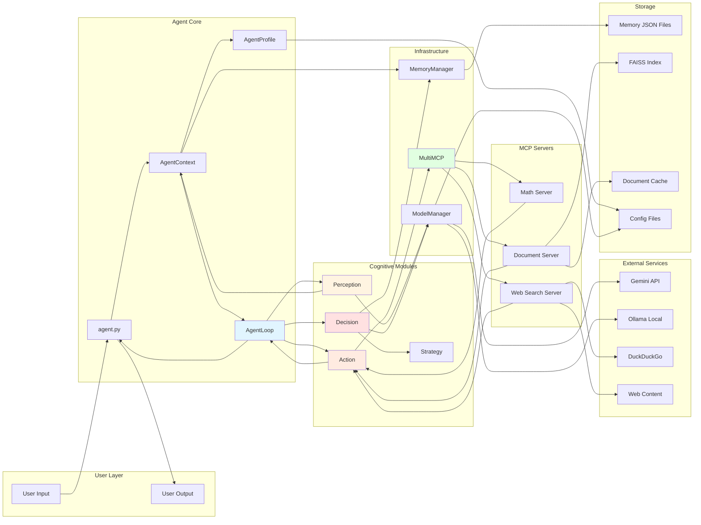

# Cortex-R Flow Diagrams - Part 2

## Document Processing Pipeline Flow

### 38. Document Processing & FAISS Indexing Flow

```mermaid
graph TD
    Start([Document Processing]) --> D1[mcp_server_2.py::process_documents]
    
    D1 --> D2[ROOT = Path(__file__).parent]
    D2 --> D3[DOC_PATH = ROOT/documents]
    D3 --> D4[INDEX_CACHE = ROOT/faiss_index]
    
    D4 --> D5[INDEX_CACHE.mkdir(exist_ok=True)]
    D5 --> D6[Define file paths]
    D6 --> D7[INDEX_FILE = index.bin]
    D7 --> D8[METADATA_FILE = metadata.json]
    D8 --> D9[CACHE_FILE = doc_index_cache.json]
    
    D9 --> D10{CACHE_FILE exists?}
    D10 -->|Yes| D11[Load CACHE_META]
    D10 -->|No| D12[CACHE_META = empty dict]
    
    D11 --> D13{METADATA_FILE exists?}
    D12 --> D13
    D13 -->|Yes| D14[Load metadata list]
    D13 -->|No| D15[metadata = empty list]
    
    D14 --> D16{INDEX_FILE exists?}
    D15 --> D16
    D16 -->|Yes| D17[faiss.read_index(INDEX_FILE)]
    D16 -->|No| D18[index = None]
    
    D17 --> D19[DOC_PATH.glob(*.*)]
    D18 --> D19
    D19 --> D20{For each file}
    
    D20 --> D21[file_hash(file)]
    D21 --> D22[hashlib.md5(file.read_bytes)]
    D22 --> D23[hexdigest()]
    
    D23 --> D24{file.name in CACHE_META?}
    D24 -->|Yes| D25{hash matches?}
    D24 -->|No| D26[Process file]
    D25 -->|Yes| D27[Skip file - unchanged]
    D25 -->|No| D26
    
    D27 --> D20
    
    D26 --> D28[ext = file.suffix.lower()]
    D28 --> D29{File type?}
    
    D29 -->|.pdf| D30[extract_pdf]
    D29 -->|.html/.htm/.url| D31[extract_webpage]
    D29 -->|other| D32[MarkItDown converter]
    
    D30 --> D33[pymupdf4llm.to_markdown]
    D33 --> D34[write_images=True]
    D34 --> D35[image_path=documents/images]
    D35 --> D36[Extract text + images]
    D36 --> D37[Fix image paths with regex]
    D37 --> D38[replace_images_with_captions]
    
    D31 --> D39[trafilatura.fetch_url]
    D39 --> D40[trafilatura.extract]
    D40 --> D41[include_tables=True]
    D41 --> D42[include_images=True]
    D42 --> D43[output_format=markdown]
    D43 --> D38
    
    D32 --> D44[converter.convert(file)]
    D44 --> D45[Extract text_content]
    D45 --> D46[Return markdown]
    
    D38 --> D47{For each image in markdown}
    D47 --> D48[caption_image(img_path)]
    
    D48 --> D49[Load image file]
    D49 --> D50[base64.b64encode(image)]
    D50 --> D51[requests.post to OLLAMA_URL]
    D51 --> D52[model: GEMMA_MODEL]
    D52 --> D53[prompt: Describe image]
    D53 --> D54[images: [encoded_image]]
    D54 --> D55[stream: True]
    
    D55 --> D56{For each line in stream}
    D56 --> D57[json.loads(line)]
    D57 --> D58[Extract result field]
    D58 --> D59[Append to caption_parts]
    D59 --> D60{done == True?}
    D60 -->|No| D56
    D60 -->|Yes| D61[Join caption_parts]
    
    D61 --> D62[Return caption]
    D62 --> D63[Replace image markdown with caption]
    D63 --> D47
    
    D47 --> D64[markdown content ready]
    D46 --> D64
    
    D64 --> D65{len(markdown.split()) < 10?}
    D65 -->|Yes| D66[chunks = [markdown]]
    D65 -->|No| D67[semantic_merge(markdown)]
    
    D67 --> D68[WORD_LIMIT = 512]
    D68 --> D69[words = text.split()]
    D69 --> D70[i = 0]
    D70 --> D71[final_chunks = empty list]
    
    D71 --> D72{i < len(words)?}
    D72 -->|No| D73[Return final_chunks]
    D72 -->|Yes| D74[chunk_words = words[i:i+WORD_LIMIT]]
    
    D74 --> D75[chunk_text = join(chunk_words)]
    D75 --> D76[Create LLM prompt]
    D76 --> D77[Ask: Multiple topics in chunk?]
    
    D77 --> D78[requests.post to OLLAMA_CHAT_URL]
    D78 --> D79[model: PHI_MODEL]
    D79 --> D80[messages: [user: prompt]]
    D80 --> D81[stream: False]
    
    D81 --> D82[Extract reply content]
    D82 --> D83{reply not empty?}
    D83 -->|No| D84[Single topic]
    D83 -->|Yes| D85[Multiple topics detected]
    
    D84 --> D86[Append chunk_text to final_chunks]
    D86 --> D87[i += WORD_LIMIT]
    D87 --> D72
    
    D85 --> D88[split_point = chunk_text.find(reply)]
    D88 --> D89{split_point found?}
    D89 -->|No| D86
    D89 -->|Yes| D90[first_part = chunk_text[:split_point]]
    
    D90 --> D91[second_part = reply]
    D91 --> D92[Append first_part to final_chunks]
    D92 --> D93[leftover_words = second_part.split()]
    D93 --> D94[words = leftover_words + words[i+WORD_LIMIT:]]
    D94 --> D95[i = 0]
    D95 --> D72
    
    D66 --> D96[Chunks ready]
    D73 --> D96
    
    D96 --> D97[embeddings_for_file = empty list]
    D97 --> D98[new_metadata = empty list]
    D98 --> D99{For each chunk in tqdm}
    
    D99 --> D100[get_embedding(chunk)]
    D100 --> D101[requests.post to EMBED_URL]
    D101 --> D102[model: EMBED_MODEL]
    D102 --> D103[prompt: chunk]
    D103 --> D104[Receive embedding vector]
    D104 --> D105[np.array(embedding, dtype=float32)]
    
    D105 --> D106[Append to embeddings_for_file]
    D106 --> D107[Create metadata dict]
    D107 --> D108[doc: file.name]
    D108 --> D109[chunk: chunk text]
    D109 --> D110[chunk_id: file.stem_i]
    D110 --> D111[Append to new_metadata]
    D111 --> D99
    
    D99 --> D112{embeddings_for_file not empty?}
    D112 -->|No| D20
    D112 -->|Yes| D113{index is None?}
    
    D113 -->|Yes| D114[dim = len(embeddings_for_file[0])]
    D114 --> D115[index = faiss.IndexFlatL2(dim)]
    D113 -->|No| D116[Use existing index]
    
    D115 --> D117[np.stack(embeddings_for_file)]
    D116 --> D117
    D117 --> D118[index.add(stacked_embeddings)]
    
    D118 --> D119[metadata.extend(new_metadata)]
    D119 --> D120[CACHE_META[file.name] = fhash]
    
    D120 --> D121[CACHE_FILE.write_text(json.dumps)]
    D121 --> D122[METADATA_FILE.write_text(json.dumps)]
    D122 --> D123[faiss.write_index(index, INDEX_FILE)]
    
    D123 --> D124[Log: Saved index and metadata]
    D124 --> D20
    
    D20 --> End([Processing Complete])
    
    style D67 fill:#e1f5ff
    style D100 fill:#fff4e1
    style D118 fill:#ffe1e1
    style D123 fill:#e1ffe1
```


---

### 39. Strategy Selection Flow

```mermaid
graph TD
    Start([Strategy Selection]) --> S1[core/strategy.py::decide_next_action]
    
    S1 --> S2[Extract context.agent_profile.strategy]
    S2 --> S3[planning_mode = strategy.planning_mode]
    S3 --> S4[exploration_mode = strategy.exploration_mode]
    S4 --> S5[memory_fallback_enabled = strategy.memory_fallback_enabled]
    S5 --> S6[max_steps = strategy.max_steps]
    S6 --> S7[max_lifelines_per_step = strategy.max_lifelines_per_step]
    
    S7 --> S8[select_decision_prompt_path]
    S8 --> S9{planning_mode?}
    
    S9 -->|conservative| S10[Return: decision_prompt_conservative.txt]
    S9 -->|exploratory| S11{exploration_mode?}
    
    S11 -->|parallel| S12[Return: decision_prompt_exploratory_parallel.txt]
    S11 -->|sequential| S13[Return: decision_prompt_exploratory_sequential.txt]
    S11 -->|None| S14[Fallback: conservative]
    
    S10 --> S15[prompt_path selected]
    S12 --> S15
    S13 --> S15
    S14 --> S15
    
    S15 --> S16[filter_tools_by_hint]
    S16 --> S17[Receive all_tools]
    S17 --> S18[Receive perception.tool_hint]
    
    S18 --> S19{tool_hint exists?}
    S19 -->|No| S20[Return all_tools]
    S19 -->|Yes| S21[hint_lower = hint.lower()]
    
    S21 --> S22{For each tool in all_tools}
    S22 --> S23[tool.name.lower()]
    S23 --> S24{hint_lower in tool_name?}
    S24 -->|Yes| S25[Add to filtered list]
    S24 -->|No| S22
    
    S22 --> S26{filtered list empty?}
    S26 -->|Yes| S20
    S26 -->|No| S27[Return filtered list]
    
    S20 --> S28[filtered_tools ready]
    S27 --> S28
    
    S28 --> S29[summarize_tools(filtered_tools)]
    S29 --> S30{For each tool}
    S30 --> S31[Format: - tool.name: tool.description]
    S31 --> S32[Append to list]
    S32 --> S30
    S30 --> S33[Join with newlines]
    S33 --> S34[filtered_summary ready]
    
    S34 --> S35{planning_mode?}
    
    S35 -->|conservative| S36[conservative_plan]
    S35 -->|exploratory| S37[exploratory_plan]
    
    S36 --> S38{force_replan?}
    S38 -->|Yes| S39[Use all_tools]
    S38 -->|No| S40{filtered_summary empty?}
    S40 -->|Yes| S39
    S40 -->|No| S41[Use filtered_summary]
    
    S39 --> S42[summarize_tools(all_tools)]
    S41 --> S43[tool_context ready]
    S42 --> S43
    
    S43 --> S44[generate_plan]
    S44 --> S45[Load prompt_path]
    S45 --> S46[Format with tool_context]
    S46 --> S47[ModelManager.generate_text]
    S47 --> S48[Return plan code]
    
    S37 --> S49{force_replan?}
    S49 -->|Yes| S50{memory_fallback_enabled?}
    S49 -->|No| S51{filtered_summary empty?}
    
    S50 -->|Yes| S52[find_recent_successful_tools]
    S50 -->|No| S53[Use all_tools]
    
    S52 --> S54[Initialize tool_successes = empty]
    S54 --> S55[reversed(memory_items)]
    S55 --> S56{For each item (newest first)}
    
    S56 --> S57{item.type == tool_output?}
    S57 -->|No| S56
    S57 -->|Yes| S58{item.success == True?}
    S58 -->|No| S56
    S58 -->|Yes| S59{item.tool_name exists?}
    S59 -->|No| S56
    S59 -->|Yes| S60{tool_name already in list?}
    S60 -->|Yes| S56
    S60 -->|No| S61[Append tool_name]
    
    S61 --> S62{len(tool_successes) >= limit?}
    S62 -->|Yes| S63[Break loop]
    S62 -->|No| S56
    
    S56 --> S64[Return tool_successes]
    S63 --> S64
    
    S64 --> S65{fallback_tools found?}
    S65 -->|Yes| S66[Filter all_tools by fallback_tools]
    S65 -->|No| S53
    
    S66 --> S67[summarize_tools(fallback_tools)]
    S67 --> S68[Use fallback_summary]
    
    S53 --> S69[summarize_tools(all_tools)]
    S51 -->|Yes| S69
    S51 -->|No| S70[Use filtered_summary]
    
    S68 --> S71[tool_context ready]
    S69 --> S71
    S70 --> S71
    
    S71 --> S44
    
    S48 --> End([Return Plan to AgentLoop])
    
    style S8 fill:#e1f5ff
    style S16 fill:#fff4e1
    style S52 fill:#ffe1e1
    style S44 fill:#e1ffe1
```

---

### 40. Web Search Flow (DuckDuckGo)

```mermaid
graph TD
    Start([Web Search Request]) --> W1[mcp_server_3.py::duckduckgo_search_results]
    
    W1 --> W2[Receive SearchInput]
    W2 --> W3[Extract query]
    W3 --> W4[Extract max_results: default=10]
    W4 --> W5[Receive Context object]
    
    W5 --> W6[DuckDuckGoSearcher.search]
    W6 --> W7[RateLimiter.acquire]
    
    W7 --> W8[Get current datetime.now()]
    W8 --> W9[Filter self.requests]
    W9 --> W10[Keep only requests < 1 minute old]
    
    W10 --> W11{len(requests) >= requests_per_minute?}
    W11 -->|No| W12[Append current timestamp]
    W11 -->|Yes| W13[Calculate wait_time]
    
    W13 --> W14[wait_time = 60 - (now - requests[0]).seconds]
    W14 --> W15{wait_time > 0?}
    W15 -->|Yes| W16[asyncio.sleep(wait_time)]
    W15 -->|No| W12
    W16 --> W12
    
    W12 --> W17[Create form data]
    W17 --> W18[data = {q: query, b: , kl: }]
    W18 --> W19[ctx.info: Searching DuckDuckGo]
    
    W19 --> W20[httpx.AsyncClient()]
    W20 --> W21[client.post]
    W21 --> W22[url: BASE_URL]
    W22 --> W23[data: form data]
    W23 --> W24[headers: User-Agent]
    W24 --> W25[timeout: 30.0]
    
    W25 --> W26{HTTP success?}
    W26 -->|No| W27[Catch HTTPError]
    W26 -->|Yes| W28[result.text]
    
    W27 --> W29[ctx.error: HTTP error]
    W29 --> W30[Return empty list]
    
    W28 --> W31[BeautifulSoup(result.text, html.parser)]
    W31 --> W32{soup exists?}
    W32 -->|No| W33[ctx.error: Parse failed]
    W32 -->|Yes| W34[soup.select(.result)]
    
    W33 --> W30
    
    W34 --> W35{For each result element}
    W35 --> W36[result.select_one(.result__title)]
    W36 --> W37{title_elem exists?}
    W37 -->|No| W35
    W37 -->|Yes| W38[title_elem.find(a)]
    
    W38 --> W39{link_elem exists?}
    W39 -->|No| W35
    W39 -->|Yes| W40[title = link_elem.get_text(strip=True)]
    
    W40 --> W41[link = link_elem.get(href, )]
    W41 --> W42{y.js in link?}
    W42 -->|Yes| W35
    W42 -->|No| W43{link starts with //duckduckgo.com/l/?uddg=?}
    
    W43 -->|Yes| W44[urllib.parse.unquote]
    W44 --> W45[Split by uddg=]
    W45 --> W46[Split by &]
    W46 --> W47[Extract actual URL]
    W43 -->|No| W48[Use link as-is]
    
    W47 --> W49[result.select_one(.result__snippet)]
    W48 --> W49
    W49 --> W50{snippet_elem exists?}
    W50 -->|Yes| W51[snippet = snippet_elem.get_text(strip=True)]
    W50 -->|No| W52[snippet = empty string]
    
    W51 --> W53[Create SearchResult]
    W52 --> W53
    W53 --> W54[title: title]
    W54 --> W55[link: link]
    W55 --> W56[snippet: snippet]
    W56 --> W57[position: len(results) + 1]
    
    W57 --> W58[Append to results list]
    W58 --> W59{len(results) >= max_results?}
    W59 -->|Yes| W60[Break loop]
    W59 -->|No| W35
    
    W35 --> W61[ctx.info: Found N results]
    W60 --> W61
    
    W61 --> W62[format_results_for_llm]
    W62 --> W63{results empty?}
    W63 -->|Yes| W64[Return: No results found message]
    W63 -->|No| W65[Initialize output list]
    
    W65 --> W66[Append: Found N search results]
    W66 --> W67{For each result}
    W67 --> W68[Append: position. title]
    W68 --> W69[Append:    URL: link]
    W69 --> W70[Append:    Summary: snippet]
    W70 --> W71[Append: empty line]
    W71 --> W67
    
    W67 --> W72[Join output with newlines]
    W72 --> W73[Return formatted string]
    
    W30 --> W74[PythonCodeOutput(result=...)]
    W64 --> W74
    W73 --> W74
    
    W74 --> End([Return to MCP Client])
    
    style W7 fill:#e1f5ff
    style W31 fill:#fff4e1
    style W62 fill:#ffe1e1
    style W74 fill:#e1ffe1
```


---

### 41. Configuration Loading Flow

```mermaid
graph TD
    Start([Application Start]) --> C1[agent.py::main]
    
    C1 --> C2[open(config/profiles.yaml, r)]
    C2 --> C3[yaml.safe_load(f)]
    C3 --> C4[profile dict loaded]
    
    C4 --> C5[profile.get(mcp_servers, [])]
    C5 --> C6[mcp_servers_list]
    C6 --> C7{For each server in list}
    C7 --> C8[Create dict: server[id]: server]
    C8 --> C9[Add to mcp_servers dict]
    C9 --> C7
    
    C7 --> C10[mcp_servers dict ready]
    
    C10 --> C11[MultiMCP.__init__]
    C11 --> C12[Receive server_configs list]
    C12 --> C13[self.server_configs = server_configs]
    C13 --> C14[self.tool_map = empty dict]
    C14 --> C15[self.server_tools = empty dict]
    
    C15 --> C16[MultiMCP.initialize]
    C16 --> C17{For each config in server_configs}
    
    C17 --> C18[Extract config[script]]
    C18 --> C19[Extract config[cwd]]
    C19 --> C20[StdioServerParameters]
    C20 --> C21[command: sys.executable]
    C21 --> C22[args: [script]]
    C22 --> C23[cwd: working directory]
    
    C23 --> C24[stdio_client(params)]
    C24 --> C25[Spawn subprocess]
    C25 --> C26[Create read/write streams]
    
    C26 --> C27[ClientSession(read, write)]
    C27 --> C28[session.initialize()]
    C28 --> C29[MCP handshake]
    
    C29 --> C30[session.list_tools()]
    C30 --> C31[Send list_tools request]
    C31 --> C32[MCP server processes]
    C32 --> C33[Receive tools.tools list]
    
    C33 --> C34{For each tool in tools.tools}
    C34 --> C35[tool.name]
    C35 --> C36[tool.description]
    C36 --> C37[tool.parameters]
    
    C37 --> C38[Create tool_map entry]
    C38 --> C39[tool_map[tool.name] = {config, tool}]
    
    C39 --> C40[server_key = config[id]]
    C40 --> C41{server_key in server_tools?}
    C41 -->|No| C42[server_tools[server_key] = empty list]
    C41 -->|Yes| C43[Get existing list]
    
    C42 --> C44[Append tool to server_tools[server_key]]
    C43 --> C44
    C44 --> C34
    
    C34 --> C45[Close session]
    C45 --> C46[Close subprocess]
    C46 --> C17
    
    C17 --> C47[All servers initialized]
    
    C47 --> C48[AgentContext.__init__]
    C48 --> C49[AgentProfile.__init__]
    
    C49 --> C50[open(config/profiles.yaml, r)]
    C50 --> C51[yaml.safe_load(f)]
    C51 --> C52[config dict loaded]
    
    C52 --> C53[self.name = config[agent][name]]
    C53 --> C54[self.id = config[agent][id]]
    C54 --> C55[self.description = config[agent][description]]
    
    C55 --> C56[StrategyProfile(**config[strategy])]
    C56 --> C57[Pydantic validation]
    C57 --> C58[self.strategy = StrategyProfile]
    
    C58 --> C59[self.memory_config = config[memory]]
    C59 --> C60[self.llm_config = config[llm]]
    C60 --> C61[self.persona = config[persona]]
    
    C61 --> C62[AgentProfile ready]
    
    C62 --> C63[ModelManager.__init__]
    C63 --> C64[MODELS_JSON.read_text()]
    C64 --> C65[json.loads(content)]
    C65 --> C66[self.config = models dict]
    
    C66 --> C67[PROFILE_YAML.read_text()]
    C67 --> C68[yaml.safe_load(content)]
    C68 --> C69[self.profile = profile dict]
    
    C69 --> C70[self.text_model_key = profile[llm][text_generation]]
    C70 --> C71[self.model_info = config[models][text_model_key]]
    C71 --> C72[self.model_type = model_info[type]]
    
    C72 --> C73{model_type?}
    C73 -->|gemini| C74[os.getenv(GEMINI_API_KEY)]
    C73 -->|ollama| C75[No initialization needed]
    
    C74 --> C76[genai.Client(api_key=api_key)]
    C76 --> C77[self.client = genai client]
    
    C75 --> C78[ModelManager ready]
    C77 --> C78
    
    C78 --> End([Configuration Complete])
    
    style C16 fill:#e1f5ff
    style C49 fill:#fff4e1
    style C63 fill:#ffe1e1
    style C78 fill:#e1ffe1
```

---

### 42. Error Handling and Retry Flow

```mermaid
graph TD
    Start([Error Occurs]) --> E1{Error Level?}
    
    E1 -->|Tool Execution| E2[MCP Tool Error]
    E1 -->|Sandbox Execution| E3[Sandbox Error]
    E1 -->|AgentLoop| E4[Loop Error]
    E1 -->|Perception/Decision| E5[Module Error]
    
    E2 --> E6[MultiMCP.call_tool]
    E6 --> E7{Error Type?}
    E7 -->|ValueError| E8[Tool not found]
    E7 -->|HTTPError| E9[Server communication error]
    E7 -->|TimeoutError| E10[Request timeout]
    E7 -->|Other| E11[Generic exception]
    
    E8 --> E12[Raise ValueError to caller]
    E9 --> E13[Log error to stderr]
    E10 --> E13
    E11 --> E13
    
    E13 --> E14[Return error message]
    E14 --> E15[Propagate to sandbox]
    
    E3 --> E16[run_python_sandbox]
    E16 --> E17{Error Type?}
    E17 -->|SyntaxError| E18[Code compilation failed]
    E17 -->|ValueError| E19[solve() not found]
    E17 -->|RuntimeError| E20[Max tool calls exceeded]
    E17 -->|Other| E21[Execution exception]
    
    E18 --> E22[Catch in except block]
    E19 --> E22
    E20 --> E22
    E21 --> E22
    
    E22 --> E23[log(sandbox, error message)]
    E23 --> E24[Format: [sandbox error: ...]]
    E24 --> E25[Return error string]
    
    E25 --> E26[AgentLoop receives result]
    E26 --> E27{result starts with [sandbox error:?}
    E27 -->|Yes| E28[Execution failed]
    E27 -->|No| E29[Success or further processing]
    
    E28 --> E30[context.update_subtask_status(failure)]
    E30 --> E31[MemoryManager.add_tool_output(success=False)]
    E31 --> E32[lifelines_left -= 1]
    
    E32 --> E33{lifelines_left >= 0?}
    E33 -->|Yes| E34[Retry: Continue loop]
    E33 -->|No| E35[Max retries exhausted]
    
    E34 --> E36[Log: Retrying with lifelines left]
    E36 --> E37[Return to Perception phase]
    
    E35 --> E38[Log: Max lifelines reached]
    E38 --> E39[Move to next step]
    E39 --> E40{step < max_steps?}
    E40 -->|Yes| E37
    E40 -->|No| E41[Return: Max steps reached]
    
    E4 --> E42[AgentLoop.run]
    E42 --> E43{step >= max_steps?}
    E43 -->|Yes| E44[Return: Max steps reached]
    E43 -->|No| E45{lifelines_left < 0?}
    E45 -->|Yes| E46[Move to next step]
    E45 -->|No| E47[Continue current step]
    
    E44 --> E48[context.final_answer = [Max steps reached]]
    E46 --> E49[step += 1]
    E49 --> E50[Reset lifelines_left]
    E50 --> E47
    
    E5 --> E51{Module?}
    E51 -->|Perception| E52[extract_perception error]
    E51 -->|Decision| E53[generate_plan error]
    
    E52 --> E54[Catch Exception]
    E54 --> E55[log(perception, error)]
    E55 --> E56[Create fallback PerceptionResult]
    E56 --> E57[intent = unknown]
    E57 --> E58[selected_servers = all servers]
    E58 --> E59[Return fallback result]
    
    E53 --> E60[Catch Exception]
    E60 --> E61[log(plan, error)]
    E61 --> E62[Return: FINAL_ANSWER: [unknown]]
    
    E59 --> E63[Continue execution with fallback]
    E62 --> E63
    
    E12 --> E64[Propagate to caller]
    E15 --> E64
    E25 --> E64
    E41 --> E64
    E48 --> E64
    E63 --> E64
    
    E64 --> End([Error Handled])
    
    style E16 fill:#e1f5ff
    style E26 fill:#fff4e1
    style E32 fill:#ffe1e1
    style E54 fill:#e1ffe1
```


---

### 43. Session Lifecycle Flow

```mermaid
graph TD
    Start([User Starts Agent]) --> L1[agent.py::main]
    
    L1 --> L2[Print: Cortex-R Agent Ready]
    L2 --> L3[current_session = None]
    
    L3 --> L4[Load config/profiles.yaml]
    L4 --> L5[Extract mcp_servers list]
    L5 --> L6[Create mcp_servers dict]
    
    L6 --> L7[MultiMCP(server_configs)]
    L7 --> L8[await multi_mcp.initialize()]
    L8 --> L9[Discover all tools from servers]
    
    L9 --> L10[Enter main while True loop]
    L10 --> L11[input: What do you want to solve?]
    
    L11 --> L12{User input?}
    L12 -->|exit| L13[Break loop]
    L12 -->|new| L14[current_session = None]
    L12 -->|query| L15[Process query]
    
    L14 --> L10
    
    L15 --> L16[Enter inner while True loop]
    L16 --> L17[AgentContext.__init__]
    
    L17 --> L18{current_session exists?}
    L18 -->|No| L19[Generate new session_id]
    L18 -->|Yes| L20[Use current_session]
    
    L19 --> L21[today = datetime.now()]
    L21 --> L22[ts = int(time.time())]
    L22 --> L23[uid = uuid.uuid4().hex[:6]]
    L23 --> L24[Format: YYYY/MM/DD/session-{ts}-{uid}]
    L24 --> L25[session_id created]
    
    L20 --> L26[session_id = current_session]
    L25 --> L26
    
    L26 --> L27[AgentProfile.__init__]
    L27 --> L28[Load agent configuration]
    
    L28 --> L29[MemoryManager.__init__]
    L29 --> L30[Parse session_id for path]
    L30 --> L31[memory_path = memory/YYYY/MM/DD/session-{id}.json]
    
    L31 --> L32[MemoryManager.load()]
    L32 --> L33{memory_path exists?}
    L33 -->|Yes| L34[Load existing session]
    L33 -->|No| L35[Initialize empty items list]
    
    L34 --> L36[json.load(memory_path)]
    L36 --> L37[Deserialize to MemoryItem objects]
    L37 --> L38[self.items = loaded items]
    
    L35 --> L39[self.items = empty list]
    
    L38 --> L40[MemoryManager.add: run_metadata]
    L39 --> L40
    
    L40 --> L41[Create MemoryItem]
    L41 --> L42[type: run_metadata]
    L42 --> L43[text: Started new session...]
    L43 --> L44[tags: [run_start]]
    L44 --> L45[metadata: {start_time, step}]
    
    L45 --> L46[Append to self.items]
    L46 --> L47[MemoryManager.save()]
    
    L47 --> L48[os.makedirs(dirname, exist_ok=True)]
    L48 --> L49[Create date hierarchy]
    L49 --> L50[open(memory_path, w)]
    L50 --> L51[Serialize items to dicts]
    L51 --> L52[json.dump(raw, f, indent=2)]
    L52 --> L53[Close file]
    
    L53 --> L54[Context ready]
    
    L54 --> L55[AgentLoop.__init__]
    L55 --> L56[await agent.run()]
    
    L56 --> L57[Execute perception-decision-action loop]
    L57 --> L58[Multiple steps with retries]
    
    L58 --> L59{Result type?}
    L59 -->|FINAL_ANSWER| L60[Extract answer]
    L59 -->|FURTHER_PROCESSING_REQUIRED| L61[Extract content]
    L59 -->|Error| L62[Max steps/lifelines reached]
    
    L60 --> L63[MemoryManager.add_tool_output]
    L63 --> L64[success = True]
    L64 --> L65[MemoryManager.save()]
    
    L61 --> L66[Update user_input_override]
    L66 --> L67[Continue inner loop]
    L67 --> L16
    
    L62 --> L68[MemoryManager.add_tool_output]
    L68 --> L69[success = False]
    L69 --> L65
    
    L65 --> L70[Return result dict]
    
    L70 --> L71[agent.py: Parse result]
    L71 --> L72{Contains FINAL_ANSWER:?}
    L72 -->|Yes| L73[Split and extract]
    L72 -->|No| L74{Contains FURTHER_PROCESSING_REQUIRED:?}
    
    L73 --> L75[print: Final Answer]
    L75 --> L76[Break inner loop]
    
    L74 -->|Yes| L77[Extract content]
    L74 -->|No| L78[print: Raw result]
    
    L77 --> L79[user_input = content]
    L79 --> L80[print: Further Processing Required]
    L80 --> L67
    
    L78 --> L76
    
    L76 --> L81{current_session was None?}
    L81 -->|Yes| L82[current_session = context.session_id]
    L81 -->|No| L83[Keep current_session]
    
    L82 --> L84[Session established]
    L83 --> L84
    
    L84 --> L10
    
    L13 --> L85[Exit main loop]
    L85 --> L86[Cleanup]
    L86 --> L87[Close MCP connections]
    L87 --> End([Application Exit])
    
    L10 -.->|KeyboardInterrupt| L88[Catch Ctrl+C]
    L88 --> L89[print: Shutting down...]
    L89 --> L87
    
    style L17 fill:#e1f5ff
    style L29 fill:#fff4e1
    style L56 fill:#ffe1e1
    style L65 fill:#e1ffe1
```

---

### 44. Complete Data Flow Diagram



---

## Summary of Flow Diagrams

### Diagram Index:

1. **Complete End-to-End Flow (Diagram 32)** - Full system execution from user input to output
2. **Perception Module Flow (Diagram 33)** - Query analysis and server selection
3. **Decision Module Flow (Diagram 34)** - Code generation and plan creation
4. **Action Module Flow (Diagram 35)** - Sandbox execution and tool calling
5. **Memory Management Flow (Diagram 36)** - Session persistence operations
6. **MCP Server Tool Execution (Diagram 37)** - Tool routing and execution
7. **Document Processing Pipeline (Diagram 38)** - FAISS indexing and semantic chunking
8. **Strategy Selection Flow (Diagram 39)** - Planning mode and tool filtering
9. **Web Search Flow (Diagram 40)** - DuckDuckGo search and rate limiting
10. **Configuration Loading (Diagram 41)** - Startup and initialization
11. **Error Handling Flow (Diagram 42)** - Multi-level error recovery
12. **Session Lifecycle (Diagram 43)** - Complete session management
13. **Data Flow Diagram (Diagram 44)** - System-wide data movement

### Key Insights from Diagrams:

**Execution Patterns:**
- Perception → Decision → Action loop with retry logic
- Multi-level error handling with graceful degradation
- Stateless MCP connections with subprocess isolation
- Memory-based adaptive strategy selection

**Data Flow:**
- User input → Context → Modules → MCP Servers → External Services
- Results flow back through same path with transformations
- Memory persists at each significant operation
- Configuration loaded once at startup

**Critical Paths:**
- Tool call: Sandbox → MultiMCP → Subprocess → MCP Server → Tool Function
- Document processing: Extract → Chunk → Embed → Index → Search
- Error recovery: Detect → Log → Retry → Fallback → Continue

**Performance Bottlenecks:**
- Subprocess spawning per tool call (~100ms overhead)
- LLM API calls (variable latency)
- Document embedding generation (batch processing)
- FAISS index updates (I/O bound)

