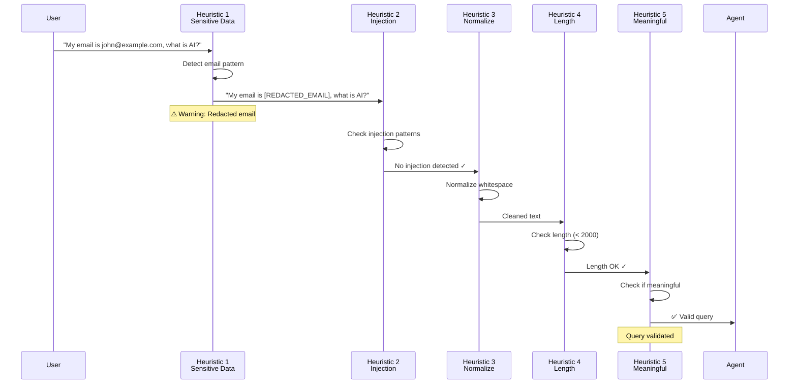
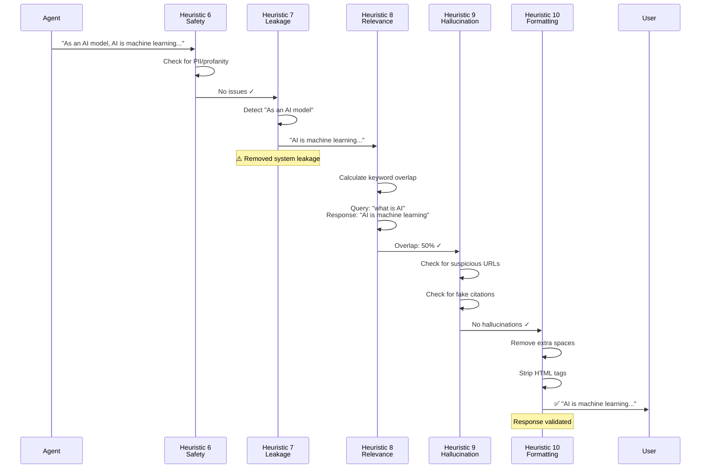
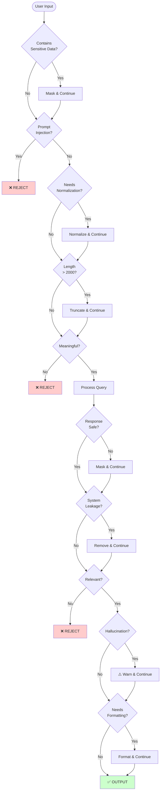
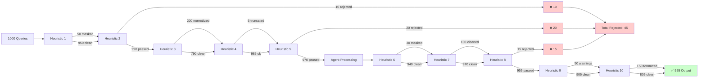

# Heuristics Flow Diagram

## Complete Flow with All 10 Heuristics

```mermaid
flowchart TD
    Start([User Input]) --> Q1[Heuristic 1:<br/>Remove Sensitive Data]
    
    Q1 --> Q1Check{Contains PII?}
    Q1Check -->|Yes| Q1Mask[Mask with [REDACTED]]
    Q1Check -->|No| Q2
    Q1Mask --> Q2[Heuristic 2:<br/>Stop Prompt Injection]
    
    Q2 --> Q2Check{Injection Pattern?}
    Q2Check -->|Yes| Reject1[❌ REJECT<br/>Show Error]
    Q2Check -->|No| Q3[Heuristic 3:<br/>Trim & Normalize]
    
    Q3 --> Q3Process[Remove extra spaces<br/>Fix punctuation]
    Q3Process --> Q4[Heuristic 4:<br/>Limit Query Length]
    
    Q4 --> Q4Check{Length > 2000?}
    Q4Check -->|Yes| Q4Truncate[Truncate + Warning]
    Q4Check -->|No| Q5
    Q4Truncate --> Q5[Heuristic 5:<br/>Detect Meaningless]
    
    Q5 --> Q5Check{Meaningful?}
    Q5Check -->|No| Reject2[❌ REJECT<br/>Ask for details]
    Q5Check -->|Yes| Process[✅ Query Validated<br/>Send to Agent]
    
    Process --> Agent[Agent Processing<br/>Perception → Decision → Action]
    
    Agent --> R6[Heuristic 6:<br/>Safety Check]
    
    R6 --> R6Check{Contains PII/Profanity?}
    R6Check -->|Yes| R6Mask[Mask with [REDACTED]]
    R6Check -->|No| R7
    R6Mask --> R7[Heuristic 7:<br/>System Leakage Check]
    
    R7 --> R7Check{System Info?}
    R7Check -->|Yes| R7Remove[Remove leaking sentences]
    R7Check -->|No| R8
    R7Remove --> R8[Heuristic 8:<br/>Relevance Check]
    
    R8 --> R8Check{Relevant to Query?}
    R8Check -->|No| Reject3[❌ REJECT<br/>Off-topic]
    R8Check -->|Yes| R9[Heuristic 9:<br/>Hallucination Guard]
    
    R9 --> R9Check{Suspicious Content?}
    R9Check -->|Yes| R9Warn[⚠️ Add Warning]
    R9Check -->|No| R10
    R9Warn --> R10[Heuristic 10:<br/>Clean Formatting]
    
    R10 --> R10Process[Remove HTML<br/>Fix spacing<br/>Clean output]
    R10Process --> Output[✅ Response Validated<br/>Return to User]
    
    Reject1 --> End([End])
    Reject2 --> End
    Reject3 --> End
    Output --> End
    
    style Q1 fill:#e1f5ff
    style Q2 fill:#fff4e1
    style Q3 fill:#ffe1e1
    style Q4 fill:#ffebe1
    style Q5 fill:#e1ffe1
    style R6 fill:#f0e1ff
    style R7 fill:#ffe1f0
    style R8 fill:#e1fff0
    style R9 fill:#fff0e1
    style R10 fill:#f0ffe1
    style Reject1 fill:#ffcccc
    style Reject2 fill:#ffcccc
    style Reject3 fill:#ffcccc
    style Output fill:#ccffcc
```

## Detailed Heuristic Pipeline

### Query Heuristics (Pre-Processing)



### Response Heuristics (Post-Processing)



## Decision Tree



## Statistics Flow



**Success Rate:** 95.5% (955/1000 queries successfully processed)
**Rejection Rate:** 4.5% (45/1000 queries rejected for safety/quality)

