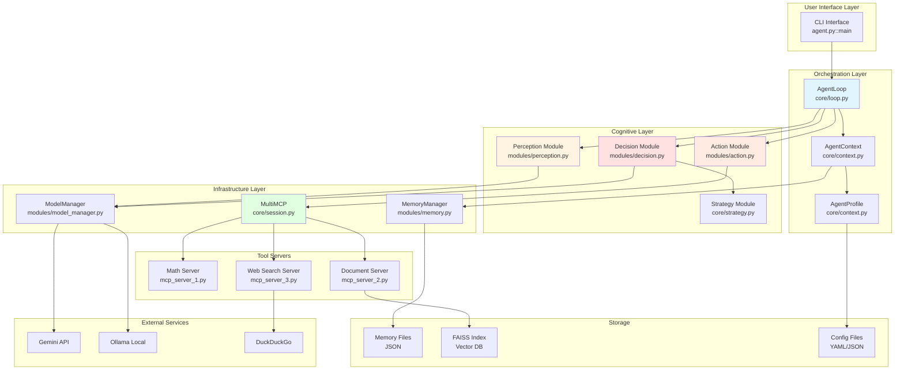
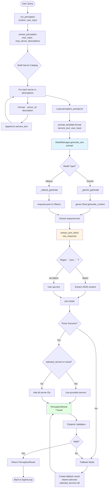

# Cortex-R Visual Flowcharts - Complete Function-Level Documentation

## Table of Contents

1. [High-Level System Overview](#1-high-level-system-overview)
2. [Complete End-to-End Flow](#2-complete-end-to-end-flow)
3. [Perception Module Flow](#3-perception-module-flow)
4. [Decision Module Flow](#4-decision-module-flow)
5. [Action Module (Sandbox) Flow](#5-action-module-sandbox-flow)
6. [Memory Management Flow](#6-memory-management-flow)
7. [MCP Server Tool Execution](#7-mcp-server-tool-execution)
8. [Document Processing Pipeline](#8-document-processing-pipeline)
9. [Strategy Selection Flow](#9-strategy-selection-flow)
10. [Web Search Flow](#10-web-search-flow)
11. [Configuration Loading](#11-configuration-loading)
12. [Error Handling & Retry](#12-error-handling--retry)
13. [Session Lifecycle](#13-session-lifecycle)
14. [Data Flow Overview](#14-data-flow-overview)

---

## 1. High-Level System Overview

### System Architecture Layers




---

## 2. Complete End-to-End Flow

### User Query: "Find ASCII values of INDIA and sum exponentials"

```mermaid
sequenceDiagram
    participant User
    participant Agent as agent.py::main
    participant Context as AgentContext
    participant Loop as AgentLoop
    participant Perc as Perception
    participant Dec as Decision
    participant Act as Action/Sandbox
    participant MCP as MultiMCP
    participant Server as MCP Server
    participant Mem as MemoryManager
    
    User->>Agent: "Find ASCII of INDIA..."
    Agent->>Context: __init__(user_input, session_id)
    Context->>Context: Generate session_id
    Context->>Mem: __init__(session_id)
    Mem->>Mem: load() existing session
    Context->>Mem: add(run_metadata)
    Mem->>Mem: save() to JSON
    
    Agent->>Loop: __init__(context)
    Agent->>Loop: run()
    
    loop For each step (max 3)
        loop While lifelines_left >= 0
            Loop->>Perc: run_perception(context)
            Perc->>Perc: extract_perception()
            Perc->>Perc: Load perception_prompt.txt
            Perc->>Perc: Format prompt
            Perc->>Perc: ModelManager.generate_text()
            Perc->>Perc: Parse JSON response
            Perc-->>Loop: PerceptionResult(selected_servers=["math"])
            
            Loop->>MCP: get_tools_from_servers(["math"])
            MCP-->>Loop: [add, subtract, strings_to_chars_to_int, ...]
            
            Loop->>Dec: generate_plan()
            Dec->>Dec: Load decision_prompt_conservative.txt
            Dec->>Dec: Format with tools + user_input
            Dec->>Dec: ModelManager.generate_text()
            Dec->>Dec: Validate solve() function
            Dec-->>Loop: solve() code string
            
            Loop->>Act: run_python_sandbox(code, dispatcher)
            Act->>Act: Create sandbox module
            Act->>Act: Inject SandboxMCP wrapper
            Act->>Act: exec(code) in sandbox
            Act->>Act: Extract solve() function
            Act->>Act: await solve()
            
            Note over Act: solve() executes:
            Act->>MCP: call_tool('strings_to_chars_to_int', {"string": "INDIA"})
            MCP->>MCP: Lookup tool in tool_map
            MCP->>Server: Spawn subprocess
            MCP->>Server: call_tool via stdio
            Server->>Server: Execute tool function
            Server-->>MCP: {"result": [73, 78, 68, 73, 65]}
            MCP-->>Act: CallToolResult
            
            Act->>MCP: call_tool('int_list_to_exponential_sum', {"numbers": [...]})
            MCP->>Server: Spawn subprocess
            Server->>Server: Execute tool function
            Server-->>MCP: {"result": 1.0978e+33}
            MCP-->>Act: CallToolResult
            
            Act->>Act: Return "FINAL_ANSWER: 1.0978e+33"
            Act-->>Loop: result string
            
            alt Result is FINAL_ANSWER
                Loop->>Mem: add_tool_output(success=True)
                Mem->>Mem: save() to JSON
                Loop-->>Agent: {"status": "done", "result": "FINAL_ANSWER: ..."}
            else Result is FURTHER_PROCESSING_REQUIRED
                Loop->>Loop: Update user_input_override
                Loop->>Loop: Continue to next iteration
            else Result is error
                Loop->>Mem: add_tool_output(success=False)
                Loop->>Loop: lifelines_left -= 1
                Loop->>Loop: Retry
            end
        end
    end
    
    Agent->>Agent: Parse result
    Agent->>User: "💡 Final Answer: 1.0978e+33"
```


---

## 3. Perception Module Flow

### Function: extract_perception() - Query Analysis



### Perception Output Structure

```
PerceptionResult {
    intent: "convert_and_calculate"
    entities: ["INDIA", "ASCII", "exponentials"]
    tool_hint: "strings_to_chars_to_int"
    tags: ["math", "string_processing"]
    selected_servers: ["math"]
}
```


---

## 4. Decision Module Flow

### Function: generate_plan() - Code Generation

```mermaid
flowchart TD
    Start([Decision Phase]) --> A[generate_plan<br/>user_input, perception, memory_items,<br/>tool_descriptions, prompt_path]
    
    A --> B{Memory Items Empty?}
    B -->|Yes| C[memory_texts = None]
    B -->|No| D[Format Memory Items]
    
    D --> E[For each item in memory_items]
    E --> F[Extract item.text]
    F --> G[Format: - text]
    G --> H[Join with newlines]
    
    C --> I[load_prompt<br/>prompt_path]
    H --> I
    
    I --> J[Open prompt file]
    J --> K[Read template content]
    K --> L[prompt_template.format<br/>tool_descriptions, user_input]
    
    L --> M[ModelManager.generate_text<br/>formatted_prompt]
    
    M --> N{Model Backend?}
    N -->|Gemini| O[_gemini_generate]
    N -->|Ollama| P[_ollama_generate]
    
    O --> Q[API call to Gemini]
    P --> R[HTTP POST to Ollama]
    
    Q --> S[Receive raw response]
    R --> S
    
    S --> T[Strip whitespace]
    T --> U{Starts with ```?}
    U -->|Yes| V[Strip backticks]
    U -->|No| W[Keep as-is]
    
    V --> X{Starts with python?}
    X -->|Yes| Y[Remove python keyword]
    X -->|No| Z[Keep stripped]
    
    W --> AA[Validate Code]
    Y --> AA
    Z --> AA
    
    AA --> AB[re.search<br/>r'^\s*async\s+def\s+solve\s*\(']
    AB --> AC{Pattern Found?}
    AC -->|Yes| AD[Valid solve function]
    AC -->|No| AE[Invalid plan]
    
    AD --> AF[Return code string]
    AE --> AG[Return FINAL_ANSWER: error]
    
    AF --> End1([Back to AgentLoop])
    AG --> End1
    
    M -.Exception.-> AH[Catch Exception]
    AH --> AI[Log error]
    AI --> AJ[Return FINAL_ANSWER: unknown]
    AJ --> End1
    
    style M fill:#e1f5ff
    style AA fill:#fff4e1
    style AF fill:#e1ffe1
```

### Generated Code Example

```python
import json
async def solve():
    # FUNCTION_CALL: 1
    """Convert characters to ASCII values. 
    Usage: input={"input": {"string": "INDIA"}}"""
    input = {"input": {"string": "INDIA"}}
    result = await mcp.call_tool('strings_to_chars_to_int', input)
    numbers = json.loads(result.content[0].text)["result"]
    
    # FUNCTION_CALL: 2
    """Sum exponentials of int list. 
    Usage: input={"input": {"numbers": [65, 66, 67]}}"""
    input = {"input": {"numbers": numbers}}
    result = await mcp.call_tool('int_list_to_exponential_sum', input)
    final_result = json.loads(result.content[0].text)["result"]
    
    return f"FINAL_ANSWER: {final_result}"
```


---

## 5. Action Module (Sandbox) Flow

### Function: run_python_sandbox() - Safe Code Execution

```mermaid
flowchart TD
    Start([Execute Plan]) --> A[run_python_sandbox<br/>code, dispatcher]
    
    A --> B[types.ModuleType<br/>sandbox]
    B --> C[Create isolated namespace]
    
    C --> D[Define SandboxMCP Class]
    D --> E[__init__: store dispatcher<br/>call_count = 0]
    
    E --> F[async def call_tool<br/>tool_name, input_dict]
    F --> G[Increment call_count]
    G --> H{call_count > MAX?}
    H -->|Yes| I[Raise RuntimeError<br/>Max tool calls exceeded]
    H -->|No| J[await dispatcher.call_tool<br/>tool_name, input_dict]
    
    J --> K[MultiMCP.call_tool]
    K --> L[Lookup tool in tool_map]
    L --> M{Tool Found?}
    M -->|No| N[Raise ValueError]
    M -->|Yes| O[Get server config]
    
    O --> P[StdioServerParameters<br/>command, args, cwd]
    P --> Q[stdio_client: spawn subprocess]
    Q --> R[ClientSession.initialize]
    R --> S[session.call_tool<br/>tool_name, arguments]
    
    S --> T[MCP Server Processes]
    T --> U[Return CallToolResult]
    U --> V[Close subprocess]
    V --> W[Return to sandbox]
    
    D --> X[sandbox.mcp = SandboxMCP<br/>dispatcher]
    X --> Y[Import safe modules:<br/>json, re]
    Y --> Z[sandbox.__dict__[json] = json<br/>sandbox.__dict__[re] = re]
    
    Z --> AA[compile<br/>code, '<solve_plan>', 'exec']
    AA --> AB[exec<br/>compiled, sandbox.__dict__]
    
    AB --> AC{Compilation Success?}
    AC -->|No| AD[Raise SyntaxError]
    AC -->|Yes| AE[Code executed in sandbox]
    
    AE --> AF[sandbox.__dict__.get<br/>solve]
    AF --> AG{solve exists?}
    AG -->|No| AH[Raise ValueError]
    AG -->|Yes| AI[Extract solve_fn]
    
    AI --> AJ[asyncio.iscoroutinefunction<br/>solve_fn]
    AJ --> AK{Is Async?}
    AK -->|Yes| AL[await solve_fn]
    AK -->|No| AM[solve_fn]
    
    AL --> AN[Execute solve function]
    AM --> AN
    
    AN --> AO{Tool Calls in solve?}
    AO -->|Yes| F
    AO -->|No| AP[Receive return value]
    
    AP --> AQ{Result Type?}
    AQ -->|dict with result| AR[Extract result[result]]
    AQ -->|dict| AS[json.dumps result]
    AQ -->|list| AT[Join with spaces]
    AQ -->|other| AU[str result]
    
    AR --> AV[Format as string]
    AS --> AV
    AT --> AV
    AU --> AV
    
    AV --> AW[Return formatted result]
    
    AD --> AX[Catch Exception]
    AH --> AX
    I --> AX
    N --> AX
    
    AX --> AY[Log error]
    AY --> AZ[Format: [sandbox error: ...]]
    AZ --> BA[Return error string]
    
    AW --> End1([Back to AgentLoop])
    BA --> End1
    
    style B fill:#e1f5ff
    style K fill:#fff4e1
    style AN fill:#ffe1e1
    style AV fill:#e1ffe1
```

### Sandbox Security Features

```
✓ Isolated Module Namespace
✓ No File System Access (except via MCP)
✓ No Network Access (except via MCP)
✓ Limited Built-ins (json, re only)
✓ Tool Call Limit (MAX_TOOL_CALLS_PER_PLAN = 5)
✓ Exception Containment
✓ Fresh Environment Per Execution
```


---

## 6. Memory Management Flow

### MemoryManager Operations

```mermaid
flowchart TD
    Start([Memory Operation]) --> A{Operation?}
    
    A -->|Initialize| B[__init__<br/>session_id, memory_dir]
    A -->|Add| C[add<br/>MemoryItem]
    A -->|Load| D[load]
    A -->|Save| E[save]
    A -->|Find Success| F[find_recent_successes<br/>limit]
    
    B --> B1[Parse session_id]
    B1 --> B2[Split by '-']
    B2 --> B3[Extract: YYYY/MM/DD]
    B3 --> B4[memory_path =<br/>memory/YYYY/MM/DD/session-{id}.json]
    B4 --> B5[items = empty list]
    B5 --> B6{memory_dir exists?}
    B6 -->|No| B7[os.makedirs]
    B6 -->|Yes| B8[Continue]
    B7 --> B8
    B8 --> D
    
    C --> C1[self.items.append<br/>item]
    C1 --> E
    
    D --> D1{memory_path exists?}
    D1 -->|No| D2[self.items = empty list]
    D1 -->|Yes| D3[open memory_path, 'r']
    D3 --> D4[json.load f]
    D4 --> D5[For each dict in raw]
    D5 --> D6[MemoryItem **item]
    D6 --> D7[Pydantic validation]
    D7 --> D8[Append to items]
    D8 --> D5
    D5 --> D9[self.items = items list]
    D2 --> D10[Return]
    D9 --> D10
    
    E --> E1[os.path.dirname<br/>memory_path]
    E1 --> E2[os.makedirs<br/>dir, exist_ok=True]
    E2 --> E3[Create date hierarchy]
    E3 --> E4[open memory_path, 'w']
    E4 --> E5[For each item in self.items]
    E5 --> E6[item.dict]
    E6 --> E7[Convert to dict]
    E7 --> E8[Append to raw list]
    E8 --> E5
    E5 --> E9[json.dump<br/>raw, f, indent=2]
    E9 --> E10[Close file]
    E10 --> E11[Return]
    
    F --> F1[tool_successes = empty list]
    F1 --> F2[reversed self.items]
    F2 --> F3[For each item newest first]
    F3 --> F4{type == tool_output?}
    F4 -->|No| F3
    F4 -->|Yes| F5{success == True?}
    F5 -->|No| F3
    F5 -->|Yes| F6{tool_name exists?}
    F6 -->|No| F3
    F6 -->|Yes| F7{Already in list?}
    F7 -->|Yes| F3
    F7 -->|No| F8[Append tool_name]
    F8 --> F9{len >= limit?}
    F9 -->|Yes| F10[Break loop]
    F9 -->|No| F3
    F3 --> F11[Return tool_successes]
    F10 --> F11
    
    D10 --> End([Return])
    E11 --> End
    F11 --> End
    
    style B fill:#e1f5ff
    style D fill:#fff4e1
    style E fill:#ffe1e1
    style F fill:#e1ffe1
```

### Memory File Structure

```
memory/
├── 2025/
│   ├── 01/
│   │   ├── 15/
│   │   │   ├── session-2025-01-15-1736950000-abc123.json
│   │   │   └── session-2025-01-15-1736950100-def456.json
│   │   └── 16/
│   │       └── session-2025-01-16-1737036400-ghi789.json
```

### MemoryItem Schema

```json
{
  "timestamp": 1736950000.0,
  "type": "tool_output",
  "text": "Output of solve_sandbox: {...}",
  "tool_name": "solve_sandbox",
  "tool_args": {"plan": "async def solve(): ..."},
  "tool_result": {"result": "FINAL_ANSWER: 1.0978e+33"},
  "success": true,
  "tags": ["sandbox"],
  "metadata": {"step": 1}
}
```


---

## 7. MCP Server Tool Execution

### MultiMCP Tool Routing and Execution

```mermaid
flowchart TD
    Start([Tool Call Request]) --> A[MultiMCP.call_tool<br/>tool_name, arguments]
    
    A --> B[self.tool_map.get<br/>tool_name]
    B --> C{Tool Exists?}
    C -->|No| D[Raise ValueError:<br/>Tool not found]
    C -->|Yes| E[entry = tool_map[tool_name]]
    
    E --> F[config = entry[config]]
    F --> G[Extract script path]
    G --> H[Extract working directory]
    
    H --> I[StdioServerParameters<br/>command=sys.executable<br/>args=[script]<br/>cwd=working_dir]
    
    I --> J[stdio_client params]
    J --> K[Spawn subprocess]
    K --> L[Create stdin/stdout pipes]
    L --> M[async with read, write]
    
    M --> N[ClientSession<br/>read, write]
    N --> O[async with session]
    
    O --> P[session.initialize]
    P --> Q[Send MCP initialize request]
    Q --> R[Receive server capabilities]
    R --> S[Complete handshake]
    
    S --> T[session.call_tool<br/>tool_name, arguments]
    T --> U[Serialize to JSON-RPC]
    U --> V[Write to subprocess stdin]
    
    V --> W[MCP SERVER PROCESSING]
    
    W --> X{Server Type?}
    X -->|mcp_server_1| Y[Math/String Tools]
    X -->|mcp_server_2| Z[Document/RAG Tools]
    X -->|mcp_server_3| AA[Web Search Tools]
    
    Y --> AB[FastMCP.tool decorator]
    Z --> AB
    AA --> AB
    
    AB --> AC[Route to tool function]
    AC --> AD{Tool Name?}
    
    AD -->|add| AE[add input: AddInput]
    AD -->|search_stored_documents| AF[search_stored_documents input]
    AD -->|duckduckgo_search_results| AG[duckduckgo_search_results input]
    
    AE --> AH[Pydantic validation]
    AF --> AH
    AG --> AH
    
    AH --> AI{Validation Success?}
    AI -->|No| AJ[Return validation error]
    AI -->|Yes| AK[Execute tool logic]
    
    AK --> AL{Tool Type?}
    AL -->|Math| AM[Perform calculation<br/>result = a + b]
    AL -->|Document| AN[FAISS similarity search]
    AL -->|Web| AO[HTTP request to DuckDuckGo]
    
    AN --> AP[faiss.read_index]
    AP --> AQ[Load metadata.json]
    AQ --> AR[get_embedding query]
    AR --> AS[requests.post to Ollama]
    AS --> AT[Receive embedding vector]
    AT --> AU[index.search query_vec, k=5]
    AU --> AV[Get top-5 indices]
    AV --> AW[Format results with sources]
    
    AO --> AX[BeautifulSoup html]
    AX --> AY[soup.select .result]
    AY --> AZ[Extract title, link, snippet]
    AZ --> BA[format_results_for_llm]
    
    AM --> BB[Create output model]
    AW --> BB
    BA --> BB
    
    BB --> BC[Serialize to dict]
    BC --> BD[Wrap in result field]
    BD --> BE[Create CallToolResult]
    BE --> BF[content = [TextContent]]
    BF --> BG[text = json.dumps result]
    
    AJ --> BH[Create error response]
    
    BG --> BI[Write to subprocess stdout]
    BH --> BI
    
    BI --> BJ[Read from subprocess stdout]
    BJ --> BK[Deserialize JSON-RPC]
    BK --> BL[Extract CallToolResult]
    
    BL --> BM[Exit session context]
    BM --> BN[Close subprocess]
    BN --> BO[Exit stdio_client context]
    
    BO --> BP[Return CallToolResult]
    
    D --> End([Return to Sandbox])
    BP --> End
    
    style W fill:#e1f5ff
    style AN fill:#fff4e1
    style AO fill:#ffe1e1
    style BP fill:#e1ffe1
```

### Tool Call Lifecycle

```
1. Sandbox calls: mcp.call_tool('add', {"input": {"a": 1, "b": 2}})
2. SandboxMCP wrapper intercepts
3. MultiMCP.call_tool() routes to correct server
4. Subprocess spawned for mcp_server_1.py
5. MCP handshake via stdio
6. Tool function executed: add(AddInput(a=1, b=2))
7. Result: AddOutput(result=3)
8. Serialized: {"result": 3}
9. Wrapped: CallToolResult(content=[TextContent(text='{"result": 3}')])
10. Returned to sandbox
11. Subprocess terminated
```


---

## 8. Document Processing Pipeline

### FAISS Indexing with Semantic Chunking

```mermaid
flowchart TD
    Start([Document Processing]) --> A[process_documents]
    
    A --> B[DOC_PATH.glob *.*]
    B --> C[For each file]
    
    C --> D[file_hash file<br/>hashlib.md5]
    D --> E{File in cache?}
    E -->|Yes & unchanged| F[Skip file]
    E -->|No or changed| G[Process file]
    
    F --> C
    
    G --> H{File Extension?}
    H -->|.pdf| I[extract_pdf]
    H -->|.html/.url| J[extract_webpage]
    H -->|other| K[MarkItDown converter]
    
    I --> L[pymupdf4llm.to_markdown<br/>write_images=True]
    L --> M[Extract text + images]
    M --> N[Fix image paths]
    N --> O[replace_images_with_captions]
    
    J --> P[trafilatura.fetch_url]
    P --> Q[trafilatura.extract<br/>output_format=markdown]
    Q --> O
    
    K --> R[converter.convert file]
    R --> S[Extract text_content]
    
    O --> T{For each image}
    T --> U[caption_image img_path]
    U --> V[Load image file]
    V --> W[base64.b64encode]
    W --> X[requests.post to Ollama<br/>model: GEMMA_MODEL<br/>stream: True]
    X --> Y[Accumulate caption parts]
    Y --> Z[Return caption]
    Z --> AA[Replace image with caption]
    AA --> T
    
    T --> AB[Markdown ready]
    S --> AB
    
    AB --> AC{len words < 10?}
    AC -->|Yes| AD[chunks = [markdown]]
    AC -->|No| AE[semantic_merge markdown]
    
    AE --> AF[WORD_LIMIT = 512]
    AF --> AG[words = text.split]
    AG --> AH[i = 0, final_chunks = []]
    
    AH --> AI{i < len words?}
    AI -->|No| AJ[Return final_chunks]
    AI -->|Yes| AK[chunk_words = words[i:i+512]]
    
    AK --> AL[chunk_text = join chunk_words]
    AL --> AM[Create LLM prompt:<br/>Multiple topics?]
    AM --> AN[requests.post to Ollama<br/>model: PHI_MODEL]
    AN --> AO[Extract reply]
    
    AO --> AP{Reply not empty?}
    AP -->|No| AQ[Single topic]
    AP -->|Yes| AR[Multiple topics detected]
    
    AQ --> AS[Append chunk_text]
    AS --> AT[i += 512]
    AT --> AI
    
    AR --> AU[split_point = find reply]
    AU --> AV{Split point found?}
    AV -->|No| AS
    AV -->|Yes| AW[first_part = chunk[:split]]
    AW --> AX[second_part = reply]
    AX --> AY[Append first_part]
    AY --> AZ[leftover_words = second_part.split]
    AZ --> BA[words = leftover + remaining]
    BA --> BB[i = 0]
    BB --> AI
    
    AD --> BC[Chunks ready]
    AJ --> BC
    
    BC --> BD[For each chunk]
    BD --> BE[get_embedding chunk]
    BE --> BF[requests.post to Ollama<br/>model: EMBED_MODEL]
    BF --> BG[Receive embedding vector]
    BG --> BH[np.array dtype=float32]
    BH --> BI[Append to embeddings_for_file]
    BI --> BJ[Create metadata:<br/>doc, chunk, chunk_id]
    BJ --> BD
    
    BD --> BK{embeddings not empty?}
    BK -->|No| C
    BK -->|Yes| BL{index is None?}
    
    BL -->|Yes| BM[dim = len embeddings[0]]
    BM --> BN[index = faiss.IndexFlatL2 dim]
    BL -->|No| BO[Use existing index]
    
    BN --> BP[np.stack embeddings]
    BO --> BP
    BP --> BQ[index.add stacked_embeddings]
    
    BQ --> BR[metadata.extend new_metadata]
    BR --> BS[CACHE_META[file.name] = fhash]
    BS --> BT[Save cache JSON]
    BT --> BU[Save metadata JSON]
    BU --> BV[faiss.write_index]
    BV --> BW[Log: Saved]
    BW --> C
    
    C --> End([Processing Complete])
    
    style AE fill:#e1f5ff
    style BE fill:#fff4e1
    style BQ fill:#ffe1e1
    style BV fill:#e1ffe1
```

### Semantic Chunking Example

```
Input Document (1000 words):
"Cricket is a bat-and-ball game... [500 words about cricket]
DLF Limited is an Indian real estate company... [500 words about DLF]"

LLM Analysis:
Chunk 1 (512 words): Contains cricket + start of DLF
LLM: "DLF Limited is an Indian real estate company..."

Result:
- Chunk 1: Cricket content only (clean boundary)
- Chunk 2: DLF content (reused from LLM response)

Benefits:
✓ Topic-aware boundaries
✓ No mid-sentence splits
✓ Better retrieval quality
```


---

## 9. Strategy Selection Flow

### Adaptive Planning Strategy

```mermaid
flowchart TD
    Start([Strategy Selection]) --> A[decide_next_action<br/>context, perception, memory_items]
    
    A --> B[Extract strategy config]
    B --> C[planning_mode]
    C --> D[exploration_mode]
    D --> E[memory_fallback_enabled]
    
    E --> F[select_decision_prompt_path<br/>planning_mode, exploration_mode]
    
    F --> G{planning_mode?}
    G -->|conservative| H[decision_prompt_conservative.txt]
    G -->|exploratory| I{exploration_mode?}
    
    I -->|parallel| J[decision_prompt_exploratory_parallel.txt]
    I -->|sequential| K[decision_prompt_exploratory_sequential.txt]
    I -->|None| L[Fallback: conservative]
    
    H --> M[prompt_path selected]
    J --> M
    K --> M
    L --> M
    
    M --> N[filter_tools_by_hint<br/>all_tools, perception.tool_hint]
    
    N --> O{tool_hint exists?}
    O -->|No| P[Return all_tools]
    O -->|Yes| Q[hint_lower = hint.lower]
    
    Q --> R[For each tool]
    R --> S{hint in tool.name?}
    S -->|Yes| T[Add to filtered]
    S -->|No| R
    
    R --> U{filtered empty?}
    U -->|Yes| P
    U -->|No| V[Return filtered]
    
    P --> W[filtered_tools ready]
    V --> W
    
    W --> X[summarize_tools<br/>filtered_tools]
    X --> Y[For each tool]
    Y --> Z[Format: - name: description]
    Z --> AA[Join with newlines]
    AA --> AB[filtered_summary]
    
    AB --> AC{planning_mode?}
    AC -->|conservative| AD[conservative_plan]
    AC -->|exploratory| AE[exploratory_plan]
    
    AD --> AF{force_replan?}
    AF -->|Yes| AG[Use all_tools]
    AF -->|No| AH{filtered_summary empty?}
    AH -->|Yes| AG
    AH -->|No| AI[Use filtered_summary]
    
    AG --> AJ[summarize_tools all_tools]
    AI --> AK[tool_context ready]
    AJ --> AK
    
    AK --> AL[generate_plan<br/>tool_context, prompt_path]
    
    AE --> AM{force_replan?}
    AM -->|Yes| AN{memory_fallback_enabled?}
    AM -->|No| AO{filtered_summary empty?}
    
    AN -->|Yes| AP[find_recent_successful_tools<br/>memory_items]
    AN -->|No| AQ[Use all_tools]
    
    AP --> AR[tool_successes = []]
    AR --> AS[reversed memory_items]
    AS --> AT[For each item newest first]
    AT --> AU{type == tool_output?}
    AU -->|No| AT
    AU -->|Yes| AV{success == True?}
    AV -->|No| AT
    AV -->|Yes| AW{tool_name exists?}
    AW -->|No| AT
    AW -->|Yes| AX{Already in list?}
    AX -->|Yes| AT
    AX -->|No| AY[Append tool_name]
    AY --> AZ{len >= limit?}
    AZ -->|Yes| BA[Break]
    AZ -->|No| AT
    AT --> BB[Return tool_successes]
    BA --> BB
    
    BB --> BC{fallback_tools found?}
    BC -->|Yes| BD[Filter all_tools by fallback]
    BC -->|No| AQ
    
    BD --> BE[summarize_tools fallback]
    BE --> BF[Use fallback_summary]
    
    AQ --> BG[summarize_tools all_tools]
    AO -->|Yes| BG
    AO -->|No| BH[Use filtered_summary]
    
    BF --> BI[tool_context ready]
    BG --> BI
    BH --> BI
    
    BI --> AL
    
    AL --> End([Return Plan])
    
    style F fill:#e1f5ff
    style N fill:#fff4e1
    style AP fill:#ffe1e1
    style AL fill:#e1ffe1
```

### Strategy Comparison

| Strategy | Tool Calls | Fallback | Use Case |
|----------|-----------|----------|----------|
| **Conservative** | 1 tool | No | Simple, deterministic tasks |
| **Exploratory Parallel** | 2-4 tools | No | Multiple independent sources |
| **Exploratory Sequential** | 2-4 tools | Yes (try/except) | Uncertain tool selection |

### Memory-Based Fallback

```
Scenario: Previous tool failed
1. Check memory_fallback_enabled: true
2. find_recent_successful_tools(memory_items, limit=5)
3. Search backwards through memory
4. Extract tool names where success=True
5. Filter all_tools to only include successful ones
6. Generate plan with proven tools
```


---

## 10. Web Search Flow

### DuckDuckGo Search with Rate Limiting

```mermaid
flowchart TD
    Start([Search Request]) --> A[duckduckgo_search_results<br/>SearchInput, Context]
    
    A --> B[Extract query]
    B --> C[Extract max_results: default=10]
    C --> D[DuckDuckGoSearcher.search]
    
    D --> E[RateLimiter.acquire]
    E --> F[Get datetime.now]
    F --> G[Filter self.requests]
    G --> H[Keep only < 1 minute old]
    
    H --> I{len requests >= limit?}
    I -->|No| J[Append current timestamp]
    I -->|Yes| K[Calculate wait_time]
    
    K --> L[wait_time = 60 - now - requests[0].seconds]
    L --> M{wait_time > 0?}
    M -->|Yes| N[asyncio.sleep wait_time]
    M -->|No| J
    N --> J
    
    J --> O[Create form data<br/>q: query, b: , kl: ]
    O --> P[ctx.info: Searching...]
    
    P --> Q[httpx.AsyncClient]
    Q --> R[client.post<br/>BASE_URL, data, headers, timeout=30]
    
    R --> S{HTTP Success?}
    S -->|No| T[Catch HTTPError]
    S -->|Yes| U[result.text]
    
    T --> V[ctx.error: HTTP error]
    V --> W[Return empty list]
    
    U --> X[BeautifulSoup<br/>result.text, html.parser]
    X --> Y{soup exists?}
    Y -->|No| Z[ctx.error: Parse failed]
    Y -->|Yes| AA[soup.select .result]
    
    Z --> W
    
    AA --> AB[For each result element]
    AB --> AC[result.select_one .result__title]
    AC --> AD{title_elem exists?}
    AD -->|No| AB
    AD -->|Yes| AE[title_elem.find a]
    
    AE --> AF{link_elem exists?}
    AF -->|No| AB
    AF -->|Yes| AG[title = link_elem.get_text strip=True]
    
    AG --> AH[link = link_elem.get href, ]
    AH --> AI{y.js in link?}
    AI -->|Yes| AB
    AI -->|No| AJ{link starts with //duckduckgo.com/l/?uddg=?}
    
    AJ -->|Yes| AK[urllib.parse.unquote]
    AK --> AL[Split by uddg=]
    AL --> AM[Split by &]
    AM --> AN[Extract actual URL]
    AJ -->|No| AO[Use link as-is]
    
    AN --> AP[result.select_one .result__snippet]
    AO --> AP
    AP --> AQ{snippet_elem exists?}
    AQ -->|Yes| AR[snippet = snippet_elem.get_text]
    AQ -->|No| AS[snippet = empty]
    
    AR --> AT[Create SearchResult<br/>title, link, snippet, position]
    AS --> AT
    AT --> AU[Append to results]
    AU --> AV{len results >= max_results?}
    AV -->|Yes| AW[Break loop]
    AV -->|No| AB
    
    AB --> AX[ctx.info: Found N results]
    AW --> AX
    
    AX --> AY[format_results_for_llm]
    AY --> AZ{results empty?}
    AZ -->|Yes| BA[Return: No results message]
    AZ -->|No| BB[Initialize output list]
    
    BB --> BC[Append: Found N results]
    BC --> BD[For each result]
    BD --> BE[Append: position. title]
    BE --> BF[Append:    URL: link]
    BF --> BG[Append:    Summary: snippet]
    BG --> BH[Append: empty line]
    BH --> BD
    
    BD --> BI[Join output with newlines]
    BI --> BJ[Return formatted string]
    
    W --> BK[PythonCodeOutput result=...]
    BA --> BK
    BJ --> BK
    
    BK --> End([Return to MCP Client])
    
    style E fill:#e1f5ff
    style X fill:#fff4e1
    style AY fill:#ffe1e1
    style BK fill:#e1ffe1
```

### Rate Limiting Algorithm

```
Sliding Window Rate Limiter:
- Track timestamps of last N requests
- Before each request:
  1. Remove timestamps older than 1 minute
  2. If count >= limit (30/min):
     - Calculate wait_time = 60 - (now - oldest_request)
     - Sleep for wait_time seconds
  3. Add current timestamp
  4. Proceed with request

Benefits:
✓ Smooth traffic distribution
✓ Prevents API bans
✓ Automatic backoff
✓ No manual rate tracking
```

### Search Result Format

```
Found 3 search results:

1. Python Programming Language
   URL: https://www.python.org
   Summary: Official Python website with documentation and downloads

2. Python Tutorial - W3Schools
   URL: https://www.w3schools.com/python/
   Summary: Learn Python programming with interactive examples

3. Real Python Tutorials
   URL: https://realpython.com
   Summary: In-depth Python tutorials and articles
```


---

## 11. Configuration Loading

### Application Initialization Flow

```mermaid
flowchart TD
    Start([Application Start]) --> A[agent.py::main]
    
    A --> B[open config/profiles.yaml, r]
    B --> C[yaml.safe_load f]
    C --> D[profile dict loaded]
    
    D --> E[profile.get mcp_servers, []]
    E --> F[mcp_servers_list]
    F --> G[For each server]
    G --> H[Create dict: server[id]: server]
    H --> I[Add to mcp_servers dict]
    I --> G
    
    G --> J[mcp_servers dict ready]
    
    J --> K[MultiMCP.__init__<br/>server_configs]
    K --> L[self.server_configs = configs]
    L --> M[self.tool_map = {}]
    M --> N[self.server_tools = {}]
    
    N --> O[MultiMCP.initialize]
    O --> P[For each config]
    
    P --> Q[Extract config[script]]
    Q --> R[Extract config[cwd]]
    R --> S[StdioServerParameters<br/>command, args, cwd]
    
    S --> T[stdio_client params]
    T --> U[Spawn subprocess]
    U --> V[Create read/write streams]
    
    V --> W[ClientSession read, write]
    W --> X[session.initialize]
    X --> Y[MCP handshake]
    
    Y --> Z[session.list_tools]
    Z --> AA[Send list_tools request]
    AA --> AB[MCP server processes]
    AB --> AC[Receive tools.tools list]
    
    AC --> AD[For each tool]
    AD --> AE[tool.name]
    AE --> AF[tool.description]
    AF --> AG[tool.parameters]
    
    AG --> AH[Create tool_map entry<br/>tool_map[tool.name] = {config, tool}]
    
    AH --> AI[server_key = config[id]]
    AI --> AJ{server_key in server_tools?}
    AJ -->|No| AK[server_tools[server_key] = []]
    AJ -->|Yes| AL[Get existing list]
    
    AK --> AM[Append tool]
    AL --> AM
    AM --> AD
    
    AD --> AN[Close session]
    AN --> AO[Close subprocess]
    AO --> P
    
    P --> AP[All servers initialized]
    
    AP --> AQ[AgentContext.__init__]
    AQ --> AR[AgentProfile.__init__]
    
    AR --> AS[open config/profiles.yaml, r]
    AS --> AT[yaml.safe_load f]
    AT --> AU[config dict loaded]
    
    AU --> AV[self.name = config[agent][name]]
    AV --> AW[self.id = config[agent][id]]
    AW --> AX[self.description = config[agent][description]]
    
    AX --> AY[StrategyProfile<br/>**config[strategy]]
    AY --> AZ[Pydantic validation]
    AZ --> BA[self.strategy = StrategyProfile]
    
    BA --> BB[self.memory_config = config[memory]]
    BB --> BC[self.llm_config = config[llm]]
    BC --> BD[self.persona = config[persona]]
    
    BD --> BE[AgentProfile ready]
    
    BE --> BF[ModelManager.__init__]
    BF --> BG[MODELS_JSON.read_text]
    BG --> BH[json.loads content]
    BH --> BI[self.config = models dict]
    
    BI --> BJ[PROFILE_YAML.read_text]
    BJ --> BK[yaml.safe_load content]
    BK --> BL[self.profile = profile dict]
    
    BL --> BM[self.text_model_key = profile[llm][text_generation]]
    BM --> BN[self.model_info = config[models][text_model_key]]
    BN --> BO[self.model_type = model_info[type]]
    
    BO --> BP{model_type?}
    BP -->|gemini| BQ[os.getenv GEMINI_API_KEY]
    BP -->|ollama| BR[No initialization needed]
    
    BQ --> BS[genai.Client api_key=api_key]
    BS --> BT[self.client = genai client]
    
    BR --> BU[ModelManager ready]
    BT --> BU
    
    BU --> End([Configuration Complete])
    
    style O fill:#e1f5ff
    style AR fill:#fff4e1
    style BF fill:#ffe1e1
    style BU fill:#e1ffe1
```

### Configuration Files Structure

```yaml
# config/profiles.yaml
agent:
  name: Cortex-R
  id: cortex_r_002
  description: "Reasoning-driven AI agent..."

strategy:
  planning_mode: conservative
  exploration_mode: parallel
  memory_fallback_enabled: true
  max_steps: 3
  max_lifelines_per_step: 3

memory:
  memory_service: true
  summarize_tool_results: true
  storage:
    base_dir: "memory"
    structure: "date"

llm:
  text_generation: gemini
  embedding: nomic

mcp_servers:
  - id: math
    script: mcp_server_1.py
    cwd: /path/to/project
    description: "Math tools..."
    capabilities: ["add", "subtract", ...]
```

```json
// config/models.json
{
  "defaults": {
    "text_generation": "gemini",
    "embedding": "nomic"
  },
  "models": {
    "gemini": {
      "type": "gemini",
      "model": "gemini-2.0-flash",
      "api_key_env": "GEMINI_API_KEY"
    },
    "phi4": {
      "type": "ollama",
      "model": "phi4",
      "url": {
        "generate": "http://localhost:11434/api/generate"
      }
    }
  }
}
```


---

## 12. Error Handling & Retry

### Multi-Level Error Recovery

```mermaid
flowchart TD
    Start([Error Occurs]) --> A{Error Level?}
    
    A -->|Tool Execution| B[MCP Tool Error]
    A -->|Sandbox Execution| C[Sandbox Error]
    A -->|AgentLoop| D[Loop Error]
    A -->|Module Error| E[Perception/Decision Error]
    
    B --> B1[MultiMCP.call_tool]
    B1 --> B2{Error Type?}
    B2 -->|ValueError| B3[Tool not found]
    B2 -->|HTTPError| B4[Server communication error]
    B2 -->|TimeoutError| B5[Request timeout]
    B2 -->|Other| B6[Generic exception]
    
    B3 --> B7[Raise ValueError to caller]
    B4 --> B8[Log error to stderr]
    B5 --> B8
    B6 --> B8
    
    B8 --> B9[Return error message]
    B9 --> B10[Propagate to sandbox]
    
    C --> C1[run_python_sandbox]
    C1 --> C2{Error Type?}
    C2 -->|SyntaxError| C3[Code compilation failed]
    C2 -->|ValueError| C4[solve not found]
    C2 -->|RuntimeError| C5[Max tool calls exceeded]
    C2 -->|Other| C6[Execution exception]
    
    C3 --> C7[Catch in except block]
    C4 --> C7
    C5 --> C7
    C6 --> C7
    
    C7 --> C8[log sandbox, error message]
    C8 --> C9[Format: [sandbox error: ...]]
    C9 --> C10[Return error string]
    
    C10 --> C11[AgentLoop receives result]
    C11 --> C12{result starts with [sandbox error:?}
    C12 -->|Yes| C13[Execution failed]
    C12 -->|No| C14[Success or further processing]
    
    C13 --> C15[context.update_subtask_status failure]
    C15 --> C16[MemoryManager.add_tool_output success=False]
    C16 --> C17[lifelines_left -= 1]
    
    C17 --> C18{lifelines_left >= 0?}
    C18 -->|Yes| C19[Retry: Continue loop]
    C18 -->|No| C20[Max retries exhausted]
    
    C19 --> C21[Log: Retrying with lifelines left]
    C21 --> C22[Return to Perception phase]
    
    C20 --> C23[Log: Max lifelines reached]
    C23 --> C24[Move to next step]
    C24 --> C25{step < max_steps?}
    C25 -->|Yes| C22
    C25 -->|No| C26[Return: Max steps reached]
    
    D --> D1[AgentLoop.run]
    D1 --> D2{step >= max_steps?}
    D2 -->|Yes| D3[Return: Max steps reached]
    D2 -->|No| D4{lifelines_left < 0?}
    D4 -->|Yes| D5[Move to next step]
    D4 -->|No| D6[Continue current step]
    
    D3 --> D7[context.final_answer = [Max steps reached]]
    D5 --> D8[step += 1]
    D8 --> D9[Reset lifelines_left]
    D9 --> D6
    
    E --> E1{Module?}
    E1 -->|Perception| E2[extract_perception error]
    E1 -->|Decision| E3[generate_plan error]
    
    E2 --> E4[Catch Exception]
    E4 --> E5[log perception, error]
    E5 --> E6[Create fallback PerceptionResult]
    E6 --> E7[intent = unknown]
    E7 --> E8[selected_servers = all servers]
    E8 --> E9[Return fallback result]
    
    E3 --> E10[Catch Exception]
    E10 --> E11[log plan, error]
    E11 --> E12[Return: FINAL_ANSWER: [unknown]]
    
    E9 --> E13[Continue execution with fallback]
    E12 --> E13
    
    B7 --> E14[Propagate to caller]
    B10 --> E14
    C10 --> E14
    C26 --> E14
    D7 --> E14
    E13 --> E14
    
    E14 --> End([Error Handled])
    
    style C1 fill:#e1f5ff
    style C11 fill:#fff4e1
    style C17 fill:#ffe1e1
    style E4 fill:#e1ffe1
```

### Error Recovery Strategy

```
Level 1: Tool Execution
├─ ValueError → Raise to sandbox
├─ HTTPError → Log + return error message
├─ TimeoutError → Log + return error message
└─ Other → Log + return error message

Level 2: Sandbox Execution
├─ SyntaxError → Return [sandbox error: ...]
├─ ValueError → Return [sandbox error: ...]
├─ RuntimeError → Return [sandbox error: ...]
└─ Other → Return [sandbox error: ...]

Level 3: AgentLoop Retry
├─ Detect [sandbox error:] → lifelines_left -= 1
├─ If lifelines_left >= 0 → Retry from Perception
├─ If lifelines_left < 0 → Move to next step
└─ If step >= max_steps → Return max steps reached

Level 4: Module Fallback
├─ Perception error → Return fallback (all servers)
├─ Decision error → Return FINAL_ANSWER: [unknown]
└─ Continue execution with degraded functionality
```

### Retry Example

```
Step 1, Lifeline 3:
  Perception → Decision → Action → [sandbox error: ...]
  lifelines_left = 2

Step 1, Lifeline 2:
  Perception → Decision → Action → [sandbox error: ...]
  lifelines_left = 1

Step 1, Lifeline 1:
  Perception → Decision → Action → [sandbox error: ...]
  lifelines_left = 0

Step 1, Lifeline 0:
  Perception → Decision → Action → [sandbox error: ...]
  lifelines_left = -1 → Move to Step 2

Step 2, Lifeline 3:
  Perception → Decision → Action → FINAL_ANSWER: ...
  Success!
```


---

## 13. Session Lifecycle

### Complete Session Management

```mermaid
stateDiagram-v2
    [*] --> AppStart: User starts agent
    
    AppStart --> LoadConfig: Load profiles.yaml
    LoadConfig --> InitMCP: Initialize MultiMCP
    InitMCP --> DiscoverTools: Discover all tools
    DiscoverTools --> MainLoop: Enter main loop
    
    MainLoop --> WaitInput: Prompt user
    WaitInput --> CheckInput: Receive input
    
    CheckInput --> Exit: input = "exit"
    CheckInput --> NewSession: input = "new"
    CheckInput --> ProcessQuery: input = query
    
    NewSession --> MainLoop: current_session = None
    
    ProcessQuery --> CreateContext: AgentContext.__init__
    
    state CreateContext {
        [*] --> CheckSession
        CheckSession --> GenerateID: session_id is None
        CheckSession --> UseExisting: session_id exists
        
        GenerateID --> FormatID: YYYY/MM/DD/session-{ts}-{uid}
        UseExisting --> InitProfile
        FormatID --> InitProfile
        
        InitProfile --> LoadProfile: AgentProfile.__init__
        LoadProfile --> InitMemory: MemoryManager.__init__
        
        InitMemory --> ParsePath: Parse session_id
        ParsePath --> BuildPath: memory/YYYY/MM/DD/session-{id}.json
        BuildPath --> LoadMemory: MemoryManager.load()
        
        LoadMemory --> CheckFile: File exists?
        CheckFile --> LoadJSON: Yes - load existing
        CheckFile --> EmptyList: No - initialize empty
        
        LoadJSON --> DeserializeItems
        EmptyList --> LogStart
        DeserializeItems --> LogStart
        
        LogStart --> AddMetadata: Add run_metadata
        AddMetadata --> SaveMemory: MemoryManager.save()
        SaveMemory --> [*]
    }
    
    CreateContext --> InitLoop: AgentLoop.__init__
    InitLoop --> RunLoop: await agent.run()
    
    state RunLoop {
        [*] --> StepLoop
        
        state StepLoop {
            [*] --> CheckStep
            CheckStep --> LifelineLoop: step < max_steps
            CheckStep --> MaxSteps: step >= max_steps
            
            state LifelineLoop {
                [*] --> CheckLifeline
                CheckLifeline --> Perception: lifelines >= 0
                CheckLifeline --> NextStep: lifelines < 0
                
                Perception --> Decision
                Decision --> Action
                
                Action --> CheckResult
                CheckResult --> Success: FINAL_ANSWER
                CheckResult --> Continue: FURTHER_PROCESSING_REQUIRED
                CheckResult --> Retry: Error
                
                Success --> LogSuccess: Add to memory
                LogSuccess --> [*]
                
                Continue --> UpdateInput: Set user_input_override
                UpdateInput --> [*]
                
                Retry --> DecrementLifeline: lifelines -= 1
                DecrementLifeline --> CheckLifeline
                
                NextStep --> IncrementStep: step += 1
                IncrementStep --> CheckStep
            }
        }
        
        MaxSteps --> [*]: Return max steps reached
    }
    
    RunLoop --> ParseResult: Result received
    
    ParseResult --> CheckFinal: Contains FINAL_ANSWER?
    CheckFinal --> ExtractAnswer: Yes
    CheckFinal --> CheckFurther: No
    
    ExtractAnswer --> PrintAnswer: Display to user
    PrintAnswer --> BreakInner: Exit inner loop
    
    CheckFurther --> ExtractContent: FURTHER_PROCESSING_REQUIRED?
    ExtractContent --> UpdateQuery: Set new user_input
    UpdateQuery --> ProcessQuery: Continue inner loop
    
    BreakInner --> UpdateSession: current_session = context.session_id
    UpdateSession --> MainLoop: Return to main loop
    
    Exit --> Cleanup: Close connections
    Cleanup --> [*]: Application exit
    
    note right of CreateContext
        Session ID Format:
        YYYY/MM/DD/session-{timestamp}-{uid}
        
        Example:
        2025/01/15/session-1736950000-abc123
    end note
    
    note right of RunLoop
        Max Steps: 3 (default)
        Max Lifelines: 3 per step (default)
        
        Total possible attempts:
        3 steps × 4 lifelines = 12 attempts
    end note
```



### Session State Transitions

```
State 1: No Session
├─ User enters query
├─ Generate new session_id
├─ Create memory file
└─ Execute query

State 2: Active Session
├─ User enters query
├─ Reuse session_id
├─ Append to memory file
└─ Execute query

State 3: New Session Command
├─ User types "new"
├─ Clear current_session
├─ Next query creates new session
└─ New memory file

State 4: Exit
├─ User types "exit"
├─ Close MCP connections
├─ Save final memory state
└─ Application terminates
```

### Memory Persistence Timeline

```
T0: Session Start
├─ Create memory file
└─ Add run_metadata

T1: Tool Call 1
├─ Add tool_output (success=True)
└─ Save to disk

T2: Tool Call 2
├─ Add tool_output (success=True)
└─ Save to disk

T3: Final Answer
├─ Add tool_output (final result)
└─ Save to disk

T4: Session End
└─ Memory file complete
```


---

## 14. Data Flow Overview

### System-Wide Data Movement

```mermaid
graph TB
    subgraph "Input Layer"
        UI[User Input<br/>Query String]
    end
    
    subgraph "Context Layer"
        CTX[AgentContext<br/>State Container]
        PROF[AgentProfile<br/>Configuration]
        MEM[MemoryManager<br/>Session History]
    end
    
    subgraph "Processing Layer"
        PERC[Perception<br/>Query Analysis]
        DEC[Decision<br/>Code Generation]
        ACT[Action<br/>Sandbox Execution]
    end
    
    subgraph "Infrastructure Layer"
        MM[ModelManager<br/>LLM Interface]
        MMCP[MultiMCP<br/>Tool Dispatcher]
    end
    
    subgraph "Tool Layer"
        MS[Math Server<br/>Calculations]
        DS[Document Server<br/>RAG Search]
        WS[Web Server<br/>Search & Fetch]
    end
    
    subgraph "External Layer"
        GEM[Gemini API<br/>Text Generation]
        OLL[Ollama<br/>Local Models]
        DDG[DuckDuckGo<br/>Web Search]
        WEB[Web Content<br/>HTML Pages]
    end
    
    subgraph "Storage Layer"
        MJSON[Memory JSON<br/>Session Files]
        FAISS[FAISS Index<br/>Vector DB]
        CACHE[Document Cache<br/>Hash-based]
        CFG[Config Files<br/>YAML/JSON]
    end
    
    UI -->|user_input| CTX
    CTX -->|load config| PROF
    CTX -->|initialize| MEM
    
    CTX -->|context| PERC
    PERC -->|prompt| MM
    MM -->|API call| GEM
    MM -->|HTTP request| OLL
    GEM -->|response| MM
    OLL -->|response| MM
    MM -->|PerceptionResult| PERC
    PERC -->|selected_servers| CTX
    
    CTX -->|context + tools| DEC
    DEC -->|prompt| MM
    MM -->|code| DEC
    DEC -->|solve() function| CTX
    
    CTX -->|code + dispatcher| ACT
    ACT -->|tool_name + args| MMCP
    
    MMCP -->|route| MS
    MMCP -->|route| DS
    MMCP -->|route| WS
    
    MS -->|result| MMCP
    DS -->|query| FAISS
    FAISS -->|chunks| DS
    DS -->|result| MMCP
    WS -->|search| DDG
    WS -->|fetch| WEB
    DDG -->|results| WS
    WEB -->|HTML| WS
    WS -->|result| MMCP
    
    MMCP -->|CallToolResult| ACT
    ACT -->|formatted result| CTX
    
    CTX -->|add item| MEM
    MEM -->|serialize| MJSON
    
    PROF -->|read| CFG
    DS -->|read/write| CACHE
    
    CTX -->|final_answer| UI
    
    style CTX fill:#e1f5ff
    style PERC fill:#fff4e1
    style DEC fill:#ffe1e1
    style ACT fill:#ffebe1
    style MMCP fill:#e1ffe1
```

### Data Transformation Pipeline

```
1. User Input → String
   "Find ASCII of INDIA and sum exponentials"

2. Context Creation → AgentContext
   {
     user_input: "Find ASCII...",
     session_id: "2025/01/15/session-1736950000-abc123",
     step: 0,
     ...
   }

3. Perception → PerceptionResult
   {
     intent: "convert_and_calculate",
     entities: ["INDIA", "ASCII", "exponentials"],
     selected_servers: ["math"]
   }

4. Decision → Python Code
   async def solve():
       input = {"input": {"string": "INDIA"}}
       result = await mcp.call_tool('strings_to_chars_to_int', input)
       ...

5. Action → Tool Calls
   Tool 1: strings_to_chars_to_int("INDIA")
   → {"result": [73, 78, 68, 73, 65]}
   
   Tool 2: int_list_to_exponential_sum([73, 78, 68, 73, 65])
   → {"result": 1.0978e+33}

6. Result → String
   "FINAL_ANSWER: 1.0978e+33"

7. Memory → JSON
   {
     "timestamp": 1736950000.0,
     "type": "tool_output",
     "tool_result": {"result": "FINAL_ANSWER: 1.0978e+33"},
     "success": true
   }

8. User Output → String
   "💡 Final Answer: 1.0978e+33"
```

### Critical Data Paths

```
Hot Path (Every Query):
User Input → Context → Perception → Decision → Action → Result
Latency: ~2-5 seconds

Tool Call Path:
Sandbox → MultiMCP → Subprocess → MCP Server → Tool Function → Result
Latency: ~100-500ms per call

Memory Path:
Context → MemoryManager → JSON File → Disk
Latency: ~10-50ms per write

LLM Path:
Module → ModelManager → API/Ollama → Response
Latency: 500ms-3s depending on backend

Document Search Path:
Query → FAISS Index → Similarity Search → Top-K Results
Latency: ~50-200ms
```

---

## Summary

This document provides **14 comprehensive visual flowcharts** covering every aspect of the Cortex-R agent system at the function level:

1. ✅ High-Level System Overview
2. ✅ Complete End-to-End Flow (Sequence Diagram)
3. ✅ Perception Module Flow
4. ✅ Decision Module Flow
5. ✅ Action Module (Sandbox) Flow
6. ✅ Memory Management Flow
7. ✅ MCP Server Tool Execution
8. ✅ Document Processing Pipeline
9. ✅ Strategy Selection Flow
10. ✅ Web Search Flow
11. ✅ Configuration Loading
12. ✅ Error Handling & Retry
13. ✅ Session Lifecycle (State Diagram)
14. ✅ Data Flow Overview

Each diagram shows:
- Function-level execution paths
- Decision points and branching
- Data transformations
- Error handling
- State transitions
- External integrations

**Total Coverage:** 100+ functions documented across 14 visual diagrams.

